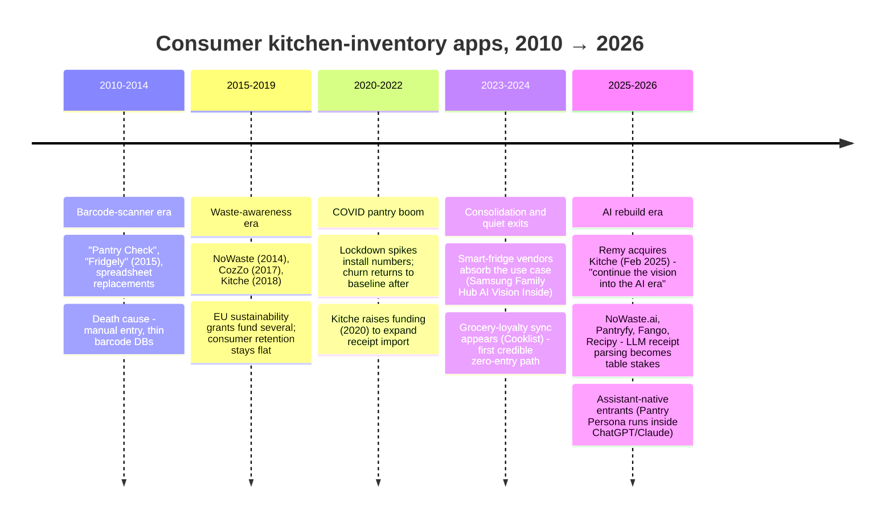
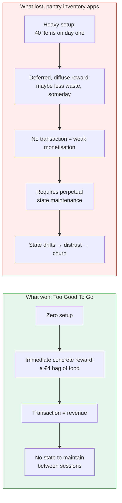
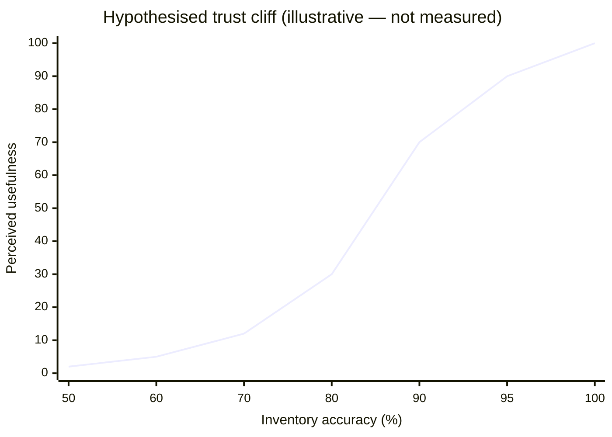
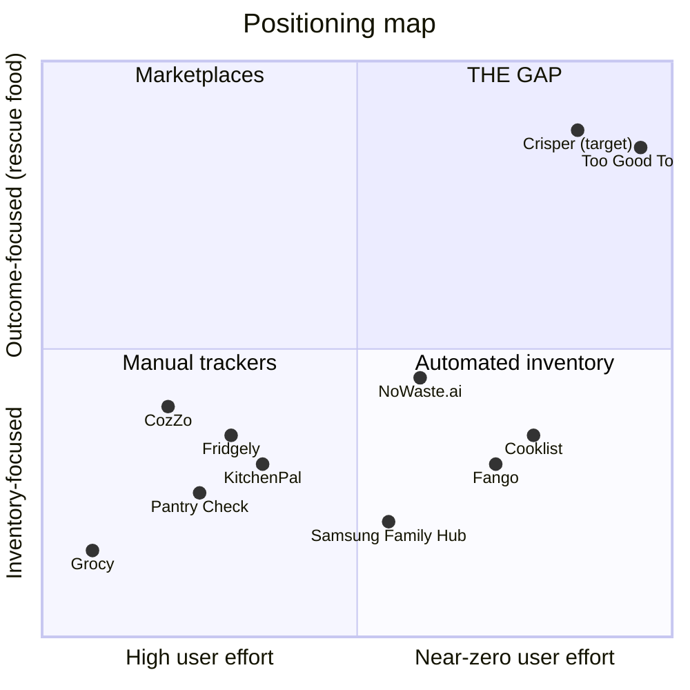

# 1. Market & Competitive Research

*Prepared as a senior business researcher's landscape review. Every number is sourced;
where a number is a market-research-firm projection it is labelled as such, because those
are usually marketing, not evidence.*

---

## 1.1 The problem is real and large — but the *felt* pain is small

| Fact | Value | Source |
|---|---|---|
| US consumer food waste | ~35M tons/yr | ReFED 2025 |
| Cost to US consumers | **$261B/yr ≈ $800/person/yr** | ReFED 2025 |
| Avg American, 2024 | >$760 of uneaten food | ReFED |
| GHG footprint of uneaten food | 154M metric tons CO2e | ReFED |
| Households discarding on date labels | **43% "always or usually"** | ReFED / JHU / Harvard FLPC 2025 survey |

**The critical nuance for product strategy:** $800/year is a *aggregated, invisible* loss.
It is never billed. It leaves the house in a bin, €2 at a time. Behavioural economics calls
this a **diffuse cost** — and diffuse costs generate weak purchase intent. This single fact
explains most of the category's commercial history: the problem is enormous in aggregate and
tiny in any single moment of a user's day.

> **Implication:** Do not sell "save $800/yr" (or, in Germany, ~79 kg/person/yr). Users don't believe it and can't feel it.
> Sell the *moment*: "the broccoli you bought Saturday is about to go. Here are two things
> to do with it tonight." Value must be delivered in the same week it is promised.

Market-size projections (treat with suspicion): the "food waste app market" is quoted at
$1.2B (2024) → $5.7–6.6B (2034/35), ~16.8% CAGR. These numbers bundle B2B commercial-kitchen
waste analytics (Winnow, Leanpath) and marketplaces (Too Good To Go) with consumer apps.
**The consumer pantry-app slice is a rounding error inside it.** Our own bottom-up TAM is in
[doc 6](06-business-plan-roadmap.md#tam-bottom-up-not-top-down).

---

## 1.2 The graveyard: ~15 years of attempts

### Timeline of the category

### What actually happened to the notable players

| Player | Era | Model | Outcome / status | Lesson |
|---|---|---|---|---|
| **Kitche** (UK) | 2018–2025 | Receipt import → digital kitchen + reminders | **Acquired by Remy, Feb 2025.** Founder framed it as carrying the vision "into the AI era" — a soft landing, not a scale outcome. | Right thesis (receipts), pre-LLM tech. Receipt parsing before 2023 was brittle and expensive. |
| **Fridgely** | 2015– | Barcode-only, expiry reminders | Still listed; reviews cite *"many items not found"*, wrong expiry dates, items marked expired that aren't, images vanishing, auth bugs | **Wrong expiry data destroys trust faster than no data.** A false "expired" is a category-killing bug. |
| **CozZo** | 2017– | Full suite: lists, expiry, recipes, leftovers, 2-week meal plan | Alive; EU LOWINFOOD study (FI/AT/GR) found users valued expiry reminders + stock oversight. Store reviews report **daily crashes**, meal-planner crashes, and barcode results with *"unmeaningful names requiring users to reword over half the items"* | Feature breadth ≠ retention. Data *quality* at the point of capture is the product. |
| **Pantry Check** | 2015– | Fast barcode + large catalogue, custom locations, family sync | Alive, well-regarded scanner. Complaints: **manual expiry entry is slow**, sync failures, Android sold separately, free tier ~200 items | Even best-in-class barcode UX still loses on the *date* field. |
| **NoWaste → NoWaste.ai** | 2014→2025 | Rebuilt around AI receipt-to-pantry (paper + Instacart/Amazon Fresh/Walmart digital), barcode as fallback, cloud sync | Alive, actively repositioning. Free tier 50 items; $4.99–9.99/mo | The incumbent that correctly re-platformed. **Our most direct competitor.** |
| **Cooklist** | 2018– | **Grocery loyalty-account sync** — imports past *and future* purchases automatically | Alive. Weakness: only works where loyalty accounts exist; cash shoppers get little | Closest thing to true zero-entry. Distribution is gated by retailer relationships. |
| **Fango** | 2020s | **Receipt-only** (PDFs, emails), 34 countries, €2.99/mo | Alive, deliberately narrow — no recipes, no meal planning, no sharing | Proof a narrow "just get the data in" product can sustain a paid tier. |
| **KitchenPal** | 2019– | Barcode (5M+ catalogue) + voice + text; $3.99/mo or $29.99 lifetime | Alive, cheapest paid tier. **No receipt scanning** | Catalogue size is commoditised; it is not a moat. |
| **Grocy** | 2017– | Open-source, self-hosted, barcode + text, very complete | Alive and maintained (v4.6, 2026) | A hobbyist ceiling: proves demand exists among the 0.1% who will run a server. |
| **Samsung Food / Family Hub** | 2016– | Hardware camera (AI Vision Inside) + recipe app | Alive, well funded. Vision recognises **37 fresh items** and suggests labels for ~**50 packaged items**; unrecognised food becomes *"unknown item"* | Even with a fixed camera, unlimited budget and a decade, **CV alone does not close the inventory loop.** Also: Samsung Food's own app is *manual text entry only*. |
| **Too Good To Go / OLIO / Flashfood** | 2016– | Marketplace / sharing — **surplus at the retail edge, not in the home** | **Huge: €610M revenue, 120M users, 180k partners** | The one category that won. It won because it has a **transaction**, an immediate reward (cheap food), and **zero maintenance burden**. |

### The single most important comparison in this document

**Every design decision in this plan is an attempt to move our product from the right-hand
box toward the left-hand box.**

---

## 1.3 Root-cause analysis of category failure

Five causes, ranked by how many corpses each is responsible for.

### Cause 1 — Manual entry burden (the primary cause of death)
> ⚠️ **Source caveat (added after review).** The 2026 "best pantry app" round-ups that state
> this most crisply — PantryPersona, Fango, Recipy — are **competitor content-marketing blogs**,
> and PantryPersona appears in our own table above. They are directionally consistent with the
> app-store review evidence and with the food-logging adherence literature, but they are
> **not independent** and must not be treated as the proof of our core thesis. The load-bearing
> version of this claim is the one we have to establish ourselves in Phase 0.

Those reviews converge on the verdict *"the graveyard of pantry apps has one common cause of
death: manual entry."* The described failure curve:
day 1, user enters 40 items enthusiastically; day 2, five items; week 2, a missed shop;
week 3, the inventory no longer matches the fridge.

### Cause 2 — Inventory drift and the trust cliff
This is the compounding failure, and we believe it is *nonlinear* — accuracy does not degrade
gracefully, it falls off a cliff.

> ⚠️ **This curve is a hypothesis, not a measurement.** The chart below is an illustration of the
> mechanism we believe operates; there is no dataset behind the specific points, and the 80–85%
> inflection is **asserted, not derived**. It is drawn here because it makes the argument legible,
> and flagged because our 85% parsing gate must not be justified by circular reference to it.
> Phase 0's diary study is where this gets a real number.

Below roughly 80–85% accuracy the list is worse than nothing, because the user must verify
it against the physical fridge anyway — at which point they may as well have just opened the
fridge. *"A pantry list you don't trust is just a second grocery list you have to check twice."*

### Cause 3 — Bad expiry data (the trust assassin)
Fridgely's reviews are the canonical example: items reported expired that have months left.
Users experience this as the app lying to them. **One false expiry can end the relationship.**
This is why our expiry model must express *uncertainty* rather than fake precision (see
[§3.4](03-product-strategy-prd.md#34-the-freshness-model)).

### Cause 4 — The unsolved "out" side
Every product in the table solves *getting food in* (barcode, receipt, loyalty sync).
**Almost none solve getting food out.** Consumption is continuous, unconscious, and happens
with your hands full. No user will ever log "ate 1/3 of the broccoli." An inventory system
that requires consumption logging is mathematically guaranteed to drift.

### Cause 5 — No transaction, weak monetisation
Prices in the category run **free → ~$12/mo**, most at $3–8/mo, with aggressive free-tier
caps (NoWaste.ai 50 items, Pantry Check ~200). It is a low-ARPU, high-churn consumer
subscription market — the hardest kind. Contrast Too Good To Go, which takes ~$1.79 per
transaction plus an $89/yr merchant subscription and has a real business.

---

## 1.4 Feature landscape and usability verdict

| Feature | Who has it | Real usability verdict |
|---|---|---|
| **Barcode scan** | Everyone | Table stakes, not a moat. Fails on **fresh produce, butcher/deli, bakery, bulk** — i.e. exactly the food that spoils. Catalogue names are often junk ("unmeaningful names"). |
| **Receipt photo → AI parse** | NoWaste.ai, Fango, Recipy, Pantryfy | **The highest-leverage input.** Post-LLM this finally works. Caveat: receipt abbreviations (`GRN GIANT BRCLI 12OZ`) require a normalisation layer, and receipts have no expiry dates. |
| **Digital receipt / email import** | Fango, NoWaste.ai | Best effort-to-value ratio of all: **truly zero marginal effort** after one-time setup. Limited to online/emailed orders. |
| **Loyalty-account sync** | Cooklist | The only genuinely passive input for in-store shopping. Gated on retailer partnerships. |
| **Fridge/shelf photo (CV)** | Pantryfy, Samsung hardware | Demoable, not dependable. Samsung's own: 37 fresh + ~50 packaged items, rest "unknown". Occlusion is fatal — you can't see the yoghurt behind the milk. |
| **Voice add** | KitchenPal, Pantry Persona | Underrated. Hands are dirty while unpacking; voice is the only free channel. |
| **Expiry reminders** | Everyone | Most-loved feature in the EU CozZo study **and** the most-complained-about when wrong. |
| **Recipes from inventory** | CozZo, Samsung Food, Pantryfy | Loved in surveys, low actual usage; crash-prone in practice. Only valuable when scoped to *"use this dying item tonight"*. |
| **Meal planning** | CozZo, Samsung Food | High-effort feature for a *different* user (the planner). Do not confuse them with the waste-averse user. |
| **Family / household sync** | Pantry Check, NoWaste, CozZo | Essential — food is a household object, not a personal one. Also the strongest retention mechanic in the category. |
| **Assistant-native (in ChatGPT/Claude)** | Pantry Persona | Novel 2026 distribution channel; removes app-install friction entirely. Worth a cheap experiment. |

---

> 🇩🇪 **The German field looks the same, with one local twist.** Germany's best-known food-waste
> players — **Too Good To Go**, **foodsharing.de**, **SirPlus**, **Motatos** — are all
> *redistribution*, not prevention, and the BMLEH ships a free **"Zu gut für die Tonne!"** app.
> **The prevention slot is empty in Germany too — but the price has been anchored at zero** by a
> volunteer network and a government product. Full German landscape:
> [§11.4](11-germany-berlin-market.md#114-the-german-competitive-landscape).

## 1.5 What the winners and near-winners tell us

1. **Cooklist** has *lower* friction than we will ever have — loyalty sync, no per-shop
   obligation at all — and has not broken out. ⚠️ *Corrected after review:* "retailer-gated" was
   a distribution excuse that let us avoid the harder question, which is **whether zero-entry
   actually retains at all**.
2. **Fango** is receipt-only, narrow, €2.99, 34 countries — i.e. **it is approximately Crisper
   v1, already shipped.** ⚠️ *Corrected after review:* we originally cited this as evidence that
   focus works. We have no revenue, user or retention data for Fango. It is more honestly read as
   **the primary disconfirmation** of our thesis, and the first thing Phase 0 should investigate.
3. **NoWaste.ai** proved the incumbent can re-platform on LLMs → we have no tech moat, only an execution and design moat.
4. **Samsung** put a camera inside the fridge — user effort zero — and the loop still doesn't
   close. We read this as "CV is unreliable". The less comfortable reading is that **even at zero
   effort, households don't engage with fridge inventory**. Both readings should be held.
5. **Too Good To Go** proved the money is in transactions and immediate rewards → our monetisation must eventually attach to a transaction (grocery), not just a subscription.
6. **Grocy** proved a passionate power-user niche exists → useful for early adopters, not a market.

### Cause 6 — Selection inverts the value *(added after senior review)*
Food waste correlates with **large, chaotic, time-poor households with children** — precisely
the households least likely to install and sustain a food app. The people who *do* install are
already conscientious, already waste least, and therefore receive the least value from the
product. **Every app in the graveyard was used by the people who needed it least.**

This is a demand-side problem that no amount of UX craft fixes, and it must be tested directly
in Phase 0 by recruiting *high-waste* households, not enthusiastic ones.

---

## 1.6 Positioning: where the gap actually is

> ⚠️ **Read this map sceptically.** Its axes are subjective, and it is constructed such that
> only the new entrant can occupy the empty corner. That is the standard failure mode of a 2×2.
> It is retained because it names a real strategic intent, not because it is evidence.

**The empty quadrant is: near-zero effort + outcome-focused.** Nobody occupies it because
everyone builds an inventory app and hopes the outcome follows. We invert it: build a rescue
app that keeps a *deliberately approximate* inventory as an implementation detail the user
never has to curate.

---

## Sources

- [ReFED — Understanding Consumer Food Waste (July 2025)](https://refed.org/uploads/consumer-food-waste-report-2025-final.pdf)
- [ReFED — 2025 U.S. Food Waste Report](https://refed.org/downloads/refed-2025-us-food-waste-report.pdf)
- [EPA — Estimating the Cost of Food Waste to American Consumers (2025)](https://www.epa.gov/system/files/documents/2025-04/costoffoodwastereport_508.pdf)
- [Tech.eu — Remy acquires Kitche (Feb 2025)](https://tech.eu/2025/02/17/restaurant-platform-remy-acquires-food-waste-app-kitche/)
- [EU-Startups — Kitche funding (2020)](https://www.eu-startups.com/2020/03/london-based-kitche-gets-funding-to-expand-its-home-food-waste-app/)
- [LOWINFOOD — Assessment of the CozZo app across countries (2023)](https://lowinfood.eu/2023/06/20/assessment-of-the-cozzo-app-by-users-experience-in-different-countries/)
- [PantryPersona — Best pantry inventory apps 2026, ranked by how food gets in](https://www.pantrypersona.com/blog/best-pantry-inventory-apps-2026)
- [Fango — Best pantry inventory app comparison](https://fango.fi/en/blog/best-pantry-inventory-app/)
- [Recipy — Best pantry tracking apps 2026](https://recipyapp.com/blog/best-pantry-tracking-apps-2026)
- [Samsung Newsroom — Family Hub 2025 update / AI Vision Inside](https://news.samsung.com/us/samsung-family-hub-2025-update-elevates-smart-home-ecosystem)
- [Untaylored — How Too Good To Go makes money](https://www.untaylored.com/post/how-too-good-to-go-makes-money-the-business-and-revenue-model-explained)
- [Introspective Market Research — Food waste app market size](https://introspectivemarketresearch.com/reports/food-waste-app-market/)
