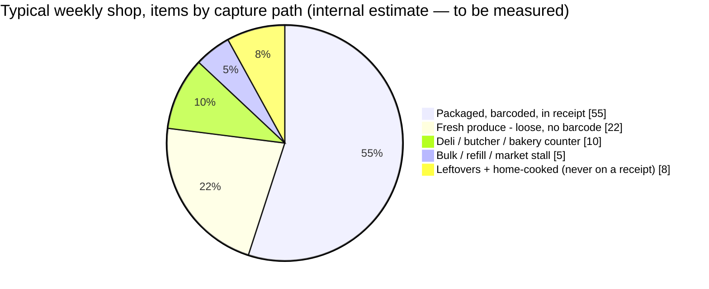
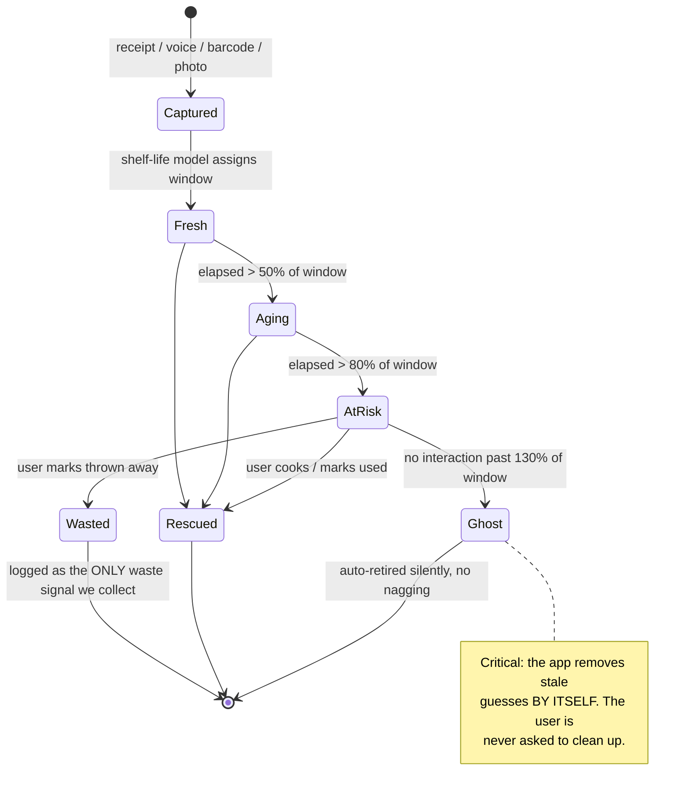
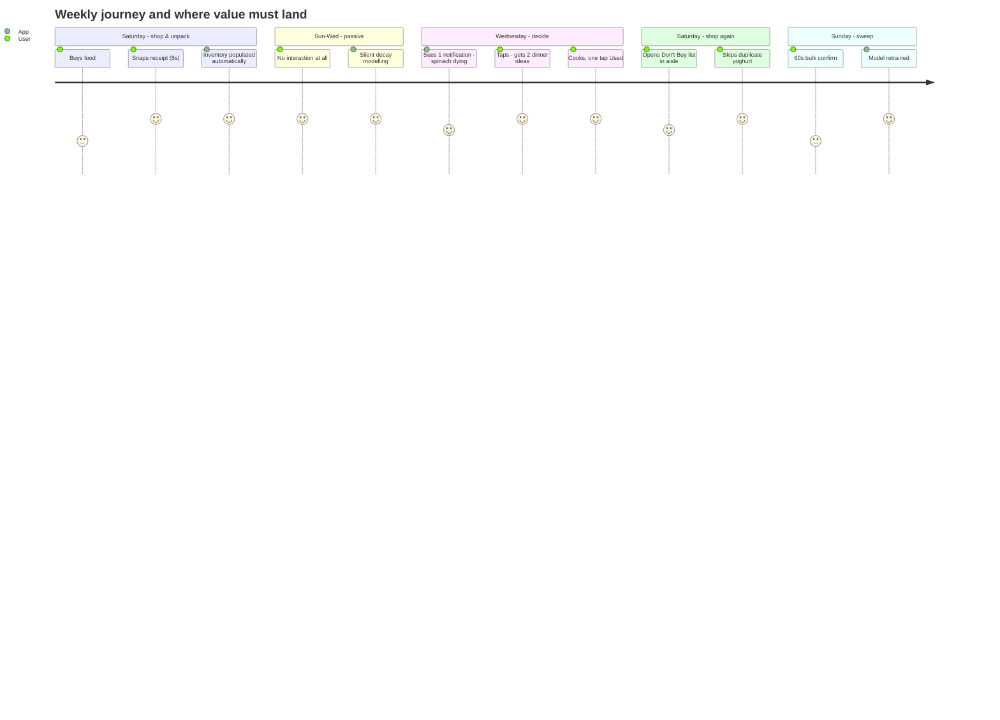
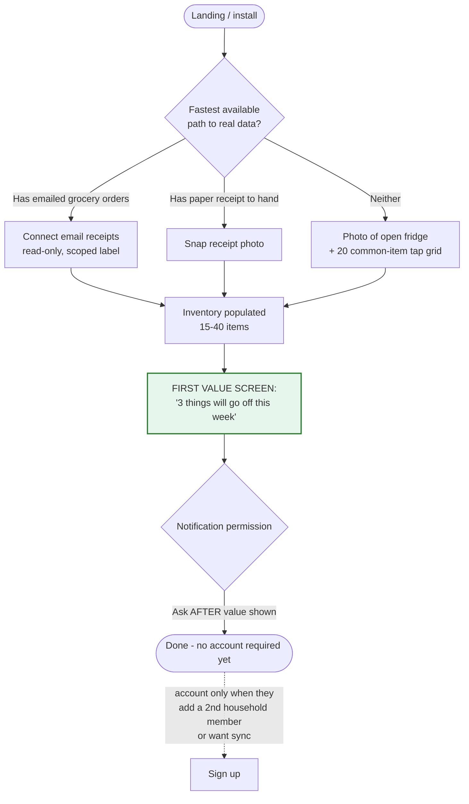

# 2. UX & Behavioural Research — Designing for a Lazy User

*"Users are lazy" is the correct instinct but the wrong framing. Users are not lazy;
they are **rationally effort-minimising** under a cost/benefit calculation that our
category consistently loses. This document quantifies that calculation and derives
design law from it.*

---

## 2.1 The evidence base

| Finding | Number | Source |
|---|---|---|
| Health-app day-1 retention | **20–30%** (70–80% never return after first session) | Sahha, health app churn analysis |
| Fitness/health app 30-day churn | **>90%** | Business of Apps 2025, via Sahha |
| Food logging adherence in a *supervised, motivated* 6-month weight-loss study | participants logged **~54% of possible days** | ⚠️ *secondary citation via PantryPersona 2026 — a competitor blog. Trace to the primary study before quoting externally.* |
| MyFitnessPal internal insight | *"If it didn't get you to log food on the first day, the chances you'd log on the second day were very low"* | ex-MFP PM |
| Effect of streaks/habit cues | daily + weekly actives **doubled** | MFP habit experiments |
| Multimodal logging (photo/voice/text, user's choice) | reduced friction and improved longitudinal retention vs. single forced modality | [SnappyMeal, arXiv 2511.03907](https://arxiv.org/pdf/2511.03907) |
| Informational interventions on food waste alone | **minimal behaviour change** (only reduced date-label-driven discards) | RCT, J. Cleaner Production 2024 |
| Behavioural intervention w/ implementation intentions | outperformed informational | Sustainability 17(23):10752 |
| Structured intervention + coaching | sustained **~30% reduction** in avoidable food waste to landfill | RCT, Circular Economy & Sustainability 2022 |
| Date-label confusion | **43%** always/usually discard on the printed date | ReFED/JHU/Harvard 2025 |

### Three conclusions that should govern the entire product

1. **Telling people facts does not change behaviour.** Informational interventions failed in
   RCT. Structured, prompted, moment-of-decision interventions worked (~30% reduction).
   → *We must intervene at the decision point (dinner planning, shopping), not with dashboards.*
2. **Day 1 predicts everything.** If the user does not experience value on day one, there
   is no day two. → *Onboarding must produce a populated, useful inventory in under 3 minutes,
   with no typing.*
3. **Forced single-modality input kills longitudinal use.** → *Offer photo, voice, receipt,
   barcode, and text; never make one mandatory.*

---

## 2.2 The user's actual cost/benefit equation

The user unconsciously computes, at every prompt:

```
        perceived_benefit(this action)
  ───────────────────────────────────────────  >  1 ?
   effort_seconds × cognitive_load × friction
```

Measured against the physical alternative — **opening the fridge door, which costs ~3 seconds
and is 100% accurate.** This is the true competitor. Not CozZo. Not NoWaste.

**Any interaction that costs more than ~10 seconds and delivers less certainty than opening
the fridge will be abandoned.** That is the design constraint the whole category has ignored.

### Effort budget (a hard product constraint)

| Moment | Budget | Rationale |
|---|---|---|
| Onboarding to first useful screen | **≤ 180 s**, zero typing | Day-1 rule |
| Post-shop capture (a whole weekly shop) | **≤ 30 s** | vs. ~5 min of typing in legacy apps |
| Daily check-in glance | **≤ 5 s** | Must beat opening the fridge |
| Weekly reconciliation ("sweep") | **≤ 60 s** | Once weekly is the max tolerable cadence |
| Correcting one wrong item | **≤ 2 taps** | Correction cost drives abandonment more than capture cost |
| **Total per household per week** | **≤ 3 minutes** | The product's headline promise |

> This table is not aspirational copy. It is an acceptance criterion. Any feature that
> breaks the budget is cut, regardless of how good it is.

---

## 2.3 Where the effort actually goes (and why "scan everything" fails)

> ✅ **Partly confirmed for Germany.** The GfK study for the BMEL finds **35% of avoidable German
> household food waste is fresh fruit and vegetables and 13% is bread and bakery** — 48% in two
> categories with no barcode, no printed date and a shelf life of days. That is independent
> confirmation of the split below and of the decision to cut barcode scanning from v1.
>
> ⚠️ **The remaining proportions are still an internal estimate, not measured data.** They are our working
> assumption from receipt inspection, and they are load-bearing (they justify cutting barcode
> from v1), so Phase 0 must replace them with real counts from real receipts. Note also the
> denominator: these are shares *of items*, and the sharper claim we make below — "45% of
> *spoiling* food has no barcode" — needs its own measurement.



> 🇩🇪 **German data confirms this split independently — and more sharply than our estimate.**
> The GfK study for the BMEL finds **35% of avoidable German household waste is fresh fruit and
> vegetables and 13% is bread and bakery: 48% in two categories with no barcode, no printed date
> and a shelf life of days.** That is the strongest external validation of the design choices in
> this document found anywhere in the research.

Two brutal facts follow:

- **~45% of items that spoil have no barcode.** The barcode-first products are structurally
  incapable of covering the food that actually rots. Broccoli — the user's own example —
  has no barcode, no expiry date, and is exactly the item that blooms and dies in ten days.
- **Leftovers and home-cooked food never appear in any automated source.** They are pure
  manual entry, and they are a large share of household waste.

→ **Design response:** receipts capture the packaged 55% *and* the produce lines
(`BROCCOLI CROWNS 1.2 LB` is on the receipt even without a barcode). The remaining ~15%
(counter, bulk, leftovers) gets a 3-second voice/photo path and is otherwise allowed to be
missing. **We explicitly accept an incomplete inventory** — see next section.

---

## 2.4 The core design doctrine: an inventory that is allowed to be wrong

Every failed competitor made the same implicit promise: *"this list is the truth."*
That promise creates two obligations the user cannot meet — enter everything, and remove
everything consumed. It is unmeetable, so it breaks, and when it breaks the user quits.

**We make the opposite promise: "this list is a good guess, and it's my job to keep it
useful, not yours."**

Concretely:

| Legacy model | Crisper model |
|---|---|
| Items are *facts* | Items are **hypotheses with a confidence score** |
| Item exists until the user deletes it | Items **decay and auto-retire** on a probabilistic model |
| "You have 3 broccoli" | "You probably still have broccoli — bought 9 days ago" |
| User must log consumption | Consumption is **inferred**; the user is asked only when it matters |
| Wrong data = user's fault | Wrong data = **our model's fault**; one tap fixes it and trains the model |

### Confidence-decay state machine



**"Ghost" auto-retirement is the single most important mechanic in the product.** It is the
antidote to inventory drift. Legacy apps accumulate zombie items forever; ours forgets, the
way a person forgets, and never asks the user to tidy up.

---

### 2.4b The error we did NOT model: missed captures *(added after senior review)*

The decay/auto-retire doctrine above handles **false positives** — items we think you have and
you don't. A reviewer pointed out that it does nothing about the error that actually breaks the
product: **false negatives — the shop you never photographed.** You cannot warn someone about
spinach you never knew they bought.

| Error type | Symptom | Handled by |
|---|---|---|
| **False positive** (ghost) | We alert on food you already ate | Confidence decay + auto-retirement ✅ |
| **False negative** (missed capture) | We are silent about food that is rotting | **Nothing, as originally scoped** ❌ |

**Honest compliance forecast** for "photograph the receipt after every shop", from analogous
consumer receipt-capture behaviour (including apps that pay cash for it):

| Week | Share of actual shops captured |
|---|---|
| 1 | 70–80% |
| 4 | 40–50% |
| 8 | 25–35% |
| 12 | 20–30% (among *retained* users) |

Our 30-second capture budget measures from *"tap add"* — which excludes the real costs: keeping
the receipt, finding it, flattening curled thermal paper, and above all **remembering**.
**No UI fixes forgetting.**

> 🇩🇪 **Germany is the best available answer to the first half of that list.** The
> **Belegausgabepflicht** (since 1 Jan 2020) requires a receipt for *every* till transaction, even
> unwanted ones — so unlike UK shoppers, who increasingly decline paper, **German shoppers are
> handed the input several times a week by law.** That removes "having a receipt" as a failure
> mode. It does **not** remove forgetting, which is why capture compliance stays a tracked metric
> and the compliance forecast above stands.

**Compounded, the Wednesday notification requires four independent things to be true:**
```
capture happened (~0.6) × item still present (~0.7)
  × shelf-life estimate right ±2 days (~0.7) × dinner not already decided (~0.6)
  ≈ 18% of notifications genuinely useful
```

**Consequences now built into the plan:**
1. **Email/digital receipt import is promoted to v1 P0** — it is the only capture path immune to
   forgetting, and doc 1 already called it the best effort-to-value ratio in the category.
2. A new first-class metric: **capture compliance = shops captured / shops taken**, measured
   week-over-week. It was previously nowhere in the plan.
3. A new first-class metric: **end-to-end alert precision** — "was this notification useful?" —
   asked directly, not inferred.
4. Passive re-capture prompts that do not depend on memory: a geofence exit from a known
   supermarket, or a card-transaction-shaped nudge, both strictly opt-in.

## 2.5 Behavioural mechanics we will and won't use

### Use

| Mechanic | Evidence | Our implementation |
|---|---|---|
| **Implementation intentions** ("if X then Y") | Outperformed informational interventions in US household RCT | "Tomorrow is bin day — the spinach goes in soup tonight." Specific, timed, actionable. |
| **Moment-of-decision prompting** | Coaching-based RCT achieved ~30% reduction | Notify at ~17:00 local (dinner decision), and on entering a grocery store (geofence, opt-in) |
| **Multimodal input** | SnappyMeal longitudinal | Photo, voice, receipt, barcode, text — all first-class |
| **Loss framing over gain framing** | Prospect theory; food waste guilt is a live emotion | "Don't lose the €3.40 in your crisper" ≥ "save money" |
| **Micro-commitment / one-tap** | Habit literature; MFP streaks doubled DAU | Every notification is actionable from the lock screen with one tap |
| **Household social accountability** | Cornell 2025: social dynamics drive habit formation | Shared household inventory; "Ana used the yoghurt" |

### Refuse

| Anti-pattern | Why |
|---|---|
| **Streaks and gamified guilt** | Research shows "accountability"/"tracking" language *creates anxiety, not motivation*. Food guilt is already high; a broken streak is a churn trigger. |
| **Daily notifications** | Notification fatigue is the top uninstall driver. **Hard cap: 3 notifications/week, adaptive down.** |
| **Waste-shaming dashboards** | Informational interventions failed in RCT and cause defensive disengagement. |
| **Mandatory consumption logging** | Mathematically guaranteed to drift; see §2.3. |
| **A "complete your inventory!" empty-state nag** | Turns our tolerance of incompleteness into a lie. |
| **Onboarding tours / feature tours** | Costs day-1 budget with zero value delivered. |

---

## 2.6 The four modes a user is actually in

Designing for "the user" is a mistake — there are four distinct contexts with different
device posture, attention and hand availability:

| Mode | When | Attention | Hands | Device | Design response |
|---|---|---|---|---|---|
| **Unpacking** | Just home, 5–15 min after shopping | Low, rushed | Full of bags | Phone on counter, wet/dirty hands | **Voice + one photo of the receipt.** No typing. Large targets. Works from a distance. |
| **Deciding** | ~17:00–19:00, "what's for dinner" | Medium, motivated | Free | Phone in hand, possibly on sofa | **The rescue card.** 2–3 concrete suggestions using dying items. |
| **Shopping** | In-store, standing in aisle | Split, noisy | One hand on trolley | Phone one-handed | **"Don't buy" list** — what you already have. Big text, thumb-reachable, works offline. |
| **Tidying** | Sunday, fridge open | High, tolerant | Free | Phone propped, possibly tablet/desktop | **The 60-second sweep.** Bulk confirm/correct. This is the only screen allowed to be dense. |



The Wednesday notification is the product. Everything else is scaffolding to make that one
notification correct and welcome.

---

## 2.7 Onboarding: the 180-second rule

Day-1 value is existential (§2.1). The onboarding must never present an empty inventory.



Rules encoded above:
- **No account wall before value.** Local-first; account is deferred until sync is needed.
- **Permission prompts come after the value moment**, never before.
- **The tap-grid fallback** (20 common perishables as big buttons: milk, eggs, bread,
  spinach, chicken, bananas…) gives a usable inventory in ~20 seconds even with no receipt.

---

## 2.8 Accessibility and inclusivity constraints

- **Wet/greasy hands** during unpacking → voice must be a genuine first-class path, and touch
  targets ≥ 48 px with generous spacing.
- **Colour**: freshness is currently signalled by red/amber/green everywhere in this category.
  ~8% of men have red-green CVD. Freshness must additionally encode via **position, text
  ("2 days left"), and icon shape** — never colour alone. WCAG 2.1 AA contrast throughout.
- **One-handed reach**: primary actions in the bottom third of the screen.
- **Low literacy / ESL households**: item names come from receipts in abbreviated retailer
  jargon; we normalise to plain language + show a product image.
- **Offline**: in-store aisles have poor signal. The "Don't buy" list must be fully offline.

---

## 2.9 UX principles (the ten laws)

1. **The fridge door is the competitor.** Beat 3 seconds or don't ship it.
2. **Never ask the user to maintain a database.**
3. **The app is allowed to be wrong; the user is never allowed to feel wrong.**
4. **Capture is cheap, correction must be cheaper.** One tap, always.
5. **Forget by default.** Stale guesses retire themselves.
6. **Show uncertainty honestly** — "probably", "~5 days" — never a false precise date.
7. **One notification, one decision, one tap.**
8. **Value before permission, permission before account.**
9. **Every screen answers one question**; only the weekly sweep may be dense.
10. **No guilt.** We reward rescue; we never punish waste.

---

## Sources
- [Sahha — Why most health app users churn within 90 days](https://sahha.ai/blog/health-app-churn-retention/)
- [SnappyMeal: Design and Longitudinal Evaluation of a Multimodal AI Food Logging Application (arXiv 2511.03907)](https://arxiv.org/pdf/2511.03907)
- [Efficacy of informational intervention on food waste: RCT (J. Cleaner Production, 2024)](https://www.sciencedirect.com/science/article/abs/pii/S0959652624005535)
- [An Empirical Comparison of Informational and Behavioral Food Waste Interventions in U.S. Households: The Advantage of Implementation Intentions (Sustainability, 2025)](https://doi.org/10.3390/su172310752)
- [The Proof Is in the Pudding: RCT of a household food waste reduction intervention (Circular Economy & Sustainability, 2022)](https://link.springer.com/article/10.1007/s43615-022-00193-7)
- [Impact of Smartphone Apps Designed to Reduce Food Waste — crossover pilot (PMC9482070)](https://www.ncbi.nlm.nih.gov/pmc/articles/PMC9482070/)
- [Systematic review of factors influencing household food waste behaviour (PMC12106936)](https://pmc.ncbi.nlm.nih.gov/articles/PMC12106936/)
- [ReFED — Understanding Consumer Food Waste 2025](https://refed.org/uploads/consumer-food-waste-report-2025-final.pdf)
