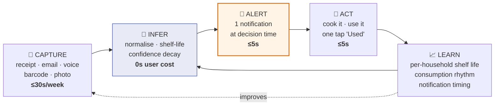
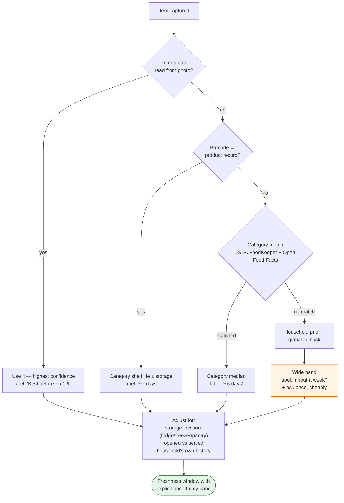

# 3. Product Strategy & PRD

> **Launch market: Berlin → Germany → DACH** ([doc 11](11-germany-berlin-market.md)).
> The product ships German-first. Germany's **Belegausgabepflicht** — a receipt for every till
> transaction, by law, since 2020 — makes it the best capture substrate in Europe.

## 3.1 Positioning statement

> **For** households who buy fresh food and keep throwing it away,
> **Crisper** is a responsive web app that watches what you bought and tells you what to
> cook before it dies.
> **Unlike** pantry-inventory apps, it never asks you to maintain a list — it captures from
> receipts automatically, guesses what's left, and forgets on its own when it's unsure.
> **The promise:** under 3 minutes a week, total.
> **German:** *"Unter 3 Minuten pro Woche — und du wirfst nichts mehr weg. Wir machen den Bon
> endlich nützlich."*

**What we are NOT building** (each of these killed someone):
- ❌ A complete, authoritative kitchen inventory system
- ❌ A meal planner (different user, different job)
- ❌ A nutrition/calorie tracker
- ❌ A grocery-shopping marketplace (v1)
- ❌ A smart-fridge hardware companion

## 3.2 Jobs to be done

| # | Job | Trigger | Current alternative | Our solution | Priority |
|---|---|---|---|---|---|
| J1 | "Tell me what's about to die so I can use it" | Mid-week, dinner time | Memory + sniff test | Rescue card + 1 notification/wk | **P0 — the product** |
| J2 | "Get my shopping into the app without work" | Just home with bags | Typing 40 items (nobody does) | Receipt snap / email import / voice | **P0 — the enabler** |
| J3 | "Don't let me buy what I already have" | In the aisle | Phone photo of the fridge before leaving | Offline "Don't buy" list | P1 |
| J4 | "Give me something to cook with these 3 dying things" | Staring into fridge at 18:30 | Google, give up, takeaway | 2–3 concrete rescue ideas | P1 |
| J5 | "Keep my partner and me in sync" | Household with 2+ adults | Shouting / WhatsApp | Shared household inventory | P1 (retention driver) |
| J6 | "Show me I'm improving" | Monthly, reflective | Nothing | Gentle rescue stats — **never** waste-shaming | P2 |

**J1 and J2 are the entire v1.** If those two don't retain users, nothing downstream matters.

## 3.3 The core loop

The loop has exactly **two** user-facing touchpoints per week: one capture, one act.
Everything else is the system working invisibly.

## 3.4 The freshness model

This is where Fridgely died (false expiries) and where we must be rigorously honest.

### Layered shelf-life estimation

### Non-negotiable rules

1. **Never display a fake precise date.** If confidence is low, the UI says *"about a week"*,
   not *"expires 14 Sep"*. Legacy apps' cardinal sin.
2. **Never say "EXPIRED".** Say *"check this one"* — because the printed date is not a safety
   date, and 43% of households already over-discard on dates. Saying "expired" makes us part
   of the problem we claim to solve.
3. **Freshness is a decay curve, not a cliff.** Broccoli at day 10 is "yellowing, use today",
   not "binary dead". The UI shows a continuum.
4. **Safety carve-out:** for high-risk categories (raw poultry, fish, ready meals, infant
   formula, soft cheese) we defer to the printed date, show a distinct safety styling, and
   never suggest "it's probably fine."
5. **Learn per-household.** If this household eats spinach in 4 days, stop warning at day 6.

### Example — the user's own broccoli case

| Day | State | UI language | Action offered |
|---|---|---|---|
| 0 | Captured from receipt `BROCCOLI CROWNS` | "Broccoli · fresh · ~10 days" | — |
| 5 | Aging | "Broccoli · about half its life" | (silent, no notification) |
| 8 | At risk | "Broccoli — florets may start yellowing. Use in the next 2 days." | 🍳 2 rescue ideas · ✔ Used · 🗑 Gone |
| 11 | Ghost candidate | *(no nag)* one quiet line in the weekly sweep: "Still have the broccoli?" | ✔ / ✖ / freeze |
| 13 | Auto-retired | Silently removed. Not counted as waste. | — |

## 3.5 Feature scope by release

```mermaid
flowchart LR
  subgraph MVP["🟢 v1 MVP — Weeks 1-14"]
    direction TB
    M1[Receipt photo → items]
    M2[Email receipt import]
    M3[Voice + tap-grid quick add]
    M4[Freshness model v1<br/>FoodKeeper + OFF]
    M5[Rescue card + 1 weekly notify]
    M6[One-tap Used / Gone]
    M7[Auto-retire ghosts]
    M8[PWA, offline read]
  end
  subgraph V2["🔵 v2 — Weeks 15-26"]
    direction TB
    N1[Household sharing]
    N2["Don't buy" in-store list]
    N3[Rescue recipes from inventory]
    N4[Barcode scan fallback]
    N5[60-second weekly sweep]
    N6[Per-household shelf-life learning]
  end
  subgraph V3["🟣 v3 — Months 7-12"]
    direction TB
    P1[Loyalty/retailer purchase sync]
    P2[Fridge-photo CV assist]
    P3[Freezer & leftovers module]
    P4[Assistant-native surface<br/>MCP / ChatGPT / Claude]
    P5[Impact & savings report]
  end
  MVP --> V2 --> V3
```

### ⚠️ Additional v1 cuts, applied after senior review
Two reviewers independently estimated the MVP as scoped at **26–32 weeks**, not 15, at this team
size. Cut to recover ~7–9 weeks:

| Cut from v1 | Reason |
|---|---|
| **Voice capture** | Web Speech is unusable on iOS; the record→upload→transcribe→parse path is a **second NLP pipeline with its own eval set**, and it will not hit the 8-second budget |
| **"Photo of the shelf"** | Contradicted our own v3 placement, and doc 1 shows Samsung failing at this *with dedicated hardware*. ⚠️ *[Doc 12](12-technical-research-capture.md) closes this: fine-grained grocery recognition is 41–89% top-1 on real shelf data and 58 mAP@50 under realistic occlusion — and waving 30 items past a camera takes 60+ seconds against an 8-second receipt photo. **It fails the effort budget by 2× and is less accurate.*** |
| **OAuth mailbox import** | `gmail.readonly` is a restricted scope requiring a **CASA Tier 2/3 assessment — $3k–15k and 4–12 weeks of calendar time**, annually re-verified. Apple Mail has no API at all. **v1 ships forward-to-address only** (`shop@in.crisper.app`), which was already the privacy-preferred path |
| **Notification ranking + learned send time** | At ≤3 observations/week, learning a per-household time-of-day takes ~6 months. Ship a fixed 17:00 send plus a durable weekly counter |
| **Per-household shelf-life learning** | Statistically broken as specified (see [§5.4c](05-technical-architecture.md)). 28 days buys something that looks right and is silently wrong. Collect the events, ship global rules |
| **Tablet 2-column and desktop 3-pane** | Phone-first plus a readable single-column desktop |
| **Dark mode** | Deferred one release |

**Added instead, all cheap and all missing:** email fallback alerts (1 day), rate-limited device
identity on the parsing endpoint (2 days), the **three German receipt checksums** (3 days — they
replace the confidence scores a vision LLM does not provide), and **repurchase-cadence consumption
inference (1 week — the highest-leverage missing piece in the architecture)**.

**Moved into the native shell (v2):** **auto-capture of receipts** via ML Kit Document Scanner
(Android) and VisionKit (iOS) — automatic edge detection and shutter, saving 3–5 seconds per
capture. The web Shape Detection API is **broken on iOS 18** and never Baseline, so there is no
credible PWA version worth building.

### Explicit v1 cuts and why
| Cut | Reason |
|---|---|
| Barcode scanning | 45% of spoiling food has no barcode; receipts already cover packaged goods. Adding a scanner in v1 signals "inventory app" and invites the manual-entry death spiral. |
| Recipes | Expensive, crash-prone in competitors, and *not* the core job. v1 offers 2 hardcoded-template rescue ideas per category ("wilted spinach → soup, omelette"). |
| Meal planning | Different user. Highest-effort feature in the category. |
| Native apps | PWA covers responsive requirement; native only when push/camera limits bite (see [doc 5](05-technical-architecture.md#57-pwa-vs-native-the-honest-tradeoff)). |
| Accounts on first run | Costs day-1 budget; local-first instead. |

## 3.6 Requirements with acceptance criteria

### R1 — Receipt capture (P0)
- User photographs a paper receipt; items appear as a reviewable list.
- **AC1:** Median end-to-end time from tapping "add shop" to confirmed inventory for a
  30-line receipt ≤ **30 seconds**.
- **AC2:** ≥ **85%** of food line items extracted with correct plain-language **German** name
  across the **10 chains covering ~80% of German grocery spend** (Edeka, REWE, Lidl, Aldi Nord,
  Aldi Süd, Kaufland, Penny, Netto, dm, Rossmann). ⚠️ *Edeka is a federation of independent
  retailers with non-uniform receipt formats — expect it to cost as much as the next three chains
  combined.* Non-food lines (bags, points, discounts) suppressed.
- **AC3:** Review screen is **confirm-by-default** — the user taps ✔ once for everything and
  only touches items that are wrong. Never a form to fill.
- **AC4:** Failure is graceful: if parsing confidence is low, show what we got, never a wall
  of errors, never a blank screen.

### R2 — Email receipt import (P0)
- **AC1:** Read-only, narrowly scoped (a single label/folder, or forwarding address).
- **AC2:** Zero marginal effort after setup — new orders appear without user action.
- **AC3:** Explicit, revocable consent screen with plain-language data statement.
- **AC4:** Fallback for privacy-averse users: forward-to-address (`shop@in.crisper.app`).

### R3 — Quick add (P0)
- **AC1:** Voice: "two broccoli, milk, chicken thighs" → 3 items, ≤ 8 s, hands-free.
- **AC2:** Tap grid of 20 household-frequent items, one tap each, no confirmation dialog.
- **AC3:** Works with wet hands: targets ≥ 48 px, no small close buttons, no drag gestures.

### R4b — Consumption inference from repurchase cadence (P0) ⚠️ *added after review*
- **AC1:** Every at-risk score is `P(still present) × P(spoiling soon)`. An alert never fires
  below `P(still present) = 0.6`.
- **AC2:** `P(still present)` is estimated from **repurchase cadence in the household's own
  capture history** — a signal receipts give us for free — with a global cadence table as cold start.
- **AC3:** The sweep only asks about items in the genuinely ambiguous 0.4–0.7 presence band.
- **Why this is P0:** without it, "consumption is inferred" is a 130% timer, and the alert band
  (80–130% of the shelf-life window) is *precisely* where food is most likely already eaten.
  A reviewer's estimate for stale alerts without this: **40–55%**, against our ≤20% target.
  **Build this before the receipt parser.**

### R4 — Freshness inference (P0)
- **AC1:** Every item gets a window + a confidence band. No item ever displays a precise date
  it did not read from a label.
- **AC2:** No item is ever labelled "expired". Language: "use soon", "check this one".
- **AC3:** High-risk categories flagged distinctly and always defer to printed date.
- **AC4:** ⚠️ *Rewritten — the original was circular, validating against FoodKeeper, which is the
  training source.* Median error ≤ 2 days on **a 20% holdout of categories excluded from the rule
  table**, plus ground truth from the Phase 0 diary study.
- **AC5:** `date_label_type` distinguishes German **"Verbrauchsdatum" (safety — hard clamp, never
  extended)** from **"Mindesthaltbarkeitsdatum / MHD" (quality — may extend)**. Conflating them is
  both a safety and a legal problem, and German competition law is enforced by competitor
  *Abmahnung*, not only by a regulator.

### R5 — Rescue alert (P0)
- **AC1:** ≤ **3 notifications/week**, default 1. Adaptive: reduce on ignore, never increase
  without a user action.
- **AC2:** Sent at learned decision time (default 17:00 local, weekday).
- **AC3:** ⚠️ *Rewritten — the original required two lock-screen action buttons, and **Safari Web
  Push does not support notification actions**, so it was undeliverable to roughly half the target
  market.* One action, resolvable in a single tap; a second button is an Android/native enhancement.
- **AC3b:** **An email fallback channel ships in v1.** Push is not guaranteed to exist for a
  large minority of iOS users, and previously there was no fallback at all.
- **AC4:** Never fires if there is nothing at risk. **Silence is a feature.**

### R6 — One-tap resolution (P0)
- **AC1:** Used / Gone / Snooze / Froze, each one tap from any surface.
- **AC2:** "Gone" (wasted) never triggers guilt copy. It is a data signal, thanked quietly.
- **AC3:** Every resolution updates the household's shelf-life priors.

### R7 — Auto-retirement (P0)
- **AC1:** Items past 130% of their window with no interaction are removed silently.
- **AC2:** The user is **never** shown a "clean up your inventory" task.
- **AC3:** Retired items are recoverable for 7 days from an "undo" affordance in the sweep.

### R8 — Responsive/PWA (P0)
- **AC1:** Single codebase, 320 px → 1440 px+. Primary target: phone portrait.
- **AC2:** Installable PWA, offline read of inventory and "Don't buy" list.
- **AC3:** LCP < 2.0 s on mid-tier Android over 4G; interactive glance in < 1 s from icon tap.

### R9 — Household sharing (P1)
- **AC1:** Invite by link, no account required for the invitee's first view.
- **AC2:** Real-time-ish sync (≤ 5 s) with conflict-free merge (last-write-wins per item field).
- **AC3:** Attribution is neutral: "Ana marked the yoghurt used" — never a leaderboard.

### R10 — Don't-buy list (P1)
- **AC1:** Fully functional offline. Loads in < 1 s.
- **AC2:** Grouped by aisle-ish category; large type; one-handed thumb reach.
- **AC3:** Shows *have* and *running low* — the shopping-time inversion of the inventory.

## 3.7 Success metrics

> ⚠️ **Rewritten after review.** The original set had **four different retention bars and three
> different conversion bars** across the documents with no source of truth, never defined the
> qualifying event for retention, and had no metric at all for the error that actually breaks the
> product — **missed captures**. This is now the single ladder; where any other document disagrees,
> this table wins.

### North Star
**Weekly Rescues per Active Household (WRAH)** = items that entered *At-Risk* and were resolved as
consumed within the risk window, per household per week.

**Retention is defined as *value received*, not app opens** — a household is retained in a week if
it completed a capture **or** resolved an alert. For a product deliberately invisible six days a
week, open-based retention reads catastrophically low and measures nothing.

| Layer | Metric | v1 target (M6) | Why |
|---|---|---|---|
| **North Star** | WRAH | ≥ 2.0 | Two rescues/week ≈ real, felt value |
| **Capture** ⚠️ new | **Capture compliance = shops captured / shops taken**, week over week | ≥ 55% at W6 | **The number the entire business rests on, and it was previously nowhere in the plan.** Expected decay without intervention: 70–80% (W1) → 25–35% (W8) |
| **Trust** ⚠️ new | **End-to-end alert precision** — "was this useful?" asked directly | ≥ 50% | Composing capture × presence × shelf-life × timing gives ~18% without the consumption model |
| Activation | first populated inventory in ≤ 180 s | ≥ 70% | Day-1 rule |
| Activation | 2nd capture completed in week 1 | ≥ 45% | The MyFitnessPal day-2 signal |
| Retention | **D30, value-received definition** | ≥ 25% | Category baseline < 10% |
| Retention | **W12, value-received definition** | ≥ 15% | Where every competitor died |
| Effort | Median user-seconds/household/week | ≤ 180 s | The headline promise |
| Trust | Correction rate on captured items | ≤ 12% | Above this, parsing isn't good enough |
| Trust | Alerts marked "already used/gone" | ≤ 20% | Direct measure of drift. **Expected 40–55% without R4b** |
| Model | Median shelf-life error on a **held-out** category set | ≤ 2 days | Prevents the Fridgely failure |
| Outcome | ⚠️ *demoted* — self-reported waste reduction at day 60 | directional only | Self-report inside our own app is among the most biased instruments available. Calling it "RCT-anchored" was borrowed credibility; the RCT involved human coaching over months |
| Business | Trial → paid conversion | ≥ 5% | Single bar; supersedes the 6%/5%/3% spread |
| Business | Gross monthly churn (paid) | ≤ 10% | ⚠️ *Was 6% — top-decile consumer subscription. Modelled at 10%* |

### Counter-metrics (things that must NOT go up)
- Notifications sent per household per week (cap 3)
- Median time on the capture screen (a *rising* number means our parsing regressed)
- Items in inventory per household (bloat = drift = the death spiral; a *falling* count
  after auto-retirement is healthy)
- Support contacts about wrong expiry dates

## 3.8 Risks and mitigations

| # | Risk | Sev | Likelihood | Mitigation | Early-warning signal |
|---|---|---|---|---|---|
| R1 | **Receipt parsing accuracy below 85%** breaks the whole thesis | Critical | Medium | LLM + retailer-specific normalisation dictionaries; 200-receipt eval set built *before* code; human-in-loop for the first 1,000 users | Correction rate > 12% |
| R2 | Users still churn at week 3 despite low effort | Critical | Medium-High | The Wednesday rescue notification must be genuinely useful; ship it in week 1 of the beta and measure W3 before building anything else | W3 retention < 20% in beta |
| R3 | Inventory drift makes alerts wrong | High | High | Confidence decay + auto-retire + weekly 60s sweep; measure "already used/gone" tap rate | >20% of alerts stale |
| R4 | Wrong expiry destroys trust (the Fridgely failure) | High | Medium | Uncertainty bands, no "EXPIRED" language, safety carve-outs | Support tickets, 1★ reviews mentioning dates |
| R5 | Email/receipt access feels invasive | High | Medium | Read-only scope, forwarding-address alternative, on-device-first framing, plain-language consent, no data resale ever | Consent screen drop-off > 40% |
| R6 | LLM/OCR cost per **paying** user exceeds ARPU | **High** | **High** | ⚠️ *Upgraded after review.* Cost is per household, revenue is per paying household — at 6% conversion, 94% of users are pure COGS. **At launch the dictionary is empty and LLM fallback is ~100%**, so costs peak when cash is scarcest. Free tier cut to 2 scans/mo; cost gate moved to beta week 4; dual-source OCR | Cost per **paying** household/mo > $2 |
| R10 ⚠️ new | **Missed captures** — the user simply forgets to photograph the receipt | **Critical** | **High** | No UI fixes forgetting. Forward-to-address import, opt-in geofence nudge on supermarket exit, and capture compliance as a tracked metric | Capture compliance < 45% at W6 |
| R11 ⚠️ new | **Selection inverts the value** — high-waste households (large, chaotic, time-poor, kids) are least likely to install; installers are already conscientious and waste least | **High** | **High** | Phase 0 recruits *high-waste* households specifically, not enthusiastic ones. No UX fixes this; it is a demand-side fact to be measured | Diary study shows rescue rate concentrated in low-waste households |
| R12 ⚠️ new | **iOS has no notification surface** for 35–45% of users | **Critical** | **High** | Email fallback in v1; native decision moved before the retention gate; G2 stratified by platform | PWA install × push opt-in < 35% |
| R7 | NoWaste.ai / a well-funded incumbent ships the same thing | Medium | High | We have no tech moat. Moat = design doctrine + per-household learning data + household network effect | — |
| R8 | Willingness to pay is simply too low | High | Medium | Test pricing in beta with a real paywall, not a survey; grocery-affiliate as second revenue leg | Conversion < 3% |
| R9 | Retailer/loyalty APIs are partner-gated (Walmart, Kroger) | Medium | High | v1 does not depend on them; treat as v3 upside only | — |
