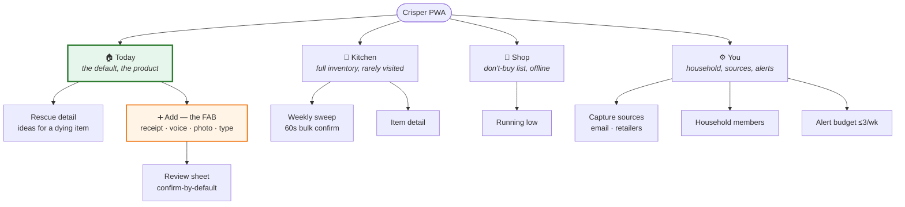
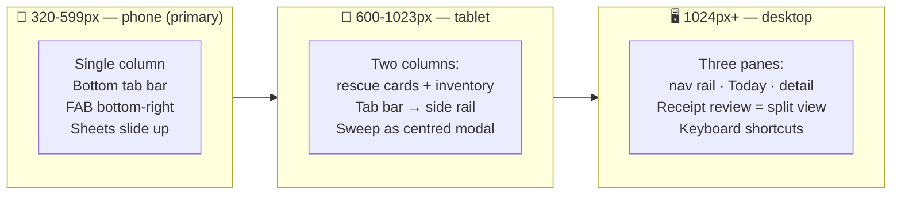
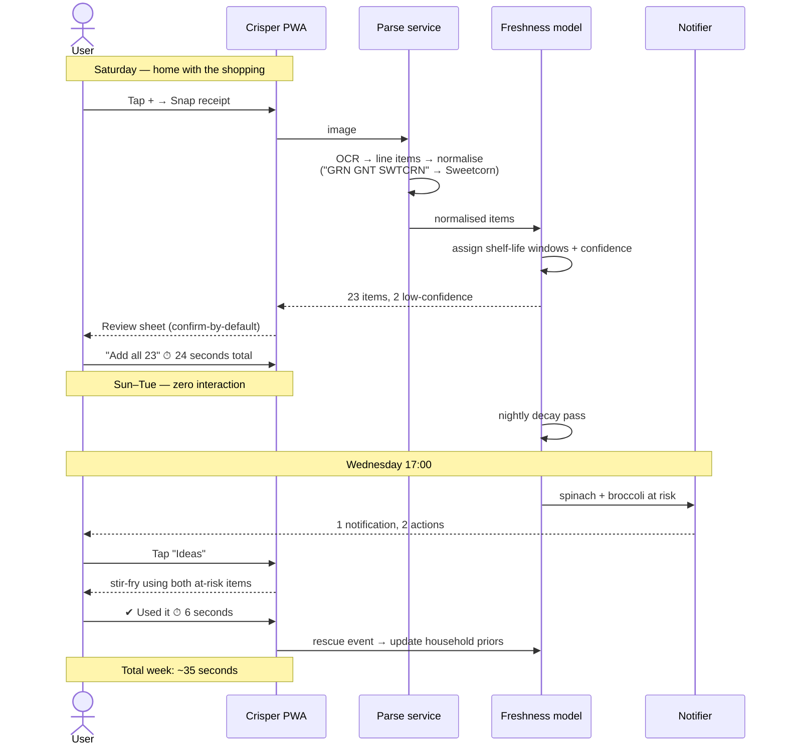

# 4. UI Screens, Wireframes & Flows

*Design language: calm, high-contrast, generous touch targets, no gamification.
Freshness is encoded by **position + text + icon shape**, with colour only as reinforcement
(never as the sole channel — red/green CVD is ~8% of men).*

---

## 4.1 Information architecture



**Four tabs, maximum.** "Today" is the app; everything else is support. If a user never
leaves "Today", the product is working as designed.

---

## 4.2 Screen 1 — Today (the home screen)

The only screen that matters. Answers exactly one question: *what should I do about food today?*

```
┌─────────────────────────────────┐
│  Thursday                    ⚙️ │
│                                 │
│  Use these first                │  ← plain, non-alarming header
│  ┌───────────────────────────┐  │
│  │ 🥦  Broccoli              │  │
│  │     may yellow in ~2 days │  │  ← honest uncertainty, not a fake date
│  │  ▓▓▓▓▓▓▓▓░░  8 of ~10 d   │  │  ← decay bar = position channel
│  │                           │  │
│  │  [ 🍳 Ideas ] [ ✔ Used ]  │  │  ← 2 taps max, thumb zone
│  └───────────────────────────┘  │
│  ┌───────────────────────────┐  │
│  │ 🥬  Spinach   use today   │  │
│  │  ▓▓▓▓▓▓▓▓▓░  6 of ~6 d    │  │
│  │  [ 🍳 Ideas ] [ ✔ Used ]  │  │
│  └───────────────────────────┘  │
│                                 │
│  Fine for now              5 →  │  ← collapsed. no scrolling wall of items
│  Probably gone             2 →  │  ← ghosts, quietly, no nagging
│                                 │
│                        ╭─────╮  │
│                        │  +  │  │  ← FAB: capture. bottom-right, thumb.
│                        ╰─────╯  │
│ ─────────────────────────────── │
│  🏠 Today  🧊 Kitchen  🛒 Shop  👤│
└─────────────────────────────────┘
```

**Design decisions and their rationale**

| Decision | Rationale |
|---|---|
| Max **3** rescue cards visible | Choice overload kills action. If 9 items are at risk, show 3 and "+6 more". |
| Decay **bar**, not a colour dot | Position/length is the primary channel → CVD-safe, glanceable in <1 s |
| Copy is *"may yellow in ~2 days"* | Concrete sensory prediction, honest uncertainty. Not "EXPIRES IN 2 DAYS" |
| "Probably gone" section | Where ghosts go to die *visibly but silently*. Never a to-do list. |
| Empty state = **celebration** | "Nothing's at risk. Nice." — never "add items to get started" |
| No counts, no scores, no streak | Anti-anxiety principle (§2.5) |

**Empty state (the most-seen screen for a well-served user):**
```
┌─────────────────────────────────┐
│  Thursday                    ⚙️ │
│                                 │
│           ✨                    │
│    Nothing's at risk.           │
│    Your kitchen's in good shape.│
│                                 │
│    Last shop: Saturday          │
│    Next check: Sunday           │
│                        ╭─────╮  │
│                        │  +  │  │
│                        ╰─────╯  │
└─────────────────────────────────┘
```

---

## 4.3 Screen 2 — Capture (the FAB sheet)

Opens as a bottom sheet. **Ordered by decreasing automation, not by developer convenience.**

```
┌─────────────────────────────────┐
│                                 │
│    What did you get?            │
│                                 │
│  ┌───────────────────────────┐  │
│  │ 🧾  Snap the receipt      │  │  ← default, biggest, first
│  │     fastest — whole shop  │  │
│  └───────────────────────────┘  │
│  ┌───────────────────────────┐  │
│  │ 🎙  Just say it      (v2) │  │  ← for wet hands · CUT FROM v1
│  │     "milk, broccoli, eggs"│  │
│  └───────────────────────────┘  │
│  ┌───────────────────────────┐  │
│  │ 📷  Photo of shelf   (v3) │  │  ← CUT FROM v1
│  └───────────────────────────┘  │
│  ┌───────────────────────────┐  │
│  │ ⌨️  Type it        (last) │  │  ← deliberately least prominent
│  └───────────────────────────┘  │
│                                 │
│  💡 REWE-Bestellungen landen    │
│     hier automatisch.  Los →    │  ← nudge to the zero-effort path
└─────────────────────────────────┘
```

> ⚠️ **Two options cut from v1 after review.** Voice is a second NLP pipeline (Web Speech is
> unusable on iOS) that will not hit the 8-second budget. Shelf-photo CV contradicted our own v3
> placement, and doc 1 shows Samsung failing at it *with dedicated hardware in the fridge*.
> v1 ships receipt photo + forward-to-address + a 20-item tap grid.

> 🇩🇪 **Germany makes the receipt path uniquely strong.** Since 1 January 2020 the
> **Belegausgabepflicht** requires a receipt for *every* till transaction, regardless of amount
> and even if the customer does not want one. Unlike UK shoppers, who increasingly decline paper,
> **every German shopper is handed a Bon several times a week by law.** The capture sheet's
> ordering is therefore not just a preference — it matches the legal reality of the market.
> Launch copy leans on the public grievance about wasted receipt paper: **"Wir machen den Bon
> endlich nützlich."**

> **Typing is last on purpose.** Every pixel of prominence given to manual entry is a step
> toward the death spiral described in [§1.3](01-market-competitive-research.md#cause-1--manual-entry-burden-the-primary-cause-of-death).

---

## 4.4 Screen 3 — Receipt review (the make-or-break screen)

This is where competitors force a form. We force **one tap**.

```
┌─────────────────────────────────┐
│  ← REWE · 14. Sept · 23 Artikel │
│                                 │
│  We got these. Fix anything odd.│  ← tone: we did the work, not you
│                                 │
│  ✔ 🥦 Brokkoli          ~10 d   │
│  ✔ 🥛 H-Milch 3,5%       ~7 d   │
│  ✔ 🍗 Hähnchenschenkel   ~2 d   │
│  ✔ 🥬 Babyspinat 260g    ~6 d   │
│  ⚠️ "GURK.SAL.STCK"             │  ← low confidence surfaces at TOP
│     Salatgurke?    [ Ja ][ ✎ ]  │
│  ✔ 🧀 Gouda am Stück    ~21 d   │
│  ✔ 🥖 Weizenbrötchen 6er ~2 d   │
│         … 16 more, all fine  ▾  │  ← collapsed: trust by default
│                                 │
│  ⊘ Ausgeblendet: Pfand, Rabatt, │  ← non-food suppressed, shown as proof
│     Tragetasche        zeigen ▾ │
│                                 │
│  ┌───────────────────────────┐  │
│  │  Alle 23 übernehmen       │  │  ← ONE TAP ENDS THE TASK
│  └───────────────────────────┘  │
└─────────────────────────────────┘
```

**Rules encoded here**
1. **Confirm-by-default.** Everything is pre-accepted; the user *subtracts*, never adds.
2. **Uncertainty floats to the top.** The 1–2 items we're unsure about are the only things
   demanding attention. High-confidence items are collapsed.
3. **Show the suppression.** Proving we filtered out "bag charge" builds trust in the parser.
4. **Never block on a failure.** If we parsed 18 of 23, add the 18 and say so.
5. **The exit is a single primary button**, always reachable without scrolling.

**Failure state — parsing was poor:**
```
│  Hmm, that receipt was hard to read.
│  We got 6 items. Want to snap it again,
│  or just tell us the fresh stuff?
│  [ Retake ]  [ 🎙 Say it ]  [ Keep the 6 ]
```
No error codes, no dead end, three ways forward.

---

## 4.5 Screen 4 — Rescue ideas

Reached from "🍳 Ideas". Scoped tightly: *use this item, tonight, with what you have.*

```
┌─────────────────────────────────┐
│  ←  Broccoli · use in ~2 days   │
│                                 │
│  Tonight                        │
│  ┌───────────────────────────┐  │
│  │ 🍜 Broccoli + chicken      │  │
│  │    stir-fry        ~20 min │  │
│  │ You have: chicken, garlic, │  │  ← uses OTHER at-risk items: compounding rescue
│  │ soy. Missing: nothing.     │  │
│  └───────────────────────────┘  │
│  ┌───────────────────────────┐  │
│  │ 🥣 Broccoli & cheddar soup │  │
│  │                    ~25 min │  │
│  │ Missing: stock             │  │
│  └───────────────────────────┘  │
│                                 │
│  Not cooking?                   │
│  [ ❄️ Freeze it ]  [ ⏰ Remind  │
│                       Saturday ]│
│                                 │
│  [ ✔ Used it ]   [ 🗑 It's gone]│
└─────────────────────────────────┘
```

- **"Freeze it" is a first-class action** — it's the cheapest real rescue and instantly resets
  the decay clock. No competitor foregrounds this.
- Snooze exists so a "no" doesn't become a delete.
- "It's gone" is neutral. It is our **only** waste signal, and it is precious training data.

---

## 4.6 Screen 5 — Kitchen (full inventory)

Deliberately demoted to a tab the user may visit twice a month.

```
┌─────────────────────────────────┐
│  Kitchen              🔎  ⋮     │
│  ┌───────────────────────────┐  │
│  │ 60-second sweep           │  │  ← the only "maintenance" we allow
│  │ 8 items we're unsure about│  │
│  │                  Start →  │  │
│  └───────────────────────────┘  │
│                                 │
│  ▼ Fridge (14)                  │
│    🥦 Broccoli      ▓▓▓▓▓▓▓▓░░  │
│    🥬 Spinach       ▓▓▓▓▓▓▓▓▓░  │
│    🥛 Milk          ▓▓▓▓░░░░░░  │
│    🍗 Chicken       ▓▓▓▓▓▓▓▓▓▓  │
│  ▶ Freezer (9)                  │
│  ▶ Pantry (22)                  │
│  ▶ Probably gone (3)     ↩️ undo │
│                                 │
│  Sorted by: time left ▾         │
└─────────────────────────────────┘
```

Sorting defaults to **time left**, never alphabetical. The list is a triage queue, not a database.

---

## 4.7 Screen 6 — The 60-second sweep

The one dense, high-intent screen. Bulk, rhythmic, swipeable, finishable.

```
┌─────────────────────────────────┐
│  Sweep            3 of 8   ✕    │
│  ▓▓▓░░░░░                       │
│                                 │
│        🥬                       │
│      Spinach                    │
│   bought 6 days ago             │
│                                 │
│   Still have it?                │
│                                 │
│  ┌────────┐        ┌─────────┐  │
│  │ ✔ Yes  │        │ ✖  No   │  │
│  └────────┘        └─────────┘  │
│      ❄️ Froze it  ·  ⏭ Skip     │
│                                 │
│  ← swipe right = yes            │
│    swipe left  = no             │
└─────────────────────────────────┘
```

- One item per card, Tinder-rhythm, ~4 s each → 8 items ≈ 35 s. **Ends.** A finishable task
  is completable; an infinite list is abandonable.
- Only surfaces items where model confidence is *genuinely* ambiguous. If we're confident, we
  don't ask. **Asking is a cost we pay from the weekly budget.**

---

## 4.8 Screen 7 — Shop / Don't-buy (offline)

```
┌─────────────────────────────────┐
│  In the shop            🔌 offline│
│                                 │
│  You already have               │
│  ─────────────────────────────  │
│  🥛 Milk          plenty        │  ← big type, one-handed, glanceable
│  🧀 Cheddar       plenty        │
│  🥚 Eggs          6 left        │
│  🥦 Broccoli      use it up!    │
│                                 │
│  Running low                    │
│  ─────────────────────────────  │
│  ☐ Butter                       │
│  ☐ Coffee                       │
│  ☐ Onions                       │
│                                 │
│  [ + add to list ]              │
└─────────────────────────────────┘
```

Inverted framing: *"you already have"* comes first. Preventing a duplicate purchase is a
rescue that costs the user nothing.

---

## 4.9 Notification design

The notification **is** the product for most weeks. Total budget: ≤3/week, default 1.

> ⚠️ **Corrected after review.** The two-button version below-left **cannot exist on iOS** —
> Safari's Web Push does not support notification action buttons. v1 ships the single-action form.

```
   v1 — works everywhere              Android / native enhancement
┌──────────────────────────────┐   ┌──────────────────────────────────────┐
│ Crisper                17:02 │   │ Crisper                        17:02 │
│ Spinach and broccoli want    │   │ Spinach and broccoli want using      │
│ using tonight. Stir-fry      │   │ tonight. Stir-fry takes 20 min.      │
│ takes 20 min.                │   │ ┌───────────┐ ┌────────────────────┐ │
│              (tap to open) → │   │ │ 🍳 Ideas  │ │ ✔ Already used it  │ │
└──────────────────────────────┘   │ └───────────┘ └────────────────────┘ │
                                   └──────────────────────────────────────┘
```

**And an email fallback ships in v1**, because for roughly 35–45% of the user base — iOS users
who never install to the home screen or never grant push — **there is otherwise no surface at
all** for the mechanic this document calls the product.

| Rule | Detail |
|---|---|
| Timing | Learned per household; default 17:00 weekday (dinner-decision moment) |
| Content | **Implementation-intention shaped**: specific items + specific action + time cost |
| Actions | Resolvable from the lock screen — no app open required |
| Frequency | Adaptive: 2 ignores → drop to fortnightly; 1 tap → hold cadence |
| Silence | If nothing is at risk, **send nothing**. Ever. |
| Forbidden | Streaks, guilt, "you wasted X", re-engagement nags, "we miss you" |

---

## 4.10 Responsive behaviour



Desktop is not the primary surface, but it matters for one job: the **Sunday sweep and receipt
review on a laptop**, which some households prefer. Design mobile-first, enhance up.

---

## 4.11 End-to-end user flow



---

## 4.12 Visual system

| Token | Value | Note |
|---|---|---|
| Type scale | 32 / 24 / 18 / 16 / 14 px | Body never below 16 px — read at arm's length on a counter |
| Touch target | ≥ 48 × 48 px, ≥ 8 px gap | Wet-hands constraint |
| Freshness channels | length of bar (primary) · text (secondary) · icon (tertiary) · colour (reinforcement only) | CVD-safe |
| Palette | Fresh `#2E7D32` · Aging `#F9A825` · At-risk `#EF6C00` · Ghost `#9E9E9E` | Amber/orange rather than red — red reads as "danger/expired", which we forbid. ⚠️ **Correction:** on white, Aging is ~2.0:1 and At-risk ~3.1:1. These are **graphic-only tokens** (bars, dots) and must never carry body text; label text uses `--ink` throughout. The earlier blanket "AA throughout" claim overstated this |
| Motion | ≤ 200 ms, respects `prefers-reduced-motion` | |
| Dark mode | Full parity — kitchens at 22:00 | |
| Voice/tone | Plain, warm, never clinical, never guilt. "may yellow soon" not "EXPIRING" | |

---

## 4.13 Copy guide (a real differentiator)

> **German-first product.** The English below is the reference copy; shipped strings are German,
> and the same rules apply. Critically, **"abgelaufen" is as forbidden as "EXPIRED"**, and the
> product must never conflate **Mindesthaltbarkeitsdatum** (quality — may be extended) with
> **Verbrauchsdatum** (safety — never extended).

| Situation | ❌ Never | ✅ Always | German ship copy |
|---|---|---|---|
| Item past its window | "EXPIRED" / "abgelaufen" | "Worth checking" | *"Lohnt sich zu prüfen"* |
| Approaching window end | "Expires in 2 days!" | "Use in the next couple of days" | *"In den nächsten zwei Tagen verbrauchen"* |
| User wasted something | "You wasted 3 items this week" | "Thanks — noted." *(then silence)* | *"Danke — notiert."* |
| Nothing at risk | "Add items to get started" | "Nothing's at risk." | *"Nichts eilt. Deine Küche ist gut in Schuss."* |
| Parse failed | "Error: OCR confidence below threshold" | "That one was hard to read." | *"Der Bon war schwer zu lesen. Nochmal, oder sag mir einfach das Frische."* |
| Re-engagement | "We miss you! 😢" | *(send nothing)* | *(nichts senden)* |
| Uncertain shelf life | "Expires 21 Sept" | "About a week, probably" | *"Ungefähr eine Woche, schätze ich"* |
| Safety-dated item | *(never soften)* | Defer to the printed date | *"Verbrauchsdatum — bitte nach Datum richten"* |


---

## 4.14 Screens that do not exist yet ⚠️ *backlog added after senior review*

Both reviewers found the same gap: doc 2 argues day-1 decides everything, and then this document
never draws onboarding. These are now the top of the design backlog.

| Missing screen / state | Why it matters |
|---|---|
| **Full onboarding sequence** | Undesigned entirely, despite being the most important screens in the app |
| **The "on the sofa, no receipt to hand" case** | The *modal* install context. Without a path, there is a 6-day gap to first value — and day 2 never happens |
| **The 20-item tap grid** | Referenced in R3 but never drawn. Note: at first run there is no household history, so it must be a global default list |
| **Correction screen** | We budget ≤2 taps for it and call correction cost the dominant abandonment driver. The `[✎]` in §4.4 is unspecified |
| **Partial consumption** | "Used half the spinach" has no representation, so binary Used/Gone **forces the user to lie, and the lie trains the priors** |
| **Setting `opened`** | The ×0.35 multiplier exists in the model; **no screen sets it** |
| **Duplicate / merge** | The 3×/week shopper has no model — "is this another milk or the same milk?" Without dedupe, inventory bloats and alerts fire on already-replaced items |
| **Holiday / away mode** | Guaranteed to produce a fridge of false at-risk alerts on return — a trust-killing event |
| **Freezer, properly** | Freezing is the most common real rescue behaviour, and *unlabelled* freezing is the top cause of freezer waste. There may be a better product hiding here |
| **Leftovers** | Shortest fuse, highest guilt, highest frequency — currently deferred to v3 |
| **Paywall, account creation, household join** | Not drawn |
| **Alert-budget settings** | Referenced in the §4.1 IA, never drawn |
| **Offline / sync-conflict states** | Not drawn |
| **"3 lines we couldn't read"** | §5.2 drops low-confidence lines silently. Silent dropping **is** invisible drift — the count must be shown |

**Contradiction to fix:** "Probably gone 2 →" on Today is a visible list of unresolved items —
i.e. a cleanup to-do list — which violates R7-AC2. It must be a passive, non-actionable summary
or it goes.
