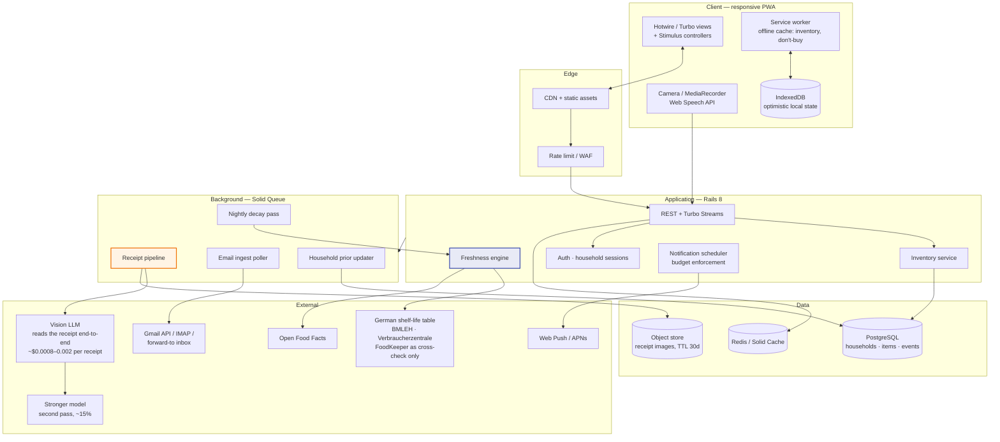
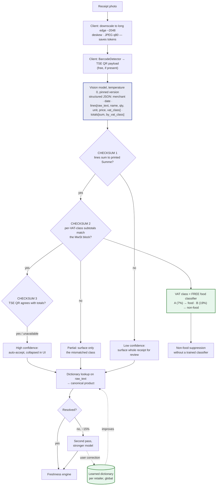
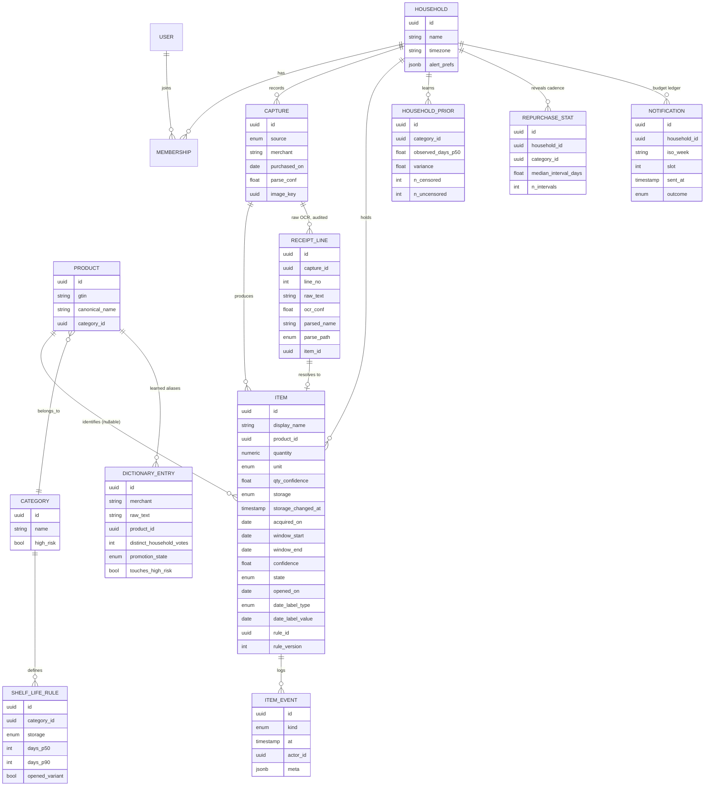
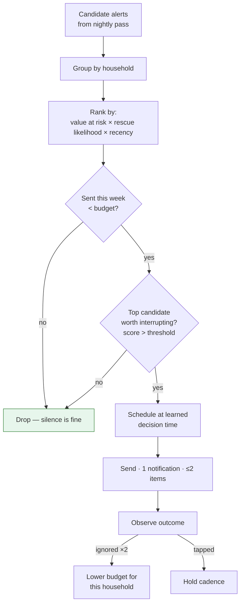

# 5. Technical Architecture

> **Launch market: Berlin → Germany → DACH** ([doc 11](11-germany-berlin-market.md)). The product
> is German-first: German UI strings, German receipt abbreviations, German date-label semantics.
>
> **Stated assumption:** this plan lives in a Ruby workspace, so the reference stack is
> **Rails 8 + Hotwire**. The architecture is stack-agnostic where it matters; §5.9 lists the
> alternative if the team is stronger in TypeScript. Flagging this rather than silently
> assuming it.

---

## 5.1 System overview



---

## 5.2 The receipt pipeline — VLM-first

> ⚠️ **Rewritten in [doc 12](12-technical-research-capture.md).** The original design specified a
> commercial receipt-OCR vendor with an LLM only as a fallback. That was a 2023 architecture.
> **A mid-tier vision model now reads a receipt end-to-end and returns structured JSON at
> ~$0.0008–0.002 — roughly 40× cheaper than negotiated OCR pricing.** The OCR vendor, the
> dual-sourcing requirement and the vendor-concentration risk are all removed.

Accuracy here still determines whether the product works at all (Risk R1) — but **the risk has
moved from cost to silent accuracy failure**, which is more dangerous because a VLM returns
fluent, confident JSON with no error bars.



### ⭐ Why the German market makes this architecture work

A VLM does not give per-field confidence scores, and **our entire doctrine — uncertainty bands,
what the sweep asks about, what surfaces in the review sheet — depends on knowing what we are
unsure of.** German receipts supply that for free, three times over:

1. **The Summe checksum.** Every receipt contains its own answer key. If the extracted lines do
   not sum to the printed total, the extraction is wrong, and we know it deterministically.
   **This single check recovers most of what per-field confidence gave us.**
2. **The VAT class as a food classifier.** German receipts mark each line with its rate —
   conventionally **`A` = 7%** (reduced, applies to *Grundnahrungsmittel*) and **`B` = 19%**
   (standard) — and the law requires the receipt to show what was taxed at which rate.
   **This largely satisfies [R1-AC2's ≥95% non-food suppression](03-product-strategy-prd.md) for
   free.** ⚠️ Strong prior, not a rule: alcohol and many beverages are 19%; books and plants are 7%.
3. **The TSE QR code.** Kassensicherungsverordnung receipts commonly carry a signed transaction
   record including amounts by VAT rate — a cryptographically-backed cross-check, readable in the
   browser via `BarcodeDetector`. ⚠️ **Payload varies by implementation (BSI TR-03153 / DSFinV-K);
   two days in Phase 0 to verify what real Edeka, REWE, Lidl and Aldi codes contain.**

### What the VLM must return, and why

`raw_text` **verbatim** alongside the normalised name. A VLM gives no bounding boxes, so the raw
line is the only provenance we get — and it is exactly the training pair the learned dictionary
needs (`"GRN GNT SWTCRN 340G" → Sweetcorn`). **The dictionary is more valuable under this
architecture, not less**: it is what lets us skip the second pass.

### Residual risks this architecture introduces

| Risk | Mitigation |
|---|---|
| **Hallucinated line items** — worse than an OCR error because they read correctly | Checksums catch price errors; two passes at temperature 0 compared for name drift (affordable at $0.0008/pass) |
| **Model deprecation** — the OCR vendor used to absorb this | Pin versions; **re-run the full 200-receipt eval on every model change.** A new standing ops cost |
| **Non-determinism in CI** | Temperature 0, pinned version, prompt hash recorded with each eval run |
| **Latency 3–10s on long receipts** | Upload-and-dismiss with async completion — already required by the ≤30s effort budget |
| **DSGVO** — images to a US model provider | One fewer processor than before. **Verify EU data residency and zero-retention terms before beta** |

**Evaluation harness before any UI work:** 200 real German receipts across the **10 chains that
cover ~80% of German grocery spend** (Edeka, REWE, Lidl, Aldi Nord, Aldi Süd, Kaufland, Penny,
Netto, dm, Rossmann), hand-labelled, **≥40% photographed by real households in their own kitchens**.
CI gate: ≥85% item-level F1 on a **defined** matching function, ≥95% non-food suppression, and
**100% checksum agreement on receipts we mark high-confidence** — that last gate is the one that
catches hallucination.

> 🇩🇪 **Two German specifics that shape this pipeline.**
> **(1) The Belegausgabepflicht guarantees the input.** Every till transaction issues a receipt by
> law, so paper-photo capture is the *primary* path, not a fallback — and email import is
> near-useless nationally, because German online grocery is only ~2.4% of retail volume.
> **(2) Edeka is a federation of independent retailers with non-uniform receipt formats.** It is
> the largest chain (€84.7bn) *and* the hardest to template. Budget for Edeka to take as long as
> the next three chains combined, and stratify the eval set to prove it.

## 5.3 Data model



**Key modelling decisions**

| Decision | Why |
|---|---|
| `ITEM.window_start` / `window_end` rather than one `expires_on` | Encodes uncertainty structurally. It is then *impossible* for the UI to render a fake precise date. This is architecture enforcing a product promise. |
| `ITEM.confidence` float | Drives auto-retirement and whether the sweep asks about it |
| `ITEM_EVENT` append-only log | Every rescue/waste/correction is training data; state is derived. Also gives us honest analytics. |
| `HOUSEHOLD_PRIOR` per category | Personalised shelf life — the retention moat. A household that eats spinach in 4 days should stop being warned at day 6. |
| `PRODUCT` nullable on `ITEM` | Loose broccoli has no GTIN and must still be a first-class item. Barcode-first schemas can't express this — that's a root cause of competitor failure. |
| Household is the tenant, not user | Food belongs to a home. Enforced by **Postgres row-level security** with a session GUC set in an `ApplicationJob` callback — *not* a Rails `default_scope`, which is convention and leaks through raw SQL and background jobs that have no session |
| `quantity` + `unit` + `qty_confidence` | ⚠️ *Added after review.* Without it, `BROCCOLI CROWNS 1.2 LB` discards the weight, partial consumption is inexpressible, and the don't-buy list ("6 eggs left", "milk plenty") is **not implementable**. Low confidence is fine — the UI can say "some spinach", which is consistent with the uncertainty doctrine |
| `opened_on` (a date, not a bool) | The ×0.35 multiplier applies to *remaining* life from the opening date. With a bool, milk opened on day 5 of a 10-day window is arithmetically undefined |
| `storage_changed_at` | "Freeze it" claims to reset the clock. Without a timestamp, freezing 8-day-old broccoli is indistinguishable from freezing fresh |
| `date_label_type` + `date_label_value` | **German launch: "Verbrauchsdatum" (safety — never extended) vs "Mindesthaltbarkeitsdatum/MHD" (quality — may extend) is *the* legally loaded distinction**, and the entire safety carve-out depends on it |
| `rule_id` + `rule_version` snapshotted on `ITEM` | Shelf-life rules are global. Without a snapshot, recategorising one product **silently re-dates live food in every household** and can fire notifications. Biggest migration hazard in the system |
| `RECEIPT_LINE` keeps the raw OCR text | Without it a bad parse cannot be audited, diffed against a user correction, retrained on, or scored for production F1 |
| `DICTIONARY_ENTRY` is a real table | It is described as the compounding asset and was **absent from the original ERD** |
| `NOTIFICATION` ledger with `UNIQUE(household_id, iso_week, slot)` | The 3/week cap is called an invariant; invariants need durable storage. A Redis counter is voided by a cache flush |
| `ITEM_EVENT` adds a `PARTIAL_USE` kind | Binary Used/Gone forces the user to lie, and the lie trains the priors |

> **Event-sourcing decision (was previously half-done):** `ITEM_EVENT` is an **append-only audit
> log**, and `ITEM` is the source of truth for current state. It is explicitly *not* a projection.
> That resolves the ambiguity, and it keeps GDPR erasure tractable — hard delete removes the
> household's rows outright rather than requiring crypto-shredding of an immutable log.

> **Sync decision (replaces last-write-wins):** LWW with no `updated_at`, no version vectors and
> an undefined client/server clock loses updates when two members sweep on two phones. Resolution
> is now **server-authoritative** with a `lock_version` per item; quantity changes are applied as
> **deltas**, never absolute writes, so two concurrent decrements both land.

---

## 5.4 The freshness engine

```
window = f(base_shelf_life, storage, opened, household_prior, printed_date)

1. printed_date read from label      → window = [printed-2d, printed+3d], conf 0.95
2. GTIN → product → category rule    → window = [p50*0.8, p90],           conf 0.80
3. text → category rule (FoodKeeper) → window = [p50*0.7, p90],           conf 0.60
4. unknown                           → global fallback by storage,        conf 0.30

then:  storage         →  FREEZER IS A LOOKUP, NOT A MULTIPLIER
                          (frozen chicken ~9 months, not 8 x a 2-day fridge window)
       opened          →  per-rule remaining-life DURATION from opened_on,
                          not a global x0.35 constant
       date_label_type →  German: VERBRAUCHSDATUM (safety) clamps hard and is NEVER extended;
                          MINDESTHALTBARKEITSDATUM (quality) may extend
       high_risk       →  hard-clamp to printed date, never extend
```

Shelf-life base data for the **German** launch: a **curated German top-200 perishables table**
built from **BMLEH / Verbraucherzentrale** guidance as the spine, **Open Food Facts** for
GTIN → product → category, with **USDA FoodKeeper as a cross-check only**.

> 🇩🇪 **This is a bigger job than the original plan implied.** The GfK study for the BMEL shows
> **35% of avoidable German household waste is fresh fruit and vegetables and 13% is bread and
> bakery** — 48% in two categories with no barcode, no printed date, and the least reliable public
> shelf-life data. **The German curation is therefore a genuine person-month on the critical path**,
> not a footnote, and it is budgeted as such.

> ⚠️ **Corrections from review, plus the German re-base.** (1) FoodKeeper publishes **ranges** ("3–5 days"), not
> distributions — the original `p50 × 0.8` manufactured percentiles that don't exist. Store the
> source range and state plainly that the band is heuristic. (2) **FoodKeeper is US guidance and does not fit a German
> launch** — different categories, different products, and different date-label law
> (MHD/Verbrauchsdatum vs best-before/use-by). The German top-200 table is **a person-month of
> food-science-adjacent research**, now budgeted as such. (3) **Open Food Facts is ODbL.** Share-alike may attach to a derived
> database, which is directly at odds with treating the learned dictionary as a proprietary moat.
> **Legal read required before any dictionary work begins** — logged as a Phase 0 blocker.

---

## 5.4b Consumption inference — the missing mechanism

> ⚠️ **Added after senior review, and it is the most important change in this document.**
> The engine above models **spoilage**. The doctrine in doc 2 promises that **consumption is
> inferred**. As originally written there was no consumption model at all — "inference" collapsed
> to *"assume it's gone at 130% of the window"*, which is a timer. Composed with an alert band of
> 80–130%, **the design fired alerts precisely in the window where food is most likely already
> eaten**: bought Saturday, eaten Monday, notified Wednesday. That is the trust cliff doc 1
> diagnoses, undefended.

**The signal we were ignoring is free.** Receipts reveal *repurchase cadence*. If a household
buys milk every six days, the milk is gone by day six regardless of shelf life — and this costs
the user nothing.

```
P(still present at day d) = survival( d ; household repurchase interval for this category,
                                          quantity bought, household size )

at_risk_score = P(still present)  ×  P(spoiling within 48h)

ALERT only when  P(still present) ≥ 0.6   AND   at_risk_score above threshold
```

`REPURCHASE_STAT` accumulates median intervals per household × category from capture history
alone. Cold start falls back to a global cadence table by category and household size.

**Consequences**
- Alerts stop firing on food that is statistically already eaten — directly attacking the
  ≤20% stale-alert target the reviewer expected to land at **40–55%** without this.
- Presence probability is also what makes the sweep cheap: we only ask about items where
  `P(still present)` sits in the genuinely ambiguous 0.4–0.7 band.
- **Build this before the receipt parser.** It determines whether the parser matters.

## 5.4c Per-household shelf-life learning — deferred out of v1

Cut from v1 on review. Three defects had to be fixed before it is worth building:

1. **Right-censoring.** "Used on day 6" means shelf life **≥ 6 days**, not = 6. Fitting a median
   to Used events estimates *time-to-consumption* and calls it *time-to-spoilage*. Treat
   Used/Froze as **right-censored** and only Gone/spoiled as uncensored; fit a Weibull with
   censoring (about a week of work, and correct).
2. **Self-confirmation.** We warn at day 8 → the user cooks at day 8 → we record 8 → we warn at
   day 7 → repeat. With no exogenous variation the estimator converges toward warning about
   everything immediately, **while the metric appears to improve.** Fix: randomise the alert day
   by ±1–2 days for a small holdout slice. Cheap, and it is the difference between a learning
   system and a feedback oscillator.
3. **`w = n/(n+5)` is a magic constant.** Real shrinkage weights by variance ratio
   `σ²_between / (σ²_between + σ²_within/n)`, which requires `variance` in the schema — now added.
   At n=6 the old formula gave a household prior 55% weight on six confounded observations.

**Validation is no longer circular.** The old AC — "validate against FoodKeeper" — measured
nothing, because FoodKeeper *is* the training source. Replaced by: hold out 20% of categories
from the rule table and measure on those, plus ground truth from the Phase 0 diary study.

---

**Nightly decay pass** (Solid Queue cron): recompute states, mark ghosts, enqueue notification
candidates. O(items) — trivially cheap, runs in the household's local early morning.

---

## 5.5 Notification budget enforcement

The 3/week cap is a **server-side invariant**, not a UI preference — otherwise it will erode
under growth pressure from some future quarter's engagement target.



Note the design bias: **the default path is to send nothing.** An alert must earn its way out.

---

## 5.6 Privacy & security

Receipts are among the most sensitive consumer data that exists — they reveal health,
religion, pregnancy, addiction, and income. This deserves more care than the category has
historically shown.

| Control | Implementation |
|---|---|
| Email scope | Read-only, single label/folder, or a forward-to address as the default (no mailbox access at all) |
| Receipt images | Encrypted at rest, **auto-deleted after 30 days**, never used for training without explicit opt-in |
| Non-food lines | Pharmacy, alcohol, and other sensitive line items **discarded at parse time, never persisted** |
| Data sale | Never. Written into the privacy policy and the ToS as a binding commitment. **In Germany this is worth more than anywhere else** — make it a headline claim, in German, on the landing page. If the business model ever requires it, we change the business model. |
| Retention | Full export + hard delete, self-serve, ≤30 days to complete |
| Auth | Passkeys first, magic link fallback. No passwords. |
| Multi-tenancy | Every query scoped by `household_id`; enforced at the model layer, not by convention |
| LLM calls | Zero-retention endpoints; item strings only, never full receipts with totals/payment data |
| **OCR endpoint identity** | ⚠️ *Added after review.* "No account wall before value" left **the most expensive endpoint in the system unauthenticated** — anyone could use Crisper as a free receipt-OCR API. A device-bound token plus per-device and per-IP rate limits is required **before the first OCR call**, shipped pre-beta. Free-tier abuse was not a risk; it was the default configuration |
| **Dictionary poisoning** | ⚠️ Corrections are **per-household by default**; global promotion requires **k ≥ 5 independent households**; a correction may **never** downgrade `CATEGORY.high_risk` without human review; corrections are rate-limited and carry provenance for rollback. Without this, remapping a high-risk item into a low-risk category silently removes the safety carve-out for every future user |
| **OCR vendor data-use terms** | ⚠️ Several commercial document-AI vendors reserve rights to train on submitted documents outside enterprise tiers. Until the contract is read, *"never used for training"* is a claim we cannot make. Dual-source from day 1 |
| **Honest scope of the privacy promise** | ⚠️ "Sensitive lines discarded at parse time" is true of *our database only* — they are still transmitted to the OCR vendor and still visible in the 30-day image. The promise must be worded to say exactly that |
| International transfer | EU receipt images to US OCR/LLM requires **SCCs plus a transfer impact assessment** — or an EU-resident vendor, which is the preferred answer here |
| Hosting | **EU region only.** German consumers are the most privacy-conscious in Europe; US-region storage of receipt images is a conversion problem as well as a legal one. Prefer an **EU-resident OCR vendor** even at a premium |
| Payments | **PayPal + SEPA Lastschrift on web checkout.** German card penetration is ~11% of online purchases — the lowest of any major Western economy — so card-only checkout would silently halve conversion, and app-store IAP is card-centric. Web-first also avoids the 15–30% store cut |
| Compliance | **DSGVO + BDSG**, and Germany's **Kündigungsbutton** requirement (a compliant one-click cancel for online subscriptions) before the paywall goes live. **DPIA moved into Phase 0** — receipts are processed from beta start, and Art. 35 requires the assessment *prior to* processing, not after |

> This is also a **differentiator**. "We never sell your shopping data" is a credible, checkable
> promise that Cooklist-style retailer integrations structurally cannot make.

---

## 5.7 PWA vs native: the honest tradeoff

| Capability | PWA (2026) | Verdict |
|---|---|---|
| Camera capture | ✅ `getUserMedia` / file input | Fine |
| Web Push, incl. iOS 16.4+ | ⚠️ iOS requires install-to-home-screen first, and **there is no install-prompt API** — observed custom-prompt install rates are 5–20% | **Existential, not a risk line** — though **less bad in Germany than the UK**: Germany is Android-dominant (iOS roughly 35–40% vs ~50% in the UK), so exposure is reduced, not removed. Still **~25–30% of the German user base would never receive the mechanic doc 4 calls "the product"** |
| **Notification action buttons** | ❌ **Safari Web Push does not support them.** Works on Chrome/Android | Doc 4 originally drew a two-button lock-screen notification **that cannot exist on half the target market**. Redesigned to a single action; two-button is now an Android/native enhancement |
| Offline | ✅ Service worker + IndexedDB | Fine |
| Voice input | ⚠️ Web Speech patchy on iOS | Fall back to audio upload + server transcription |
| Background sync | ⚠️ Limited on iOS | Server-side scheduling instead — we already do this |
| Install friction | ❌ Meaningful drop-off vs App Store | Mitigate with a well-timed install prompt *after* the first value moment |

**Decision: PWA for v1**, with three corrections from review:

1. **An email fallback alert channel ships in v1.** One day of work, it works everywhere, and a
   17:00 email is a legitimate delivery mechanism for this use case. Previously there was **no
   fallback at all** if push was unavailable.
2. **The native decision moves before the retention gate, not after.** Measuring G2 on a
   population where a large minority never received push makes the gate uninterpretable — we
   would either kill a working product for a platform reason, or pass on Android-skewed data and
   be surprised at launch. Ship the thin iOS shell *during* the beta, or stratify G2 explicitly by
   platform and push status.
3. **Auto-capture is a second, independent reason for the shell.** ML Kit Document Scanner
   (Android) and VisionKit (iOS) both provide automatic edge detection and shutter — removing 3–5
   seconds from every capture. On the web, the **Shape Detection API is broken on iOS 18** and was
   never Baseline, and an OpenCV.js fallback is a multi-MB WASM payload at ~10–15 fps with a
   documented battery cost. **Ship plain photo capture on the web in v1; add auto-capture in the
   native shell in v2. Do not build the OpenCV.js version.** (`BarcodeDetector` is the exception —
   better supported, and we need it for the TSE QR.)
4. **The native shell is 2–3 engineer-months, not one** — shell + APNs + App Store review for a
   food app + privacy nutrition labels + a second release train.

---

## 5.8 Unit cost model — corrected twice

> ⚠️ **Correction 1 (senior review):** the original model priced OCR at list rates we would not
> get as a small account and — the real error — computed **cost per household** while revenue
> arrives **per paying household**. At 6% conversion, 94% of users are pure COGS.
> ⚠️ **Correction 2 ([doc 12](12-technical-research-capture.md)):** the OCR vendor is gone.
> **VLM-first extraction costs ~$0.0008–0.002 per receipt against $0.04–0.08 for negotiated OCR.**

**Per paying household per month, at 10k households:**

| Component | Before (OCR vendor) | **Now (VLM-first)** | Assumption |
|---|---|---|---|
| Receipt parsing | €0.28 | **€0.02** | *5 receipts/mo; ~1,550 image tokens + ~900 output; 15% second pass* |
| Separate LLM normalisation | €0.02 | *included* | |
| Infra, storage, push (EU region) | €0.05 | €0.05 | |
| **Direct COGS** | €0.35 | **€0.07** | |
| Allocated free-tier cost | €0.40 | **€0.04** | *~32 free users/payer; ~20% monthly-active; 2 scans/mo cap* |
| **Fully loaded COGS** | **€0.75** | **€0.11** | |
| Net ARPU | €2.19 | €2.19 | |
| **Gross margin** | 66% | **95%** | |

**This is the first version of the model where the free tier is nearly free to serve** — ~€0.006
per free active household per month. The engineering reviewer's "free-tier abuse is the default
configuration" finding still stands and **rate limits are still required**, but the blast radius
is 40× smaller.

**The bootstrap problem is also much smaller.** At launch the dictionary is empty and every line
goes to the model — but "every line" now costs $0.002, not $0.08. **Costs no longer peak
dangerously when cash is scarcest.**

**Free tier: 2 receipt scans/month.** Retained despite the cost collapse — not for cost reasons
now, but because it is the correct packaging line ([§6.2](06-business-plan-roadmap.md)).

⚠️ **What did not improve:** cheaper parsing barely moves the *blended* break-even
(96,500 → ~92,000 active households), because the hand-off commission dominates contribution
([§10.6](10-frameworks-and-financials.md#106-break-even-analysis)). **The gain is risk reduction,
not volume.**

## 5.9 Alternative stack

If the team is TypeScript-strongest: Next.js (App Router) + Postgres (Neon/Supabase) +
Inngest/Trigger.dev for jobs + the same external services. **Do not pick a stack for novelty.
The receipt pipeline is the hard part; everything else is CRUD.**

## 5.10 Non-functional targets

| Metric | Target |
|---|---|
| LCP, mid-tier Android, 4G | < 2.0 s |
| Today screen interactive from icon tap | < 1.0 s (cached shell) |
| Receipt parse p50 / p95 | < 6 s / < 15 s |
| Uptime | 99.5% (v1), 99.9% (post-PMF) |
| Timezone-sharded decay passes (24+ per day), 100k households | < 10 min per shard |
| **Model-version eval re-run** | On every VLM version change, the full 200-receipt eval must pass before rollout. ⚠️ *A new standing ops cost — the OCR vendor used to absorb this* |
| **Alert-volume SLO** | alerts per 1,000 households per week must stay inside a band — outside it, page. ⚠️ *Added after review: the failure mode of this system is silence, which is also the designed happy path. If the decay pass dies or push subscriptions expire en masse, the product is invisibly dead and no user will report it.* A synthetic canary household exercises the full loop hourly |
| Push delivery p95 | < 60 s of scheduled time |
