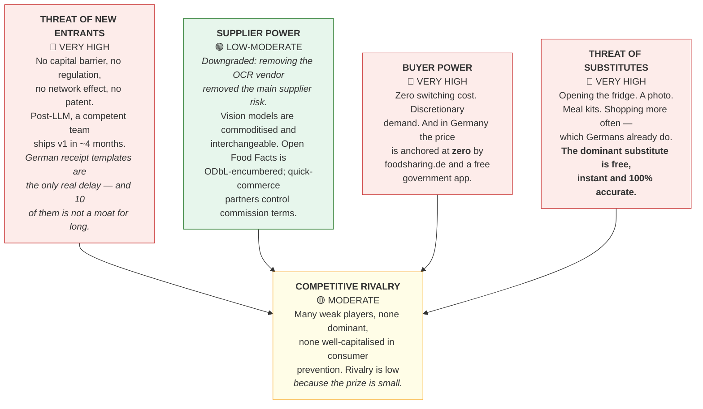
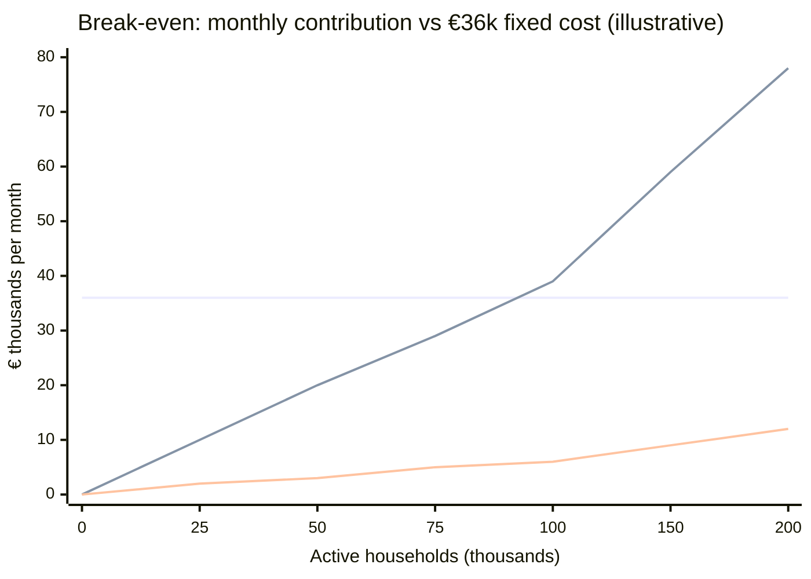

# 10. Formal Analysis — Frameworks & Financial Statements

*The frameworks investors expect, applied honestly to a **Berlin → Germany → DACH** launch.
Where a framework is shallow for this business, that is said rather than padded.
All figures in **€**; canonical market data in [doc 11](11-germany-berlin-market.md).*

---

## 10.1 Business Model Canvas

```mermaid
flowchart TB
    subgraph R1[" "]
      direction LR
      KP["🤝 <b>KEY PARTNERS</b><br/>Vision-model provider (EU residency)<br/><i>no OCR vendor — see doc 12</i><br/>Open Food Facts (⚠️ ODbL)<br/>BMLEH / Verbraucherzentrale data<br/>Flink · REWE · Knuspr · Picnic (hand-off)<br/>Berliner Bezirke · EXIST · IBB Ventures"]
      KA["⚙️ <b>KEY ACTIVITIES</b><br/>German receipt→item normalisation<br/><b>Consumption inference</b><br/>Shelf-life modelling (MHD vs Verbrauchsdatum)<br/>Notification restraint<br/>Efficacy evidence generation"]
      VP["🎁 <b>VALUE PROPOSITION</b><br/><b>“Unter 3 Minuten pro Woche —<br/>und du wirfst nichts mehr weg.”</b><br/><br/>You never maintain a list.<br/>We guess, and we forget<br/>when we stop believing<br/>our own guess.<br/><br/><i>Wir machen den Bon nützlich.</i>"]
      CR["💬 <b>CUSTOMER RELATIONSHIPS</b><br/>Deliberately low-touch<br/>≤3 notifications/week<br/>Self-serve, no account wall<br/>Household-shared, not personal<br/>German-first, privacy-forward"]
      CS["👥 <b>CUSTOMER SEGMENTS</b><br/><b>Primary:</b> time-poor families,<br/>outer Bezirke + Brandenburg —<br/>high waste, low adoption<br/><b>Secondary:</b> Berlin singles —<br/>low waste, high adoption<br/>(<b>50% of Berlin households</b> —<br/>they will flatter every metric)"]
    end
    subgraph R2[" "]
      direction LR
      KR["🏗 <b>KEY RESOURCES</b><br/><b>German retailer dictionary (10 chains)</b><br/><b>Household priors + repurchase data</b><br/>German shelf-life table<br/>Small senior team, grant-funded"]
      CH["📣 <b>CHANNELS</b><br/>Referral / household invite (€6 CAC)<br/>Assistant-native MCP (€12)<br/>Bezirke · BMLEH partnerships (€16)<br/>Short-form video, Bon-scan demo (€28)<br/>German SEO (€30, AI-threatened)<br/>❌ Paid social (€140 — unviable)"]
    end
    subgraph R3[" "]
      direction LR
      CO["💸 <b>COST STRUCTURE</b><br/>Team ~92% of costs (fixed) — <b>~€110k/yr offset by EXIST/Stipendium in Y1</b><br/>Variable cost is now trivial: <b>~$0.0015 per receipt</b> via a vision model<br/>Fully loaded COGS €0.11/paying household/month → <b>95% gross margin</b><br/>Fixed base, lean team: <b>~€36k/month</b>"]
      RS["💰 <b>REVENUE STREAMS</b><br/>Subscription €29/yr (65%) / €3.49/mo (35%) · Lifetime €69<br/><b>Quick-commerce basket hand-off — the real model</b><br/>Web checkout via <b>PayPal + SEPA</b> (cards are only ~11% in DE)<br/>❌ Never: selling shopping data"]
    end
    R1 --> R2 --> R3
```

**The canvas's own verdict:** value proposition and cost structure are sound; **the revenue stream
is the weak cell** — value is created where no transaction occurs. The Berlin hand-off is the
patch, and it is why the launch city is Berlin rather than Germany at large.

---

## 10.2 SWOT

*SWOT is usually shallow. It earns its place only because each cell carries a consequence.*

| | Helpful | Harmful |
|---|---|---|
| **Internal** | **STRENGTHS** • A named technical insight nobody has shipped: **repurchase-cadence consumption inference** • Doctrine that attacks the category's known killer (drift) • Two independent senior reviews already absorbed • Privacy position **worth more in Germany than anywhere** — Germans are Europe's most privacy-conscious consumers • **~€110k of the round is non-dilutive** (EXIST / Startup Stipendium) • Small team, low fixed base | **WEAKNESSES** • **Pre-revenue, pre-product, no traction, no pre-orders, no company yet** • No distribution and no audience • **Cannot buy customers** — paid CAC €140 vs €42 subscription LTV • No proprietary data until ~10k receipts per chain • **Berlin's demographics are wrong for the primary segment** (50% single-person households) • Team unproven in this domain **[FOUNDER TO COMPLETE]** |
| **External** | **OPPORTUNITIES** • ⭐ **Belegausgabepflicht** — German law hands every shopper a receipt, the best capture substrate in Europe • ⭐ **German receipts carry their own error-checking** — the Summe checksum, the A/B VAT class as a free food classifier, and the TSE QR code — which is exactly what a vision LLM lacks • **VLM-first parsing at ~$0.0015/receipt** takes gross margin to ~95% and makes the free tier nearly free to serve • **35% of avoidable German waste is fresh produce, 13% bakery** — exactly the barcode-less food our design targets • 10 receipt templates cover ~80% of German grocery spend • **Berlin is Europe's most competitive online-grocery city** — where the hand-off works • Post-LLM parsing removed the constraint that killed Kitche • **Nobody has published an efficacy figure** — first credible proof is a moat and a channel key • BMLEH "Zu gut für die Tonne!" has already done the awareness job | **THREATS** • **15-year category failure record**, structural not executional • **foodsharing.de and the BMLEH app anchor the price at zero** in German minds • **SirPlus's insolvency** — a famous Berlin food-waste brand with real stores, and it still failed • **German online grocery is only ~2.4% nationally** — the hand-off does not travel outside big cities • NoWaste.ai can ship the same thing; no tech moat • AI Overviews eroding the one affordable channel • **Selection bias: buyers ≠ sufferers** |

---

## 10.3 Porter's Five Forces — is this industry structurally profitable?

*The most useful framework for this business, and the answer is uncomfortable.*

> **Verdict: structurally unattractive.** Three of five forces at maximum (supplier power was
> downgraded after [doc 12](12-technical-research-capture.md) removed the OCR vendor), and **buyer power is
> worse in Germany than the UK** because a volunteer network and a state app have set the
> reference price at zero. That explains the graveyard better than any story about bad UX.
>
> **Structurally unattractive industries can still contain good businesses — but only by changing
> the game.** Two moves are available:
> 1. **Move to where a transaction exists** — the Berlin quick-commerce hand-off — converting
>    buyer power from a price ceiling into an aligned revenue event.
> 2. **Build the assets that compound** — the German retailer dictionary and household consumption
>    priors. Both improve with use and cannot be copied by a new entrant on day one.
>
> Everything else in this plan is table stakes.

---

## 10.4 PESTEL — Germany

| Factor | Relevant forces | Net effect |
|---|---|---|
| **Political** | German **National Strategy for Food Waste Reduction**, SDG 12.3 targets, BMLEH "Zu gut für die Tonne!"; Berlin Senat and Bezirk waste-reduction budgets; EXIST and IBB as instruments of policy | ✅ **Strong tailwind** — non-commercial channels, grant money, and an established public vocabulary |
| **Economic** | Food inflation has raised the salience of grocery spend; discounters gaining share (Aldi Nord +5.1%); but a discretionary €3/mo subscription is the first thing audited away | ⚖️ **Mixed** — helps the pitch, hurts the renewal |
| **Social** | High stated environmental concern, weakly acted on; **Berlin is 50% single-person households** — wrong demographic for the primary segment; strong civic/volunteer culture around food (foodsharing) | ⚠️ **Deceptive** — do not read German environmental attitudes as demand |
| **Technological** | Post-LLM receipt parsing (enabling); **Belegausgabepflicht guarantees the input** (enabling, and unique); AI Overviews eroding informational SEO (harmful); **online grocery only ~2.4% nationally** (harmful to the revenue model outside cities) | ⚖️ **The strongest enabler and a real constraint in the same column** |
| **Environmental** | 10.9m t of German food waste, 58% from households, ~79 kg/person/yr; strong ESG narrative; **the Bonpflicht's paper waste is a live public grievance we can attach to** | ✅ Supports credibility, partnerships and PR |
| **Legal** | **DSGVO + BDSG** on high-sensitivity receipt data; **Verbrauchsdatum vs MHD** food-safety liability; **UWG** substantiation rules enforced by competitor *Abmahnung*; **Kündigungsbutton** for online subscriptions; **ODbL** on Open Food Facts; UG→GmbH company form | 🔴 **The heaviest quadrant, and heavier than the UK.** Four items (DPIA, ODbL, Kündigungsbutton, food-safety wording) can each stop the project |

---

## 10.5 The three statements

### P&L — Path A (lean), €k

| | Y1 | Y2 | Y3 | Y4 | Y5 |
|---|---|---|---|---|---|
| Subscription revenue | 14 | 78 | 234 | 470 | 780 |
| Hand-off commission | 24 | 164 | 436 | 850 | 1,370 |
| **Total revenue** | **38** | **242** | **670** | **1,320** | **2,150** |
| Cost of sales | (6) | (17) | (40) | (66) | (108) |
| **Gross profit** | **32** | **225** | **630** | **1,254** | **2,042** |
| *Gross margin %* | *84%* | *93%* | *94%* | *95%* | *95%* |
| Staff costs *(net of €110k EXIST/Stipendium in Y1)* | (295) | (405) | (475) | (585) | (720) |
| Marketing | (25) | (48) | (72) | (110) | (160) |
| Legal, insurance, professional | (32) | (26) | (28) | (36) | (46) |
| Infrastructure & tools | (23) | (31) | (33) | (42) | (52) |
| Other operating | (20) | (30) | (32) | (27) | (43) |
| **Total operating costs** | **(395)** | **(540)** | **(640)** | **(800)** | **(1,021)** |
| **Operating profit / (loss)** | **(363)** | **(315)** | **(10)** | **+454** | **+1,021** |

*Hand-off commission carries no cost of sales, which is why blended margin rises with the revenue
mix. The Y1 margin is lower because the retailer dictionary is empty and more receipts take a
second pass.*

### Balance sheet — opening, post-pre-seed (€k)

| Assets | | Liabilities & equity | |
|---|---|---|---|
| Cash | 360 | Trade payables | 10 |
| Prepayments (OCR credits) | 12 | **Convertible loan (Wandeldarlehen)** | **250** |
| Intangibles (capitalised dev) | 0 | **Total liabilities** | **260** |
| | | Share capital (UG) | 25 |
| | | Grant income (EXIST/Stipendium) | 110 |
| | | Retained losses | (23) |
| **Total assets** | **372** | **Total equity + liabilities** | **372** |

*No bank debt. No fixed assets of substance. Development costs expensed, not capitalised — the
conservative treatment investors prefer, and it avoids an argument later. Note the convertible
sits as a liability until conversion.*

### Cash flow — summary (€k)

| | Y1 | Y2 | Y3 |
|---|---|---|---|
| Operating cash flow | (350) | (300) | (5) |
| Financing (pre-seed + grant + seed) | 790 | 350 | — |
| **Net movement** | **+440** | **+50** | **(5)** |
| **Closing cash** | **440** | **490** | **485** |

**Burn: €21k/mo (Phase 0) → €43k/mo (post-team).**
**The €360k pre-seed funds ~11 months. Seed must close by month 10 → start raising month 6.**
Monthly 18-month detail in [§9.8](09-investor-pack.md#98-forecast-cash-and-break-even).

---

## 10.6 Break-even analysis

**Fixed costs (lean team of 5 in Berlin): ~€36,000/month.**

| Model | Contribution/unit/month | Break-even volume | % of German SAM |
|---|---|---|---|
| Subscription only | €2.08 per paying household | **17,300 payers ≈ 577k installs** | 28% ⚠️ |
| + hand-off, base case | €0.392 per **active** household | **~91,800 actives ≈ 278k installs** | 14% ⚠️ |
| + hand-off, best case | €0.65 per active household | **~55,400 actives** | 8% ✅ |

⚠️ **VLM-first parsing improved the subscription-only row from 41% to 28% of SAM — real, but still
not a standalone path. The blended row barely moved, because the hand-off dominates contribution.**

**The gap between those two lines is the entire commercial argument of this plan.**

⚠️ **And Berlin alone cannot reach either line.** Berlin's whole SAM is ~97,000 installs — roughly
32,000 active households at full saturation, against a base-case break-even of ~96,500.
**Berlin proves the loop; Germany pays for it.**

---

## 10.7 Scenario and sensitivity analysis

The model has exactly two variables that matter. Everything else is noise by comparison.

### Sensitivity — Year 3 revenue (€k)

| | Hand-off adoption **6%** | **12%** (base) | **20%** |
|---|---|---|---|
| **Capture compliance 35%** (reviewer's prediction) | 175 | 268 | 396 |
| **Capture compliance 55%** (base) | 372 | **670** | 1,062 |
| **Capture compliance 70%** | 516 | 942 | 1,495 |

### Three cases

| | **Worst** | **Base** | **Best** |
|---|---|---|---|
| Capture compliance @ wk 6 | 35% | 55% | 70% |
| Free→paid conversion | 1.5% | 3% | 5% |
| Monthly churn | 12% | 8% | 5% |
| Hand-off adoption | 6% | 12% | 20% |
| Blended CAC | €33 | €20 | €12 |
| **Y3 revenue** | **€175k** | **€670k** | **€1.50m** |
| **LTV/CAC** | **0.9×** | **3.1×** | **7.2×** |
| **Break-even** | never at this cost base | month 36 | month 26 |
| **Outcome** | Shut down or pivot to B2B | A real, modest business | Venture-viable |

> **The worst case is not a tail risk — it is the outcome one reviewer explicitly predicted**
> (*"compliance decays to the 30s"*). Any investor should be shown this column first.

**A third variable that only matters in Germany:** *hand-off availability outside the big cities.*
With national online grocery at ~2.4%, Germany-wide rollout raises subscription volume and
**lowers** per-user economics. Model it as a declining hand-off adoption rate as the install base
moves beyond Berlin, Hamburg, Munich, Cologne and Frankfurt.

---

## 10.8 Discounted cash flow

*DCF for a pre-revenue company is close to meaningless. It is included because it was asked for,
and because the honest output is more useful than a flattering one.*

**Inputs:** Path A free cash flows Y1–Y5; terminal value at Y5 = **3× revenue = €6.45m**
*(consumer subscription apps trade ~2–5× ARR privately; 3× is mid-band)*; discount rate 45%
*(standard for pre-seed, pre-revenue)*.

| | Y1 | Y2 | Y3 | Y4 | Y5 | Terminal |
|---|---|---|---|---|---|---|
| Free cash flow (€k) | (363) | (315) | (10) | 454 | 1,021 | 6,450 |
| Discount factor @45% | 0.690 | 0.476 | 0.328 | 0.226 | 0.156 | 0.156 |
| **Present value (€k)** | (251) | (150) | (3) | 103 | 159 | **1,006** |

**NPV ≈ €864k.** Sensitivity: **€548k at a 55% discount rate; €1.36m at 35%.**
*(Up from €649k before [doc 12](12-technical-research-capture.md) removed the OCR vendor.)*

> **The honest conclusion: DCF still does not support a €2.5m cap** — though the gap has narrowed
> from roughly 4× to 3× on the back of the margin improvement. The valuation rests on comparables
> and option value — the normal basis at pre-seed — **not on projected cash flows.**
> **That is precisely why the instrument is a convertible.** A convertible defers the valuation
> argument until the concierge test has produced evidence to have it with; a priced round now
> would be an argument we would lose on the arithmetic. Any investor who runs this model arrives
> at the same number, and a founder who has already done it is more credible than one who is
> surprised by it.

---

## 10.9 Comparable company multiples

| Comparable | Data point | Implication for us |
|---|---|---|
| **Yummly** (acq. Whirlpool, 2017) | Last valued **$100m** with **20m registered users** → **~$5/registered user**; had raised ~$23m | At Path A Y3 (450k installs) this implies **~$2.25m / €2.1m** — a modest strategic outcome, consistent with the bottom-up TAM |
| **Whisk** (acq. Samsung NEXT, 2019 → Samsung Food) | Undisclosed | Appliance makers **are** active acquirers of food software. A real exit path, and a reason to keep the data asset clean and portable |
| **Kitche** (acq. Remy, Feb 2025) | Undisclosed; framed as carrying the vision forward | **The realistic base case for this category is a soft landing to a strategic buyer**, not a scale outcome |
| **SirPlus** (Berlin) | **Insolvency, then a return online in 2026** | ⚠️ **The local downside comparable.** A famous Berlin food-waste brand with retail stores and a celebrated founder — and the economics still broke. Expect this in the room |
| **Too Good To Go** | €610m revenue, 120m users | Different model. The lesson is the multiple *shape*: transaction businesses get priced on revenue, prevention apps on users |
| **KptnCook / Bring!** (DACH) | Large German installed bases, private | The most plausible **domestic** acquirers — adjacent product, same user, complementary data |
| Consumer subscription apps (private) | ~2–5× ARR | Path A Y5 (€2.15m revenue) → **€4.3–10.8m enterprise value** |

**Read together:** the credible outcome range for Path A is **€2–11m**, with a strategic acquirer
(appliance, grocery, DACH recipe app, insurer) far more likely than an independent scale outcome.
**That is a good outcome against €360k with a third non-dilutive, and a poor one against a €1m
equity seed** — which is exactly why the ask was resized and restructured.

---

## 10.10 Cohort analysis — the table that decides everything

Not a retrospective exercise; the instrumentation must exist **from beta day one**. The category's
failure is a retention failure, and retention failures only show up in cohorts.

| Weeks since first capture | W1 | W2 | W3 | W4 | W6 | W8 | W12 | W24 |
|---|---|---|---|---|---|---|---|---|
| **Capture compliance** (shops captured ÷ shops taken) | 78% | 62% | 51% | 45% | 38% | 31% | 26% | ? |
| **Value-received retention** (captured *or* resolved an alert) | 92% | 70% | 55% | 47% | 38% | 33% | **25%** | ? |
| **Alert precision** (marked useful) | 41% | 48% | 55% | 58% | 62% | 65% | 68% | ? |
| Rescues per household per week | 1.2 | 1.6 | 1.9 | 2.0 | 2.1 | 2.2 | 2.2 | ? |
| Hand-off baskets per active household | — | 0.02 | 0.05 | 0.08 | 0.11 | 0.12 | 0.12 | ? |

*Figures are the **base-case model**, not observations — nothing has been measured yet.*

**Cohorts must be cut by:**
- **Household size and presence of children** — non-negotiable in Berlin, where 50% of households
  are single-person. Without this cut, the Berlin-single cohort will flatter every number.
- **Bezirk** — Kreuzberg and Marzahn-Hellersdorf are different countries for this product.
- Acquisition channel; platform and push-enabled status (or G2 is uninterpretable); shopping
  frequency; and **hand-off availability** at the household's postcode.

**The one line to watch:** if **capture compliance and alert precision do not cross** — if the
model doesn't get more useful faster than the user gets more forgetful — the product does not
work, regardless of what any other metric says.

---

## 10.11 Research methods — what has been done, and what has not

### Done (secondary research only)
Competitor teardown across 15 products including the German field; a technical capture study
covering vision-LLM receipt extraction economics, browser and native auto-capture support, and
in-fridge camera precedent ([doc 12](12-technical-research-capture.md)); EU LOWINFOOD outputs;
BMLEH/Destatis/GfK German waste data; WRAP and ReFED national datasets; four peer-reviewed RCTs
and three systematic reviews; app-store review corpora; 2026 subscription benchmarks (RevenueCat,
Business of Apps); German grocery, quick-commerce and payments data; Berlin funding programmes;
two independent senior engineering reviews of this plan.

### Not done — and this is the honest gap
| Method | Status | Why it matters |
|---|---|---|
| **Customer interviews** | ❌ **None conducted** | Zero primary evidence. Every user-side claim here is inferred |
| **Concierge study** | ⏳ Designed, funded by this round | **The go/no-go.** Revealed behaviour, not intent. **25 households, outer Berlin Bezirke, ≥16 with children** |
| **Pre-sale** | ❌ Not attempted | **Pre-orders are the strongest demand evidence there is.** 100 × €19 lifetime licences is the cheapest credible next step |
| **German receipt corpus** | ❌ Not collected | 200 receipts across 10 chains, ≥40% photographed by real households, before any parser claim |
| **TSE QR payload verification** | ❌ Not done | 2 days. If German receipt QR codes carry per-VAT-rate totals as expected, it is **the cheapest high-confidence signal in the pipeline** |
| **Observing households unpack** | ⏳ Folded into the concierge test | Free. Settles the auto-capture and in-fridge-camera questions with evidence instead of argument |
| **Survey** | 🚫 **Deliberately declined** | §8.2: stated intent overstates revealed preference by ~an order of magnitude here. A survey would produce an encouraging number and teach us nothing |
| Competitor financials | ⚠️ Partial | German competitors file at **Bundesanzeiger** — cheap, public, and not yet pulled. Do this before the first investor meeting |

> **The single most valuable next research action is not more desk research.**
> It is **25 Berlin households and a WhatsApp group**, followed by **taking €19 off a hundred
> strangers.**
