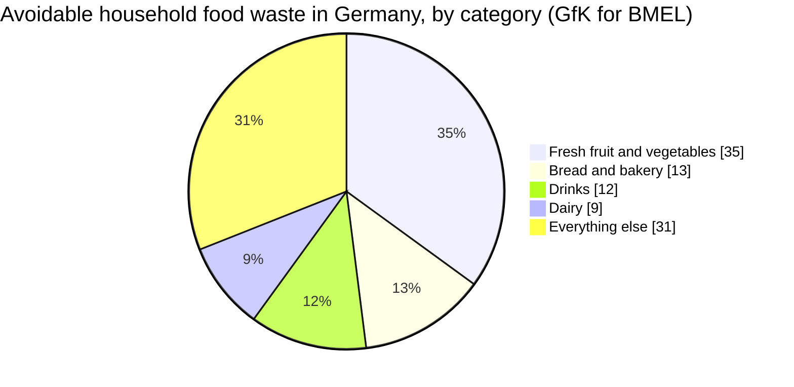
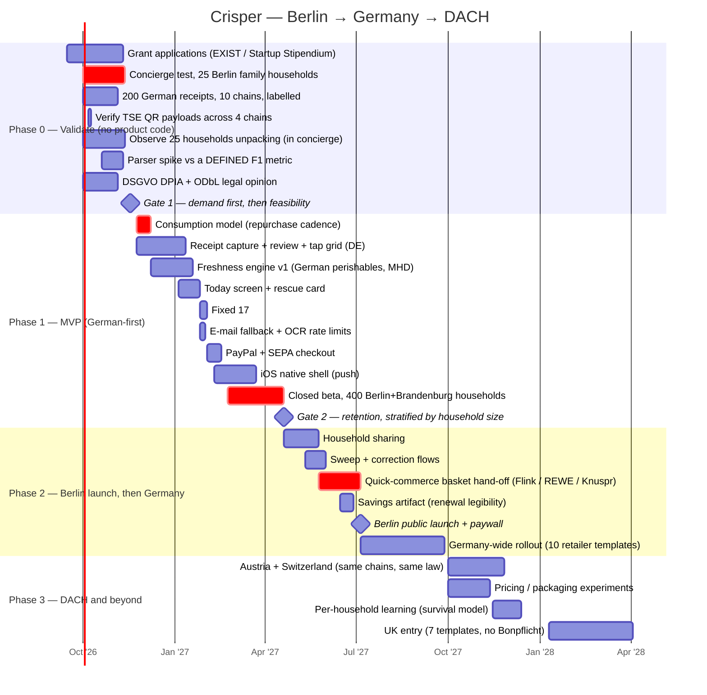

# 11. Germany & Berlin — Launch Market Analysis

> **Decision: launch in Berlin, scale to Germany, then DACH.** The UK moves to phase 3.
> This document sets the canonical market figures used by every other document in this set.

---

## 11.1 Why Germany beats the UK as the launch market

Four reasons, one of which is decisive.

### ⭐ 1. The Belegausgabepflicht — Germany hands every shopper a receipt, by law

Since **1 January 2020** (Kassengesetz / KassenSichV), every business with an electronic till in
Germany **must issue a receipt for every transaction** — regardless of the amount, and **even if
the customer does not want one**. A €0.80 Brötchen generates a Bon.

**This is the single most important fact in this document.** Our entire capture thesis rests on
the user having a receipt in their hand. In the UK, shoppers increasingly decline paper and
retailers push digital-only. **In Germany, the receipt is a legal artefact that is physically
placed in the customer's hand several times a week.**

The law is also widely resented for the paper it wastes — which hands us an unusually clean
narrative: **"Wir machen den Bon endlich nützlich."** *(We finally make the receipt useful.)*
That is a real, live public grievance we can attach to, not a manufactured one.

The law also permits **electronic receipts with customer consent** — via QR code, email, or an
app. That is an explicit, legally-sanctioned integration path that does not exist in UK law.

### ⭐ 1b. German receipts carry their own error-checking — which is exactly what a vision LLM lacks

[Doc 12](12-technical-research-capture.md) replaces the commercial OCR vendor with a vision model
reading the receipt end-to-end at ~40× lower cost. The one thing that architecture gives up is
**per-field confidence scores** — and German receipts hand them back, three times over:

1. **The Summe checksum** — extracted lines must sum to the printed total. Every receipt contains
   its own answer key.
2. **The VAT class as a free food classifier** — German receipts mark each line **`A` = 7%**
   (reduced rate, *Grundnahrungsmittel*) or **`B` = 19%** (standard), and the law requires the
   receipt to show what was taxed at which rate.
3. **The TSE QR code** — Kassensicherungsverordnung receipts commonly carry a signed transaction
   record including amounts by VAT rate, readable in-browser via `BarcodeDetector`.
   ⚠️ *Payload varies by implementation; two days in Phase 0 to verify.*

**Taken together with the Bonpflicht, Germany is not merely a convenient launch market for a
receipt-based product — it is the best-instrumented one in Europe.**

### 2. Retailer concentration makes the template moat cheap

| Group | German revenue (2025) | Visit share |
|---|---|---|
| **Edeka** | €84.7bn | 22.5% |
| **REWE Group** (REWE, Penny) | €70.6bn | 21.9% |
| **Schwarz Group** (Lidl, Kaufland) | €61.3bn | Lidl 13.4%, Kaufland ~8.5–9% |
| **Aldi** (Nord + Süd) | €36.9bn | — |

Edeka and REWE alone are **46.8%** of the market. Add Lidl, Aldi Nord, Aldi Süd, Kaufland, Penny,
Netto, plus dm and Rossmann for drugstore groceries: **≈10 receipt templates covers ~80% of
German grocery spend.** (UK needs ~7; the US needs hundreds.) The template moat is achievable
here by a small team.

### 3. Berlin has non-dilutive founder funding that London does not

| Programme | What it gives |
|---|---|
| **EXIST-Gründerstipendium** | **€2,500 per founder per month**, plus coaching and milestone support |
| **Berlin Startup Stipendium** | up to **€2,200/month per founder**, up to 12 months |
| **IBB Ventures B# Pre-Seed Fund** | **€100k–400k** as a convertible, plus coaching and network (€10m fund, Oct 2025, ~50 investments over 4 years) |
| **IBB Ventures (seed)** | €200k–1m equity, follow-on up to €6m |
| **Gründungsbonus** (IBB Business Team) | Berlin start-up subsidy |

**This changes the deal structure entirely** — see [§11.7](#117-the-revised-ask). Roughly a third
of the round can be non-dilutive, which is the correct answer for a business whose honest ceiling
([§11.6](#116-market-sizing-germany-bottom-up)) does not support a large equity raise.

### 4. Berlin is Europe's most competitive online-grocery city — which is where our revenue is

Germany's *national* online grocery share is only **~2.4% of retail volume**, one of the lowest
in Western Europe. That is bad news for the model in general — **and it makes Berlin, not
Germany, the right beachhead**, because Berlin is the exception.

Berlin is described in trade coverage as *the* hotbed of online-grocery competition in Europe:
**Flink** (Berlin-founded), **Picnic** (Edeka-backed), **REWE Lieferservice**, **Knuspr**
(Rohlik), **Flaschenpost**, plus Amazon. After Getir's 2024 exit, Flink, Knuspr, REWE and Amazon
hold roughly **70%** of German quick commerce, and the German q-commerce market is projected to
reach **$6.42bn by 2029**.

The grocery basket hand-off — which [§9.6](09-investor-pack.md#96-unit-economics) establishes is
*the* revenue model, not a side leg — needs somewhere to hand the basket to.
**Berlin is the only German city where that is densely true today.**

---

## 11.2 The German problem, quantified

| Metric | Value | Source |
|---|---|---|
| Total food waste along the German supply chain (2023) | **10.9m tonnes** | BMLEH / Destatis |
| Share arising in **private households** | **58%** | BMLEH |
| Per capita household food waste (2021) | **~79 kg/person/year** | Destatis |
| German private households (2025) | **41.13m**, avg **2.01** persons, **42.1%** single-person | Destatis Mikrozensus 2025 |
| German grocery market (2025) | **€282.5bn** | Trade estimates |
| Online grocery share of retail volume | **~2.4%** | Statista / ECDB |

### What Germans actually throw away — and why it matches our product exactly

GfK study for the BMEL, composition of **avoidable** household food waste:



**35% fresh produce + 13% bakery = 48% of avoidable waste in two categories that have no barcode,
no printed date, and a shelf life of days.** This is the strongest single validation of the
product's design choices found anywhere in this research:

- It confirms cutting barcode scanning from v1 — barcodes do not exist on the food that rots.
- It confirms that receipt line-items (`BROKKOLI`, `BIO-BANANEN`, `WEIZENBRÖTCHEN 6ER`) are the
  only viable capture path for the categories that matter.
- It confirms the freshness model must be strongest exactly where public shelf-life data is
  weakest — loose produce and bakery.

**Public framing:** the BMLEH runs **"Zu gut für die Tonne!"** and Germany has a National Strategy
for Food Waste Reduction with SDG 12.3 targets. There is an established, government-backed
vocabulary for this problem — which is a partnership channel and a credibility asset, and it also
means the *awareness* job is already done. We do not need to teach Germans that food waste
matters. That is a meaningful cost saving versus a cold market.

---

## 11.3 Berlin specifically — and the honest problem with it

| Metric | Value |
|---|---|
| Berlin households (Dec 2025) | **~2.23m** total; ~1.95m private |
| Single-person households | **977,000 — 50%** (56.8% on the Mikrozensus measure) |
| Average household size | **1.76** (vs 2.01 nationally) |
| Highest single-person share | **Friedrichshain-Kreuzberg, 59.2%** |
| Lowest single-person share (i.e. most families) | **Marzahn-Hellersdorf, 43.9%** |

### ⚠️ Berlin's demographics are wrong for our primary customer

[§9.1](09-investor-pack.md#91-the-customer-and-the-problem) defines the primary segment as the
**"Tuesday Scramble" household — two working adults, one or two children, high and unacknowledged
waste.** Berlin is **half single-person households**, the lowest average household size of any
German state, and Friedrichshain-Kreuzberg — the district a Berlin startup will instinctively
recruit from — is the *least* representative place in the country for this product.

This is exactly the selection-bias failure that [§8.2](08-why-the-category-underperforms.md)
identifies as a structural cause of category failure: **adoption concentrates in conscientious
single-person households; waste concentrates in chaotic family households.** Launching in Mitte
and Kreuzberg would reproduce the category's canonical mistake at high speed while feeling like
traction.

**Consequences, and they are operational, not rhetorical:**

1. **The Phase 0 concierge test recruits in Marzahn-Hellersdorf, Spandau, Reinickendorf and
   Treptow-Köpenick**, and in the Brandenburg commuter belt — not in Kreuzberg. Target: **≥16 of
   25 households with children.**
2. **Berlin is the testbed, not the market.** Berlin's own SAM is ~97,000 installs
   ([§11.6](#116-market-sizing-germany-bottom-up)) — **below break-even on any model.** Berlin
   proves the loop; Germany pays for it.
3. **Cohorts must be cut by household size from day one**, or the single-person cohort will
   flatter every retention number we report.

### What Berlin is genuinely good for
Highest quick-commerce density in Europe (the revenue model); non-dilutive founder funding;
dense, walkable recruitment for a concierge study; a large sustainability-literate population for
early word of mouth; press that covers food-waste startups sympathetically; and cheap access to
all ten major retail chains within a few kilometres for receipt collection.

---

## 11.4 The German competitive landscape

**The pattern is identical to the UK's, with one local twist: Germany's food-waste scene is
dominated by *redistribution*, and the *prevention* slot is empty.**

| Player | Model | Status | Relevance |
|---|---|---|---|
| **Too Good To Go** | Surplus marketplace | Very strong in Germany; €610m revenue globally, 120m users | Owns the "food waste" brand association in German consumers' minds. **Not a competitor — a positioning constraint** |
| **foodsharing.de** | Volunteer-run, free peer-to-peer redistribution | Large and culturally significant, especially in Berlin | Free, community-owned, morally unimpeachable. **Sets consumer expectation that food-waste tools are free** — the hardest fact in this table |
| **SirPlus** (Berlin) | Rescued-food retail; 6 Berlin stores + online; founded by Raphael Fellmer (also a foodsharing co-founder) | **Went through insolvency; returned online in 2026** | **The Berlin cautionary tale.** A famous brand, real stores, genuine mission — and it still could not sustain the model |
| **Motatos** (Swedish) | Discount rescued-food e-commerce | Launched Germany April 2020 | Well-capitalised, redistribution not prevention |
| **"Zu gut für die Tonne!" app** (BMLEH) | Government app: recipes, storage tips, a leftovers calculator | Free, official | **A free, state-backed information product.** Confirms the information job is done — and that information-only products have no commercial space here |
| **KptnCook, Bring!** | Recipes / shopping lists, DACH-native | Large German installed bases | Adjacent, not competing — **but plausible acquirers or distribution partners** |
| **NoWaste.ai, Fango, Cozzo, Pantry Check** | Pantry inventory | International, weak German localisation | Same weaknesses as [§1.2](01-market-competitive-research.md); **none has German retailer receipt templates** |

### Three strategic reads

1. **The prevention slot is empty in Germany too.** Every well-known German player is
   redistribution (moving surplus) rather than prevention (not creating surplus).
2. **foodsharing.de and the BMLEH app have anchored the price at zero.** German consumers have
   been trained that food-waste tools are free and often civic. Our paid tier must be justified by
   *convenience*, never by virtue — a "do good" pitch competes with a volunteer network and loses.
3. **SirPlus's insolvency is the local proof of §8.3**: even with stores, a famous founder, and
   Berlin's goodwill, food-waste economics are brutal. This will be in the room at every
   investor meeting in Berlin. **Address it before they raise it.**

---

## 11.5 German operating differences that change the product

| Area | Germany vs UK | Product consequence |
|---|---|---|
| **Receipts** | Legally mandatory on every transaction | ✅ **Best capture substrate in Europe.** Photo capture is the primary path, not a fallback |
| **Online grocery** | ~2.4% nationally (UK ~12%) | ❌ **Email/digital-receipt import is near-useless nationally**, and viable mainly in Berlin. Demoted from a v1 pillar to a Berlin-only convenience |
| **Payments** | PayPal ~28% of e-commerce (87% have used it); invoice 27%; SEPA Direct Debit 17%; **cards only ~11%** — lowest card penetration of any major Western economy | ⚠️ **Must ship PayPal + SEPA Lastschrift at launch.** Card-only checkout would silently halve conversion. App-store IAP is card-centric → **another reason web checkout is primary**, which also avoids the 15–30% store cut and improves margin |
| **Privacy** | German consumers are **the most privacy-conscious in Europe**; DSGVO plus national law | ❌ Mailbox OAuth will convert far worse than in the UK → **forward-to-address only, indefinitely.** ✅ But our "we never sell your shopping data" position is **worth more in Germany than anywhere else** — make it a headline, in German, on the landing page |
| **VAT** | **19%** (UK 20%) | Marginally better net revenue |
| **Receipt structure** | Per-line VAT class (A/B), a mandatory MwSt summary block, and usually a TSE QR code | ✅ **Three independent extraction checksums for free** — see §11.1b |
| **Language** | German-first product, German receipt abbreviations (`BROKKOLI`, `H-MILCH 3,5%`, `SCHW. SCHNITZEL`), German date labels | **"Mindesthaltbarkeitsdatum" (MHD, quality) vs "Verbrauchsdatum" (safety)** is the legally-loaded distinction — the German equivalent of best-before vs use-by, and the safety carve-out depends on it |
| **Shelf-life data** | **USDA FoodKeeper is US guidance and does not fit German products** | ⚠️ Needs a **German top-200 perishables table** built from BMLEH/Verbraucherzentrale sources. Budgeted as a person-month; this is now a harder line item, not a softer one |
| **Consumer law** | Fernabsatzrecht, 14-day Widerrufsrecht, Germany's **Kündigungsbutton** requirement for online subscriptions | Annual-first pricing must ship with a compliant one-click cancel button. Non-negotiable |
| **Recruitment** | Berlin is dense and walkable; Kiez-level community structures | Cheap concierge recruitment — **but in the right Bezirke** (§11.3) |

---

## 11.6 Market sizing, Germany — bottom-up

```
TAM — German households buying fresh food
  41.13m private households                      (Destatis Mikrozensus 2025)
  × 92% smartphone + weekly shop                 = 37.8m
  × 80% buy fresh food regularly                 = 30.3m
  TAM value @ €29/yr                             = €878m/yr theoretical

SAM — households we can serve and reach
  30.3m
  × 45% who report throwing food away often      = 13.6m   problem-aware
  × 15% who would install a food app             =  2.05m  ⚠️ STATED INTENT
  SAM installs                                   =  2.05m
  Subscription @ 3% conversion × €29             = €1.78m/yr
  Hand-off: 15% of ~680k actives × €2.20 × 12    = €2.69m/yr
  SAM total                                      ≈ €4.5m/yr

BERLIN alone (the beachhead, not the business)
  1.95m private households × 0.92 × 0.80 × 0.45 × 0.15
                                                 ≈ 97,000 installs
  ≈ €215k/yr at SAM saturation — BELOW BREAK-EVEN on every model

SOM — realistically winnable in 3 years (Path A)
  450,000 installs = 22% of German SAM
  ~9,000 payers + ~165,000 active households     ≈ €670k/yr
```

> ⚠️ **The same two honest corrections apply as in [§9.9](09-investor-pack.md#99-market-sizing-tamsamsom).**
> The 15% "would install" is *stated intent*, which [§8.2](08-why-the-category-underperforms.md)
> shows overstates revealed preference by roughly an order of magnitude in this category, and
> multiplying two survey percentages compounds the error. **Treat SAM as an upper bound.**
> Germany's SAM is ~46% larger than the UK's on household count — the market is bigger, and the
> honest caveats are identical.

**Read this plainly: Berlin cannot pay for the company.** Berlin's entire addressable market at
100% saturation is below the break-even volume in
[§10.6](10-frameworks-and-financials.md#106-break-even-analysis). **Berlin is where we find out
whether the product works. Germany is where it becomes a business.** Any plan that treats Berlin
as the market rather than the proving ground is wrong.

---

## 11.7 The revised ask

Berlin's funding infrastructure changes the shape of the round, for the better.

| Source | Amount | Dilutive? |
|---|---|---|
| **EXIST-Gründerstipendium** *or* **Berlin Startup Stipendium** (2 founders × 12 months) | **~€110k** | ❌ **Non-dilutive** |
| **IBB Ventures B# Pre-Seed** (convertible) | **€250k** | Deferred (convertible) |
| **Total** | **€360k** | **Only €250k dilutive** |

**Use of funds (€360k, ~12 months):**

| Line | € | What it buys |
|---|---|---|
| Founder salaries via grant | 110k | 12 months of two founders, non-dilutive |
| **Concierge validation test, Berlin** | **18k** | **25 households in Marzahn-Hellersdorf / Spandau / Reinickendorf, ≥16 with children.** Humans do everything the software would |
| Senior engineer, 9 months | 78k | Receipt eval harness, parser, consumption model |
| Design, contract | 26k | Onboarding + core loop, in German |
| Vision-model credits + labelling | 14k | **200 German receipts across 10 chains**, ≥40% shot by real households. ⚠️ *Reduced from €22k — [doc 12](12-technical-research-capture.md) removed the OCR vendor; parsing is now ~$0.0015/receipt* |
| German shelf-life data curation | 20k | Top-200 German perishables — a real person-month |
| Legal: DSGVO DPIA, ODbL opinion, Marke (trademark), Kündigungsbutton compliance | 18k | The items that can stop the project dead |
| Payments integration (PayPal + SEPA) | 12k | Non-optional in Germany |
| Marketing / recruitment | 20k | Concierge recruitment, first content |
| Contingency (~10%) | 36k | |
| **Total** | **352k** | *€8k released by the VLM-first change; held in contingency* |

**Why this is a better structure than the £220k pure-equity version:** ~31% of the round is
non-dilutive; the convertible defers a valuation argument that [§10.8](10-frameworks-and-financials.md#108-discounted-cash-flow)
shows the cash flows do not support anyway; and IBB Ventures brings a Berlin network that a
generalist angel does not. **A convertible with a cap around €2.5m and a 20% discount is the
appropriate instrument** — it prices the company after the concierge test tells us whether there
is a company.

---

## 11.8 Revised roadmap — Berlin first



**Why DACH before the UK:** Austria and Switzerland share the language, most of the retail chains
(REWE/Billa, Lidl, Aldi/Hofer, Spar), and — in Austria's case — comparable receipt rules. The
marginal cost of DACH after Germany is small. **The UK now requires a different capture strategy
entirely**, because it has no Bonpflicht and a far higher online-grocery share, so it is a
genuine second product motion rather than a translation.

---

## Sources

- [BMLEH — Lebensmittelabfälle in Deutschland: aktuelle Zahlen nach Sektoren](https://www.bmleh.de/DE/themen/ernaehrung/lebensmittelverschwendung/studie-lebensmittelabfaelle-deutschland.html)
- [BMLEH — GfK-Studie: Lebensmittelabfälle in privaten Haushalten](https://www.bmleh.de/DE/themen/ernaehrung/lebensmittelverschwendung/gfk-studie.html)
- [Umweltbundesamt — Lebensmittelabfälle](https://www.umweltbundesamt.de/themen/abfall-ressourcen/abfallwirtschaft/abfallvermeidung/lebensmittelabfaelle)
- [Destatis — Privathaushalte und Haushaltsmitglieder (Mikrozensus 2025)](https://www.destatis.de/DE/Themen/Gesellschaft-Umwelt/Bevoelkerung/Haushalte-Familien/Tabellen/1-1-privathaushalte-haushaltsmitglieder.html)
- [Amt für Statistik Berlin-Brandenburg — Einpersonenhaushalte 2025](https://www.statistik-berlin-brandenburg.de/presse/2026/65-Einpersonenhaushalte-2025/)
- [Haufe — Bonpflicht seit 1.1.2020](https://www.haufe.de/finance/buchfuehrung-kontierung/bonpflicht_186_507348.html)
- [KassenSichV — Belegausgabepflicht: background, effects and alternatives](https://kassensichv.net/en/articles/receipt-issuance-obligation-in-germany-background-effects-and-alternatives)
- [Grocery Trade News — German grocery market share 2025](https://www.grocerytradenews.com/german-grocery-market-share/)
- [Accurat — Supermarket dynamics in Germany 2025](https://accurat.ai/blog/supermarket-dynamics-in-germany-discounters-on-the-rise-traditional-players-under-pressure)
- [Statista — Grocery online vs offline retail, Germany](https://www.statista.com/statistics/1322971/grocery-and-delicatessen-online-vs-offline-retail-germany/)
- [E-commerce Germany — Quick commerce in Germany 2026](https://ecommercegermany.com/blog/quick-commerce-germany/)
- [Ada Insights — Is Berlin the hotbed of online grocery competition in Europe?](https://adainsights.com/blog/is-berlin-the-hotbed-of-online-grocery-competition-in-europe)
- [Handelsblatt — Too Good To Go, Sirplus, Motatos: Start-ups retten Lebensmittel](https://www.handelsblatt.com/unternehmen/handel-konsumgueter/konsum-kampf-gegen-lebensmittelverschwendung-das-start-up-too-good-to-go-will-essen-retten-und-gewinn-machen/26903076.html)
- [SirPlus — Anbieter für gerettete Lebensmittel im Vergleich 2026](https://sirplus.de/blogs/news/die-6-besten-anbieter-fur-gerettete-lebensmittel-vergleich-2026)
- [Science & Startups Berlin — EXIST Startup Grant](https://www.science-startups.berlin/programs/exist-startup-grant)
- [Science & Startups Berlin — Berliner Startup Stipendium](https://www.science-startups.berlin/programs/berliner-startup-stipendium)
- [IBB Ventures](https://www.ibbventures.de/en)
- [Berlin.de — Subsidies & financing in Berlin](https://www.berlin.de/deeptech/en/subsidies-financing-in-berlin/)
- [Hyperswitch — Popular payment methods in Germany](https://hyperswitch.io/blog/popular-payment-methods-in-germany)
- [Primer — Online payments in Germany](https://primer.io/blog/online-payments-in-germany)
