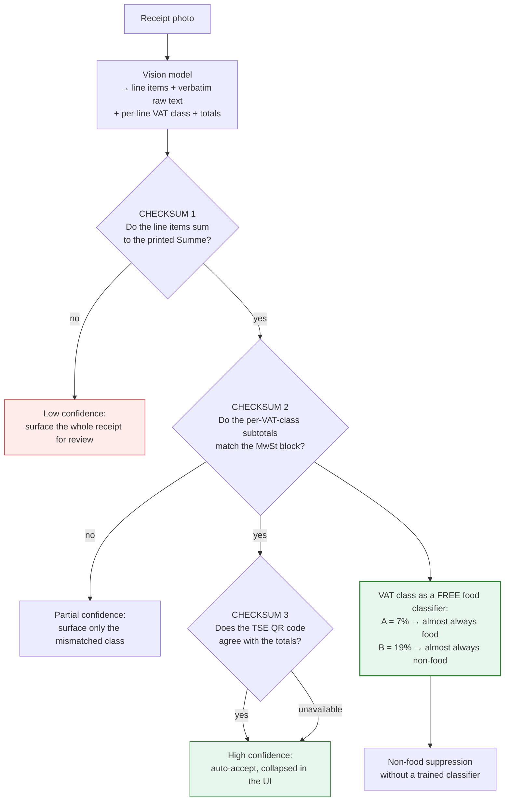

# 12. Technical Research — Capture Mechanisms

*Three proposals evaluated: VLM-only receipt reading, automatic camera capture, and an in-fridge
phone holder. One is right and improves the economics materially, one is half-right, and one has
an exact commercial precedent that is discontinued.*

| # | Proposal | Verdict |
|---|---|---|
| 1 | **A vision LLM can read receipts — no separate OCR vendor** | ✅ **ADOPT.** Correct, and it cuts parsing cost ~40× |
| 2a | **Auto-capture of receipts** (camera opens, shutter fires itself) | ✅ **ADOPT in the native shell, v2** |
| 2b | **Auto-capture of goods** (wave items past the camera) | ❌ **REJECT for v1.** Costs *more* user effort than a receipt, at 41–89% accuracy |
| 3 | **Phone holder inside the fridge** | ❌ **REJECT.** Smarter's FridgeCam did exactly this and is discontinued |

---

## 12.1 Idea 1 — VLM-first receipt reading ✅

**You are right, and this is the most valuable technical correction to the plan so far.**
The original architecture ([§5.2](05-technical-architecture.md)) specified a commercial receipt-OCR
vendor (Veryfi / Mindee / Taggun / Tabscanner) with an LLM only as a fallback. That was a 2023
architecture. In 2026 a mid-tier vision model reads a receipt end-to-end and returns structured
JSON directly.

### The cost case is overwhelming

Image token pricing, per the current provider formulas:

| Provider | Tokenisation | Tokens for a 1200×2048 receipt photo |
|---|---|---|
| **Gemini (Flash tier)** | 768×768 tiles, **258 tokens per tile** | 2×3 tiles = **1,548** |
| **OpenAI (Mini tier)** | 32×32 patches, capped ~2,500 | **2,500** |
| **Claude (Haiku tier)** | `(width × height) / 750` | **3,277** |

Cost of one 30-line German receipt, input + ~900 output tokens of JSON:

| Model tier | Input | Output | **Cost per receipt** |
|---|---|---|---|
| **Gemini 2.5 Flash** ($0.15/$0.60 per M) | $0.00029 | $0.00054 | **~$0.0008** |
| **GPT-5 Mini** ($0.25/$2.00 per M) | $0.00063 | $0.00180 | **~$0.0024** |
| **Claude Haiku 4.5** ($1.00/$5.00 per M) | $0.00328 | $0.00450 | **~$0.0078** |
| *Commercial receipt-OCR API (our previous assumption)* | | | *$0.04–0.08* |

**With a 15% second pass on a stronger model for low-confidence receipts, blended cost lands at
~$0.0015–0.002 per receipt — roughly 40× cheaper than the negotiated OCR pricing the plan assumed.**

### What this does to the unit economics

| Per paying household / month | Before (OCR vendor) | **After (VLM-first)** |
|---|---|---|
| Receipt parsing | €0.28 | **€0.02** |
| LLM normalisation | €0.02 | *(included above)* |
| Infra, storage, push | €0.05 | €0.05 |
| **Direct COGS** | €0.35 | **€0.07** |
| Allocated free-tier cost | €0.40 | **€0.04** |
| **Fully loaded COGS** | **€0.75** | **€0.11** |
| Net ARPU | €2.19 | €2.19 |
| **Gross margin** | **66%** | **95%** |
| **LTV, subscription only** | €29 | **€42** |
| **LTV/CAC, subscription only** | 1.4× ❌ | **2.1×** ⚠️ |
| **LTV/CAC, with hand-off** | 2.4× | **3.1× ✅** |

> **This is the first version of the model that clears the 3× LTV/CAC threshold investors ask for.**
> It also removes the "free-tier abuse kills us" risk that the engineering reviewer flagged as
> critical — a free user now costs ~€0.006/month to serve rather than €0.04. Rate limiting is
> still required, but **the blast radius is 40× smaller.**

⚠️ **One honest caveat on the break-even figure.** Cheaper parsing barely moves the *blended*
break-even (96,500 → ~92,000 active households), because in the blended model the hand-off
commission dominates contribution. **The real gain is risk reduction, not volume**: it makes the
free tier nearly free to serve, which is what makes an organic-only growth strategy survivable.

### The risk moves — it does not disappear

The plan traded a **cost** risk for an **accuracy** risk, and the second one is more dangerous
because it is silent.

| Risk | Why it matters here | Mitigation (must be v1, not bolted on) |
|---|---|---|
| **No per-field confidence scores** | Commercial OCR returns confidence per field. Our entire doctrine — uncertainty bands, what the sweep asks about, what surfaces in the review sheet — depends on knowing what we are unsure of. **A VLM returns fluent JSON with no error bars.** | The three German checksums below |
| **Hallucination** | A VLM will invent a plausible line item on a faded thermal receipt. This is **worse than an OCR error**, because it is confident and reads correctly | Checksums catch price errors; self-consistency (two passes at temperature 0, compare) catches name drift. At $0.0008/pass this is affordable |
| **No bounding boxes / provenance** | Harder to build `RECEIPT_LINE` and audit a bad parse | Require the model to return the **verbatim raw line** alongside the normalised name. That gives the dictionary training pair without needing coordinates |
| **Model deprecation** | Providers retire models. **The OCR vendor used to absorb this for us** | Pin model versions; re-run the full 200-receipt eval on every model change. This is a *new* standing ops cost — budget it |
| **Latency** | 3–10s on a long receipt vs 1–2s for OCR | Upload-and-dismiss with async completion — already required by the ≤30s effort budget |
| **Determinism for the eval harness** | Non-deterministic output makes CI gates noisy | Temperature 0, pinned version, fixed prompt hash recorded with every eval run |
| **DSGVO** | Receipt images to a US model provider | Same problem as the OCR vendor, but **one fewer processor in the chain**. Verify EU data residency and zero-retention terms before beta |

### ⭐ Three German-specific validation mechanisms that replace confidence scores

This is where the German launch market pays off a second time. **German receipts carry their own
built-in error checking**, which is exactly what a VLM lacks.



**1. The Summe checksum.** Every receipt contains its own answer key. If the extracted line items
do not sum to the printed total, the extraction is wrong — and we know it, cheaply and
deterministically. **This single check recovers most of what per-field confidence scores gave us.**

**2. The VAT class as a free food/non-food classifier.** German receipts mark each line with its
VAT rate — conventionally **`A` = 7%** (the reduced rate, which applies to *Grundnahrungsmittel*)
and **`B` = 19%** (the standard rate). German law requires that the receipt shows what was taxed at
which rate. **That is a legally-mandated, per-line food signal on every German receipt** — and
[§3.6 R1-AC2](03-product-strategy-prd.md) requires ≥95% non-food suppression, which this largely
solves for free.
⚠️ *It is a strong prior, not a perfect classifier: alcohol, many beverages and some luxury foods
are 19%, while books and plants are 7%. Treat it as a feature with high weight, not a rule.*

**3. The TSE QR code.** Since the Kassensicherungsverordnung, German receipts commonly carry a QR
code containing the signed transaction record, including amounts by VAT rate. If it parses, it is
a **cryptographically-backed** cross-check on the totals — and `BarcodeDetector` reads it in the
browser for free.
⚠️ **Verify before relying on it:** the exact payload is defined by BSI TR-03153 / DSFinV-K and
implementations vary. **Two days of work to confirm what real Edeka, REWE, Lidl and Aldi QR codes
actually contain** — worth doing in Phase 0, because if it holds it is the cheapest high-confidence
signal in the entire pipeline.

### Revised pipeline

```
1. Client: downscale to long edge ~2048, deskew, JPEG q80    (cheap, saves tokens)
2. Client: BarcodeDetector → TSE QR payload if present        (free)
3. Server: VLM call, temperature 0, structured JSON schema:
      { merchant, date, lines:[{raw_text, name, qty, unit, price, vat_class}],
        totals:{ sum, by_vat_class }, confidence_notes }
4. Checksums 1–3
5. Dictionary lookup on raw_text → canonical product          (the compounding asset)
6. Only unresolved lines go to a stronger model               (~15%)
```

**What survives from the original design:** the learned retailer dictionary is *more* valuable
now, not less — it is what lets us skip the second pass, and it still improves with every
correction. **What dies:** the OCR vendor, the dual-sourcing requirement, the vendor
concentration risk, and the "$0.01–0.03 list-price fantasy" problem the reviewer identified.

---

## 12.2 Idea 2 — Automatic camera capture

The proposal has two halves with very different verdicts.

### 2a. Auto-capture of receipts ✅ ADOPT (native shell, v2)

Open the camera, the app detects the receipt's edges, and the shutter fires itself when the frame
is stable and in focus. **This is mature, well-supported technology** and it removes 3–5 seconds
and one decision from the capture flow — meaningful against a 30-second budget.

| Platform | Capability | Verdict |
|---|---|---|
| **Android native** | **ML Kit Document Scanner** — automatic capture, edge detection, auto-crop, rotation correction. First-party, free | ✅ Excellent |
| **iOS native** | **VisionKit** (`VNDocumentCameraViewController` / `DataScannerViewController`) — the same behaviour as the system Notes scanner | ✅ Excellent |
| **Web / PWA — Shape Detection API** | **Broken on iOS 18** (open WebKit bug), never Baseline, experimental in Chrome | ❌ **Cannot rely on it** |
| **Web / PWA — OpenCV.js (WASM)** | Canny edge detection + contour finding works, but a multi-MB WASM payload, ~10–15 fps on mid-tier phones, and **continuous camera + per-frame processing is a documented battery drain** | ⚠️ Degraded fallback only |
| **Web / PWA — `BarcodeDetector`** | Better supported than the rest of Shape Detection; useful for the **TSE QR** | ✅ Use it |

> **This reinforces a decision already made for another reason.**
> [§5.7](05-technical-architecture.md#57-pwa-vs-native-the-honest-tradeoff) already concluded we
> need a thin native shell because **Safari Web Push has no notification action buttons** and iOS
> PWA install rates are 5–20%. Auto-capture is a **second independent reason** for the same shell,
> which improves the case for building it during the beta rather than after.
>
> **Sequencing:** ship the plain "take a photo" flow in v1 on the web; add ML Kit / VisionKit
> auto-capture in the native shell in v2. Do **not** build an OpenCV.js version — it is real work
> for a degraded result on the platform where it matters least.

### 2b. Auto-capture of goods ❌ REJECT for v1

*"User opens the camera once and all goods are automatically identified, photographed and sent."*

This is the more ambitious half, and the evidence is against it on **two independent grounds** —
accuracy and, more decisively, **user effort**.

**Accuracy.** Fine-grained grocery recognition is much worse than demos suggest:

| Benchmark | Result |
|---|---|
| **RP2K** (500k+ real shelf photos), SKU top-1 match | base CLIP **41%** · Fashion CLIP **50%** · specialised model **89%** |
| **Grocer-Help** (13k images, 349 categories, realistic occlusion and lighting) | **58.3 mAP@50** for a lightweight model |
| The same class of model on *clean* data | **99.4 mAP@50, 98.4% top-1** |
| **Samsung Family Hub**, dedicated in-fridge hardware, a decade of work | **37 fresh items**; everything else logged as *"unknown item"* |

The gap between 99% on clean data and 58% in realistic conditions is the whole story. A kitchen
counter at 19:00 with mixed lighting, bags, occlusion and packaging variation is the realistic
condition, not the clean one.

**Effort — and this is the decisive argument.** [§2.2](02-ux-behavioural-research.md#22-the-users-actual-costbenefit-equation)
sets a hard budget of **≤30 seconds to capture an entire shop**.

| Method | Time for a 30-item shop | Accuracy |
|---|---|---|
| **One receipt photo** | **~8 seconds** | 85%+ target, with three built-in checksums |
| Waving 30 items past a camera at ~2s each | **60+ seconds** | 41–89%, worse in a real kitchen |

**Holding each item up to a camera is more work than photographing one receipt, and less
accurate.** It fails the effort budget by 2×. And it fails hardest on exactly the food that
matters: **35% of avoidable German household waste is loose fresh produce**, which has no
packaging to recognise — a camera can perhaps tell broccoli from cauliflower, but not how much you
bought, and quantity is what the decay model needs.

**Where it *is* worth building — later, and narrowly.** Roughly 15% of items never appear on a
receipt: bakery counter, Wochenmarkt, bulk, and leftovers ([§2.3](02-ux-behavioural-research.md)).
For *those*, a single-item "show me one thing" flow beats typing. That is a **v3 experiment scoped
to the receipt's blind spot**, not a replacement for the receipt.

---

## 12.3 Idea 3 — A phone holder inside the fridge ❌ REJECT

**This product has been built and sold, and it is discontinued.**

### The precedent: Smarter FridgeCam (SFC01)

A wireless camera that stuck inside any fridge, photographed the contents each time the door
closed, recognised food, and maintained a shopping list — *exactly* the proposal, with purpose-built
hardware rather than a spare phone. Reviewers' verdict:

- **"The biggest problem is that the object recognition just doesn't work very well"** — failing on
  common branded items placed directly in front of the camera
- **Battery: 9 days in practice against 6 months advertised**
- Connection problems, fiddly setup, and *"a sense that the whole thing is just more work than
  it's worth"*
- **Status: discontinued**

Samsung, with a camera built into the appliance, a decade of iteration and effectively unlimited
budget, reaches **37 recognised fresh items**. That is the ceiling for in-fridge vision, set by a
company that controls the hardware.

### And a phone is a worse camera for this than the FridgeCam was

| Problem | Detail |
|---|---|
| **Temperature** | Phone operating range is **0–35°C**, with 15–25°C recommended. A fridge runs at ~4°C — **inside spec but at the very bottom of it**, and lithium-ion cells deliver less current when cold |
| **Condensation** | The real killer. Every door opening cycles a cold device into warm, humid kitchen air; moisture forms **inside the casing**, causing corrosion and shorts. This is a *when*, not an *if* |
| **Wi-Fi** | A fridge is a metal-lined box. Thin aluminium alone attenuates 2.4 GHz by **10–15 dB**; a sealed conductive enclosure approaches a Faraday cage. Signal will be marginal at best |
| **Light** | The interior is dark with the door shut, and the door light is a harsh point source when open — the worst possible lighting for recognition |
| **Occlusion** | You cannot see the yoghurt behind the milk. **No single fixed viewpoint solves a packed fridge**, which is why Samsung's in-appliance camera still misses most items |
| **Power** | Charging means routing a cable through the door seal, or recharging constantly |
| **The spare phone** | **Almost nobody has a spare smartphone to dedicate to their fridge.** This is a hardware product wearing a software product's clothes, and it needs a bill of materials, certification, support and returns |

### The salvageable insight

The instinct behind the idea is right: **"users normally just put goods into the fridge"** — that
*is* the moment of truth, and it is when the data exists. The mistake is putting the camera in the
cold box. **The unpacking happens on the counter, not in the fridge.**

A cheaper version of the same idea, worth one Phase 0 observation rather than a hardware
programme: an **"Auspacken" mode** — the user props the phone against the wall on the counter
(a €5 stand, not our product), taps once, and the app captures while they unpack.

But note that even this loses to the receipt on the effort budget, for the reasons in §12.2b.
**The right Phase 0 action is not to build it — it is to watch 25 households unpack their
shopping and find out what actually happens in those 90 seconds.** That observation is already
funded as part of the concierge test, and it costs nothing extra.

---

## 12.4 What changes in the plan

| Change | Where | Effect |
|---|---|---|
| **Replace the OCR vendor with VLM-first extraction** | [§5.2](05-technical-architecture.md) | Parsing cost €0.28 → €0.02 per household/month |
| **Add the three German checksums** (Summe, VAT class, TSE QR) | [§5.2](05-technical-architecture.md) | Replaces the per-field confidence scores a VLM does not provide. **Must be v1** |
| **Use the A/B VAT class for non-food suppression** | [§3.6 R1](03-product-strategy-prd.md) | Largely solves the ≥95% suppression criterion for free |
| **Revised COGS and margin** | [§9.6](09-investor-pack.md#96-unit-economics), [§10.5](10-frameworks-and-financials.md) | Gross margin 66% → **95%**; LTV/CAC with hand-off 2.4× → **3.1×** |
| **Auto-capture (receipts) added to the native shell scope** | [§3.5](03-product-strategy-prd.md), [§5.7](05-technical-architecture.md) | Second independent reason to build the shell during beta |
| **Auto-capture (goods) → v3, scoped to the receipt's blind spot** | [§3.5](03-product-strategy-prd.md) | Not a v1 capture path |
| **In-fridge camera → rejected, with the precedent recorded** | this document | Prevents it being re-proposed later |
| **New standing ops cost: model-version eval re-runs** | [§5.10](05-technical-architecture.md) | The OCR vendor used to absorb this |
| **New Phase 0 task: verify TSE QR payloads** (2 days) | [§11.8](11-germany-berlin-market.md) | Cheapest possible high-confidence signal, if it holds |
| **New Phase 0 observation: watch households unpack** | [§11.8](11-germany-berlin-market.md) | Free; settles idea 2b and 3 with evidence rather than argument |

---

## Sources

- [Roboflow — What does it cost to process an image with a vision model?](https://blog.roboflow.com/image-token-cost-vlm/)
- [Cheapest vision & multimodal LLM API in 2026: full price comparison](https://www.clawrouters.com/blog/cheapest-vision-multimodal-llm-api-2026)
- [IntuitionLabs — LLM API pricing 2026](https://intuitionlabs.ai/articles/llm-api-pricing-comparison-2025)
- [TokenCost — Vision API cost per image, 2026](https://tokencost.app/blog/vision-api-cost-per-image)
- [Towards Data Science — Extracting receipt information with OCR and GPT-4o mini](https://towardsdatascience.com/how-to-effortlessly-extract-receipt-information-with-ocr-and-gpt-4o-mini-0825b4ac1fea/)
- [Invoice OCR API benchmarks 2026: speed, accuracy, cost](https://invoicedataextraction.com/blog/invoice-ocr-api-benchmarks)
- [Google ML Kit — Document Scanner](https://developers.google.com/ml-kit/vision/doc-scanner)
- [Chrome for Developers — The Shape Detection API](https://developer.chrome.com/docs/capabilities/shape-detection)
- [WebKit bug 281848 — Shape Detection API doesn't work on iOS](https://bugs.webkit.org/show_bug.cgi?id=281848)
- [MDN — Barcode Detection API](https://developer.mozilla.org/en-US/docs/Web/API/Barcode_Detection_API)
- [LearnOpenCV — Automatic document scanner using OpenCV](https://learnopencv.com/automatic-document-scanner-using-opencv/)
- [A real-world framework for automated product recognition (Scientific Reports, 2026)](https://www.nature.com/articles/s41598-026-42266-9)
- [Width.ai — AI product recognition in 2026: identifying every SKU on the shelf](https://www.width.ai/post/product-recognition)
- [Label Your Data — Computer vision in retail: 2026 scaling gaps](https://labelyourdata.com/articles/computer-vision-in-retail)
- [Expert Reviews — Smarter FridgeCam review](https://www.expertreviews.co.uk/home-garden/large-appliances/smarter-fridgecam-review)
- [Tech Advisor — Smarter FridgeCam review: not so smart](https://www.techadvisor.com/article/719327/smarter-fridgecam-review.html)
- [Mint Mobile — Can your phone get too cold?](https://www.mintmobile.com/blog/can-your-phone-get-too-cold/)
- [Integra Enclosures — Enclosure material and wireless signal loss](https://integraenclosures.com/category/technical-articles/enclosure-material-wireless-signal/)
- [Mehrwertsteuerrechner — Mehrwertsteuer auf Lebensmittel: 7% oder 19%](https://www.mehrwertsteuerrechner.de/steuern/mehrwertsteuer-auf-lebensmittel-und-getraenke/)
- [ScienceDirect — Comparative study on the energy consumption of Progressive Web Apps](https://www.sciencedirect.com/science/article/abs/pii/S0306437922000230)
