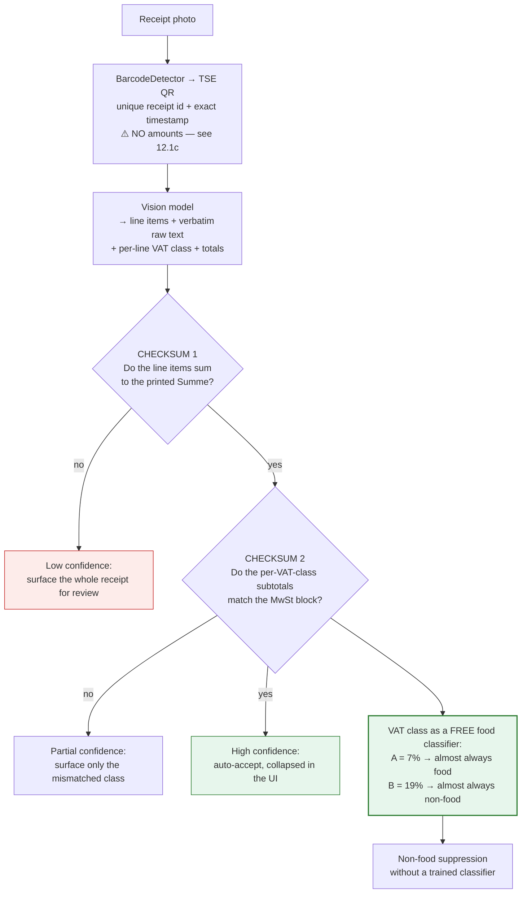

# 12. Technical Research — Capture Mechanisms

*Four proposals evaluated: VLM-only receipt reading, automatic camera capture, an in-fridge phone
holder, and a door-mounted phone during unpacking — the last now with a full engineering study
covering mounting physics, camera geometry, barcode vs object recognition, thermal and battery
budget, and German camera law. Plus the technical questions this plan had
flagged "verify" and never had: extraction accuracy, hallucination rates, the TSE QR payload,
EU data residency, Open Food Facts licensing, and on-device feasibility.*

> ### ⚠️ Correction notice — one earlier claim in this document was wrong
> **The TSE QR code on a German receipt does *not* contain amounts or VAT-rate subtotals.**
> It carries the till serial number, transaction number, signature counter, timestamps and the
> cryptographic signature — **and nothing else.** "Checksum 3" as previously described **does not
> exist**. See [§12.1c](#121c-the-tse-qr-code--what-it-actually-contains) for what the QR *is*
> genuinely good for, which is narrower but real. Corrected in
> [§5.2](05-technical-architecture.md), [§11.1b](11-germany-berlin-market.md) and the visual brief.

| # | Proposal | Verdict |
|---|---|---|
| 1 | **A vision LLM can read receipts — no separate OCR vendor** | ✅ **ADOPT.** Correct, and it cuts parsing cost ~40× |
| 2a | **Auto-capture of receipts** (camera opens, shutter fires itself) | ✅ **ADOPT in the native shell, v2** |
| 2b | **Auto-capture of goods** (wave items past the camera) | ❌ **REJECT for v1.** Costs *more* user effort than a receipt, at 41–89% accuracy |
| 3 | **Phone holder inside the fridge** | ❌ **REJECT.** Smarter's FridgeCam did exactly this and is discontinued |
| 3b | **Magnetic mount on the fridge *door*, used only while loading** | ⚠️ **TEST, DON'T BUILD.** Removes every physics objection and attacks the plan's #1 risk — but the closest matched benchmark says **~49% recognition**, and the magnet may not stick |
| 3c | **Door mount — full engineering study** ([§12.3c](#123c-door-mount--full-engineering-feasibility)) | ⚠️ **Concept survives, three assumptions corrected.** It cannot go on the door (it swings); a standard magnet won't hold it (shear is 15–25% of pull); **barcodes not object recognition** are the right signal — but at a **5% EAN false-positive rate the camera needs the receipt as its answer key** |

---

## 12.1 Idea 1 — VLM-first receipt reading ✅

**You are right, and this is the most valuable technical correction to the plan so far.**
The original architecture ([§5.2](05-technical-architecture.md)) specified a commercial receipt-OCR
vendor (Veryfi / Mindee / Taggun / Tabscanner) with an LLM only as a fallback. That was a 2023
architecture. In 2026 a mid-tier vision model reads a receipt end-to-end and returns structured
JSON directly.

### The cost case is overwhelming

Image token pricing, per the current provider formulas:

| Provider | Tokenisation | Tokens for a 1200×2048 receipt photo |
|---|---|---|
| **Gemini (Flash tier)** | 768×768 tiles, **258 tokens per tile** | 2×3 tiles = **1,548** |
| **OpenAI (Mini tier)** | 32×32 patches, capped ~2,500 | **2,500** |
| **Claude (Haiku tier)** | `(width × height) / 750` | **3,277** |

Cost of one 30-line German receipt, input + ~900 output tokens of JSON:

| Model tier | Input | Output | **Cost per receipt** |
|---|---|---|---|
| **Gemini 2.5 Flash** ($0.15/$0.60 per M) | $0.00029 | $0.00054 | **~$0.0008** |
| **GPT-5 Mini** ($0.25/$2.00 per M) | $0.00063 | $0.00180 | **~$0.0024** |
| **Claude Haiku 4.5** ($1.00/$5.00 per M) | $0.00328 | $0.00450 | **~$0.0078** |
| *Commercial receipt-OCR API (our previous assumption)* | | | *$0.04–0.08* |

**With a 15% second pass on a stronger model for low-confidence receipts, blended cost lands at
~$0.0015–0.002 per receipt — roughly 40× cheaper than the negotiated OCR pricing the plan assumed.**

### And the accuracy case now supports it too — which it previously did not

⚠️ **The original version of this document recommended VLM-first on cost alone.** That was a gap:
a 40× cost saving is worthless if the extraction is worse. The evidence now available:

| Finding | Number |
|---|---|
| Vision-first ("native image") extraction vs a parsed-text OCR pipeline, scanned invoices | **92.71% vs 64.03%** |
| Traditional OCR-only, structured invoice fields | 85–95% |
| LLM-based extraction, same fields | **97–99%** |
| OmniDocBench v1.5 SOTA (GLM-OCR), beating Gemini 3 Pro and GPT-5.2 | **94.6%** |

**Reading a receipt as a document beats reading it as a character stream**, because layout, column
structure and label association are recoverable in one pass rather than reconstructed by rules
afterwards. On a German receipt — where the item name, quantity, VAT class and price sit in fixed
columns — that is exactly the advantage we need.

### ⚠️ But specialised models hallucinate measurably less than general VLMs

The one place a general VLM is genuinely worse, and it is the place that matters most for us:

| Model | Hallucination benchmark accuracy |
|---|---|
| **PP-OCRv6_medium** (specialised OCR) | **93.2%** |
| Kimi-K2.6 | 85.0% |
| Qwen3-VL-235B | 80.6% |
| MiniMax-M3 | 72.6% |

**A purpose-built document model invents fewer line items than a general-purpose VLM.** That is a
20-point spread on precisely the failure mode that would destroy trust — a confident, plausible,
wrong item on a faded thermal Bon.

> ### ⭐ Which opens an option the plan had not considered: a self-hosted open-weight OCR model
>
> OmniDocBench is described as **saturated**, with open-weight specialists now beating frontier
> models on document parsing. That makes a self-hosted specialist model a serious v2 architecture,
> and it solves **three** of our problems at once:
>
> | Problem | Self-hosted specialist |
> |---|---|
> | DSGVO — receipt images to a US provider | ✅ **Never leaves our EU infrastructure** |
> | Model deprecation as a standing ops cost | ✅ We control the version; it changes when we change it |
> | Hallucination | ✅ ~20 points better than general VLMs on the hallucination benchmark |
> | Per-call cost | ✅ Effectively zero marginal cost, GPU amortised |
> | Engineering cost | ❌ Real: inference infra, GPU, evaluation, ops |
>
> **Recommendation: hosted VLM for v1** (zero infra, fastest to the Phase 0 answer), with the
> self-hosted specialist as the planned v2 migration once volume justifies the GPU — and evaluate
> both against the same 200-receipt German corpus so the switch is a measured decision, not a
> rewrite.

### What this does to the unit economics

| Per paying household / month | Before (OCR vendor) | **After (VLM-first)** |
|---|---|---|
| Receipt parsing | €0.28 | **€0.02** |
| LLM normalisation | €0.02 | *(included above)* |
| Infra, storage, push | €0.05 | €0.05 |
| **Direct COGS** | €0.35 | **€0.07** |
| Allocated free-tier cost | €0.40 | **€0.04** |
| **Fully loaded COGS** | **€0.75** | **€0.11** |
| Net ARPU | €2.19 | €2.19 |
| **Gross margin** | **66%** | **95%** |
| **LTV, subscription only** | €29 | **€42** |
| **LTV/CAC, subscription only** | 1.4× ❌ | **2.1×** ⚠️ |
| **LTV/CAC, with hand-off** | 2.4× | **3.1× ✅** |

> **This is the first version of the model that clears the 3× LTV/CAC threshold investors ask for.**
> It also removes the "free-tier abuse kills us" risk that the engineering reviewer flagged as
> critical — a free user now costs ~€0.006/month to serve rather than €0.04. Rate limiting is
> still required, but **the blast radius is 40× smaller.**

⚠️ **One honest caveat on the break-even figure.** Cheaper parsing barely moves the *blended*
break-even (96,500 → ~91,800 active households), because in the blended model the hand-off
commission dominates contribution. **The real gain is risk reduction, not volume**: it makes the
free tier nearly free to serve, which is what makes an organic-only growth strategy survivable.

### The risk moves — it does not disappear

The plan traded a **cost** risk for an **accuracy** risk, and the second one is more dangerous
because it is silent.

| Risk | Why it matters here | Mitigation (must be v1, not bolted on) |
|---|---|---|
| **No per-field confidence scores** | Commercial OCR returns confidence per field. Our entire doctrine — uncertainty bands, what the sweep asks about, what surfaces in the review sheet — depends on knowing what we are unsure of. **A VLM returns fluent JSON with no error bars.** | The two German checksums below (§12.1c corrects an earlier claim of three) |
| **Hallucination** | A VLM will invent a plausible line item on a faded thermal receipt. This is **worse than an OCR error**, because it is confident and reads correctly | Checksums catch price errors; self-consistency (two passes at temperature 0, compare) catches name drift. At $0.0008/pass this is affordable |
| **No bounding boxes / provenance** | Harder to build `RECEIPT_LINE` and audit a bad parse | Require the model to return the **verbatim raw line** alongside the normalised name. That gives the dictionary training pair without needing coordinates |
| **Model deprecation** | Providers retire models. **The OCR vendor used to absorb this for us** | Pin model versions; re-run the full 200-receipt eval on every model change. This is a *new* standing ops cost — budget it |
| **Latency** | 3–10s on a long receipt vs 1–2s for OCR | Upload-and-dismiss with async completion — already required by the ≤30s effort budget |
| **Determinism for the eval harness** | Non-deterministic output makes CI gates noisy | Temperature 0, pinned version, fixed prompt hash recorded with every eval run |
| **DSGVO** | Receipt images to a US model provider | Same problem as the OCR vendor, but **one fewer processor in the chain**. Verify EU data residency and zero-retention terms before beta |

### ⭐ Two German-specific validation mechanisms that replace confidence scores

This is where the German launch market pays off a second time. **German receipts carry their own
built-in error checking**, which is exactly what a VLM lacks.
*(This section previously claimed three. The third was wrong — see [§12.1c](#121c-the-tse-qr-code--what-it-actually-contains).)*



**1. The Summe checksum.** Every receipt contains its own answer key. If the extracted line items
do not sum to the printed total, the extraction is wrong — and we know it, cheaply and
deterministically. **This single check recovers most of what per-field confidence scores gave us.**

**2. The VAT class as a free food/non-food classifier.** German receipts mark each line with its
VAT rate — conventionally **`A` = 7%** (the reduced rate, which applies to *Grundnahrungsmittel*)
and **`B` = 19%** (the standard rate). German law requires that the receipt shows what was taxed at
which rate. **That is a legally-mandated, per-line food signal on every German receipt** — and
[§3.6 R1-AC2](03-product-strategy-prd.md) requires ≥95% non-food suppression, which this largely
solves for free.
⚠️ *It is a strong prior, not a perfect classifier: alcohol, many beverages and some luxury foods
are 19%, while books and plants are 7%. Treat it as a feature with high weight, not a rule.*

**3. ~~The TSE QR code as a totals cross-check~~ — see the correction below.**

### 12.1c The TSE QR code — what it actually contains

⚠️ **This document previously claimed the TSE QR code carries amounts by VAT rate, and that it
therefore provides a cryptographically-backed cross-check on the totals. That is wrong.**

The QR payload contains the **TSE signature data only**:

| Field | In the QR? |
|---|---|
| Till / TSE serial number | ✅ |
| Transaction number | ✅ |
| Signature counter | ✅ |
| Transaction start and end timestamps (`YYYY-MM-DDThh:mm:ss.fffZ`) | ✅ |
| Cryptographic signature | ✅ |
| **Line items** | ❌ |
| **Totals** | ❌ |
| **Amounts by VAT rate** | ❌ |

The *amounts* and *applicable VAT rate* are legally required to appear **on the printed receipt**
(§6 KassenSichV), which is why checksums 1 and 2 work — but they are printed text we must read,
not data we can decode. **The QR is a tamper-evidence mechanism for the tax authority, not a data
interchange format for us.**

**What the QR is genuinely worth, which is narrower but real:**

1. **A unique receipt identifier.** TSE serial + transaction number + signature counter is a
   globally unique key for that purchase. That gives us **free, exact duplicate detection** —
   solving the "did this household already upload this Bon?" problem deterministically instead of
   by fuzzy matching on merchant, date and total.
2. **An authoritative purchase timestamp.** [§5.2](05-technical-architecture.md) flags
   **retro-capture** as unhandled: people photograph receipts days late, so `acquired_on` must come
   from the receipt, and an item can be *born already at-risk*. The QR gives an exact,
   machine-readable, tamper-evident purchase time — better than parsing a printed date, and it
   costs nothing because `BarcodeDetector` is already in the pipeline.

**Net effect on the architecture:** we lose one of three checksums. The two that remain — the
Summe reconciliation and the VAT-class classifier — are the two that were doing the real work, and
both are printed on every German receipt by law. **The confidence story survives; the cryptographic
flourish does not.**

⚠️ **Still to verify against the 200-receipt corpus, not by desk research:** whether the
**`A` / `B` VAT-class convention is universal across the ten chains.** Some retailers use `1`/`2`,
some use asterisks, some place the marker before rather than after the price. The corpus answers
this definitively; no amount of searching will.

### 12.1d EU data residency — concrete, and it constrains the vendor choice

Flagged repeatedly as "verify before beta". Here is the actual position, and it differs sharply by
provider:

| Provider | EU residency | Zero retention | Practical consequence for us |
|---|---|---|---|
| **OpenAI** | ✅ European data residency for API Projects | ✅ In-region with **zero data retention** — requests and responses not stored at rest | ⚠️ **Configurable only for *new* Projects — it cannot be applied retroactively.** Create the Project correctly on day one or you are migrating later |
| **Google Vertex AI** | ✅ EU regions (`europe-west1`, `europe-west4`) | ⚠️ Zero-retention-*equivalent* terms for eligible enterprise customers, via a DPA amendment | ⚠️ Region is configured **per call, not per project, by default** — so **the DPIA must specify and verify region pinning**, and a mis-set call silently leaves the EU |
| **Anthropic direct API** | ❌ No customer-selectable EU-only residency | — | Route via an **EU-scoped Bedrock or Vertex endpoint** instead of the direct API |

**Three consequences, all actionable now:**
1. **Create the OpenAI Project with European residency from the very first Phase 0 call.** This is
   a five-minute decision that is expensive to reverse.
2. **Region pinning is a DPIA line item, not an implementation detail** — write it into the DPIA
   and add an automated assertion that no call leaves the EU region.
3. **The EU AI Act became broadly applicable on 2 August 2026** — i.e. it applies to us now, not
   at some future date. Confirm classification (we are almost certainly minimal-risk, but the
   assessment should exist in writing before beta).

### Revised pipeline

```
1. Client: downscale to long edge ~2048, deskew, JPEG q80    (cheap, saves tokens)
2. Client: BarcodeDetector → TSE QR                            (free)
      → unique receipt id (dedupe) + exact purchase timestamp
      → NOT totals; the QR contains no amounts
3. Server: VLM call, temperature 0, structured JSON schema:
      { merchant, date, lines:[{raw_text, name, qty, unit, price, vat_class}],
        totals:{ sum, by_vat_class }, confidence_notes }
4. Checksums 1–2 (Summe reconciliation, VAT-class subtotals)
5. Dictionary lookup on raw_text → canonical product          (the compounding asset)
6. Only unresolved lines go to a stronger model               (~15%)
```

**What survives from the original design:** the learned retailer dictionary is *more* valuable
now, not less — it is what lets us skip the second pass, and it still improves with every
correction. **What dies:** the OCR vendor, the dual-sourcing requirement, the vendor
concentration risk, and the "$0.01–0.03 list-price fantasy" problem the reviewer identified.

---

## 12.2 Idea 2 — Automatic camera capture

The proposal has two halves with very different verdicts.

### 2a. Auto-capture of receipts ✅ ADOPT (native shell, v2)

Open the camera, the app detects the receipt's edges, and the shutter fires itself when the frame
is stable and in focus. **This is mature, well-supported technology** and it removes 3–5 seconds
and one decision from the capture flow — meaningful against a 30-second budget.

| Platform | Capability | Verdict |
|---|---|---|
| **Android native** | **ML Kit Document Scanner** — automatic capture, edge detection, auto-crop, rotation correction. First-party, free | ✅ Excellent |
| **iOS native** | **VisionKit** (`VNDocumentCameraViewController` / `DataScannerViewController`) — the same behaviour as the system Notes scanner | ✅ Excellent |
| **Web / PWA — Shape Detection API** | **Broken on iOS 18** (open WebKit bug), never Baseline, experimental in Chrome | ❌ **Cannot rely on it** |
| **Web / PWA — OpenCV.js (WASM)** | Canny edge detection + contour finding works, but a multi-MB WASM payload, ~10–15 fps on mid-tier phones, and **continuous camera + per-frame processing is a documented battery drain** | ⚠️ Degraded fallback only |
| **Web / PWA — `BarcodeDetector`** | Better supported than the rest of Shape Detection; useful for the **TSE QR** | ✅ Use it |

> **This reinforces a decision already made for another reason.**
> [§5.7](05-technical-architecture.md#57-pwa-vs-native-the-honest-tradeoff) already concluded we
> need a thin native shell because **Safari Web Push has no notification action buttons** and iOS
> PWA install rates are 5–20%. Auto-capture is a **second independent reason** for the same shell,
> which improves the case for building it during the beta rather than after.
>
> **Sequencing:** ship the plain "take a photo" flow in v1 on the web; add ML Kit / VisionKit
> auto-capture in the native shell in v2. Do **not** build an OpenCV.js version — it is real work
> for a degraded result on the platform where it matters least.

### 2b. Auto-capture of goods ❌ REJECT for v1

*"User opens the camera once and all goods are automatically identified, photographed and sent."*

This is the more ambitious half, and the evidence is against it on **two independent grounds** —
accuracy and, more decisively, **user effort**.

**Accuracy.** Fine-grained grocery recognition is much worse than demos suggest:

| Benchmark | Result |
|---|---|
| **RP2K** (500k+ real shelf photos), SKU top-1 match | base CLIP **41%** · Fashion CLIP **50%** · specialised model **89%** |
| **Grocer-Help** (13k images, 349 categories, realistic occlusion and lighting) | **58.3 mAP@50** for a lightweight model |
| The same class of model on *clean* data | **99.4 mAP@50, 98.4% top-1** |
| **Samsung Family Hub**, dedicated in-fridge hardware, a decade of work | **37 fresh items**; everything else logged as *"unknown item"* |

The gap between 99% on clean data and 58% in realistic conditions is the whole story. A kitchen
counter at 19:00 with mixed lighting, bags, occlusion and packaging variation is the realistic
condition, not the clean one.

**Effort — and this is the decisive argument.** [§2.2](02-ux-behavioural-research.md#22-the-users-actual-costbenefit-equation)
sets a hard budget of **≤30 seconds to capture an entire shop**.

| Method | Time for a 30-item shop | Accuracy |
|---|---|---|
| **One receipt photo** | **~8 seconds** | 85%+ target, with two built-in checksums |
| Waving 30 items past a camera at ~2s each | **60+ seconds** | 41–89%, worse in a real kitchen |

**Holding each item up to a camera is more work than photographing one receipt, and less
accurate.** It fails the effort budget by 2×. And it fails hardest on exactly the food that
matters: **35% of avoidable German household waste is loose fresh produce**, which has no
packaging to recognise — a camera can perhaps tell broccoli from cauliflower, but not how much you
bought, and quantity is what the decay model needs.

**Where it *is* worth building — later, and narrowly.** Roughly 15% of items never appear on a
receipt: bakery counter, Wochenmarkt, bulk, and leftovers ([§2.3](02-ux-behavioural-research.md)).
For *those*, a single-item "show me one thing" flow beats typing. That is a **v3 experiment scoped
to the receipt's blind spot**, not a replacement for the receipt.

---

## 12.3 Idea 3 — A phone holder inside the fridge ❌ REJECT

**This product has been built and sold, and it is discontinued.**

### The precedent: Smarter FridgeCam (SFC01)

A wireless camera that stuck inside any fridge, photographed the contents each time the door
closed, recognised food, and maintained a shopping list — *exactly* the proposal, with purpose-built
hardware rather than a spare phone. Reviewers' verdict:

- **"The biggest problem is that the object recognition just doesn't work very well"** — failing on
  common branded items placed directly in front of the camera
- **Battery: 9 days in practice against 6 months advertised**
- Connection problems, fiddly setup, and *"a sense that the whole thing is just more work than
  it's worth"*
- **Status: discontinued**

Samsung, with a camera built into the appliance, a decade of iteration and effectively unlimited
budget, reaches **37 recognised fresh items**. That is the ceiling for in-fridge vision, set by a
company that controls the hardware.

### And a phone is a worse camera for this than the FridgeCam was

| Problem | Detail |
|---|---|
| **Temperature** | Phone operating range is **0–35°C**, with 15–25°C recommended. A fridge runs at ~4°C — **inside spec but at the very bottom of it**, and lithium-ion cells deliver less current when cold |
| **Condensation** | The real killer. Every door opening cycles a cold device into warm, humid kitchen air; moisture forms **inside the casing**, causing corrosion and shorts. This is a *when*, not an *if* |
| **Wi-Fi** | A fridge is a metal-lined box. Thin aluminium alone attenuates 2.4 GHz by **10–15 dB**; a sealed conductive enclosure approaches a Faraday cage. Signal will be marginal at best |
| **Light** | The interior is dark with the door shut, and the door light is a harsh point source when open — the worst possible lighting for recognition |
| **Occlusion** | You cannot see the yoghurt behind the milk. **No single fixed viewpoint solves a packed fridge**, which is why Samsung's in-appliance camera still misses most items |
| **Power** | Charging means routing a cable through the door seal, or recharging constantly |
| **The spare phone** | **Almost nobody has a spare smartphone to dedicate to their fridge.** This is a hardware product wearing a software product's clothes, and it needs a bill of materials, certification, support and returns |

---

## 12.3b The door-mount variant — a materially different proposal ⚠️

*Refined proposal: a magnetic phone mount on the **outside** of the fridge door. The user clips
their own phone in when they start loading shopping into the fridge, the camera watches items go
in, and they take the phone off when they're done.*

**This is not the same idea as §12.3, and it deserves a different verdict.** Every objection in
the table above is a consequence of putting the device *inside a cold, wet, dark, metal box*.
Move it outside and they all disappear at once:

| §12.3 objection | Door-mount status |
|---|---|
| Operating temperature 0–35°C vs a 4°C fridge | ✅ Gone — room temperature |
| **Condensation inside the casing** (the killer) | ✅ Gone — no cold cycling |
| Wi-Fi through a metal enclosure, 10–15 dB loss | ✅ Gone — outside the box |
| Darkness with the door shut | ✅ Gone — kitchen lighting, and the door is open anyway |
| Power / charging through the door seal | ✅ Gone — a 3–5 minute session |
| **Needs a spare phone** | ✅ Gone — it's your own phone, for three minutes |
| Occlusion: can't see the yoghurt behind the milk | ✅ **Better than the receipt here** — items are seen one at a time as they're handled, not as a packed static scene |
| Hardware risk: BOM, certification, firmware, battery, returns | ✅ Gone — **a magnetic phone mount is a €10–15 commodity.** We recommend one or ship a branded one as an onboarding gift. **This is an accessory, not a hardware product** |

### ⭐ And it attacks the one risk nothing else in the plan touches

[R10 — missed captures](03-product-strategy-prd.md) is the plan's most dangerous risk:
compliance decaying from ~75% in week 1 to **25–35% by week 8**, because *"no UI fixes
forgetting."* Photographing a receipt requires remembering to do a discretionary thing with an
object you may already have binned.

**Loading the fridge is not forgettable.** It is a mandatory physical act, at a fixed location,
that happens on every single shop. A mount left permanently on the door is a **persistent visual
cue at exactly the right moment.** Structurally, that is a far better trigger than a receipt
photo — and **no other proposal in this plan improves R10 at all.**

That is the strongest argument for this idea, and it is stronger than the accuracy argument
against it.

### The two things that could still sink it

**1. The magnet may not stick — and this is concrete and checkable.**
Grade **304 austenitic stainless steel is non-magnetic**, and it is the common finish on
premium fridges. Ferritic **430** holds a magnet but is "less common on premium models". Some
doors have a magnetic steel backing behind the cladding, giving weak or patchy hold.

⚠️ **The German angle makes this worse, not better:** German kitchens have a high rate of
*Einbaukühlschränke* — integrated fridges behind a wooden cabinet door, where no magnet holds at
all. **The mount may fail on a large share of exactly the households we want**, and adhesive or
clamp mounts are a meaningfully worse user experience.
*Cost to find out: 30 seconds per household in the concierge test.*

**2. Accuracy is still the binding constraint — and there is a benchmark that matches this task
almost exactly.**

Shelf-photo benchmarks were the wrong comparison. The right one is **EPIC-KITCHENS-100**: large-scale
**egocentric video of people handling objects in their own kitchens**, which is precisely the door-mount
scenario. The result is sobering:

| Benchmark | Task | Result |
|---|---|---|
| **EPIC-KITCHENS-100** | Top-1 **noun** classification, 300 noun classes, egocentric kitchen video | **~48.9%** |
| RP2K | Fine-grained SKU top-1, clean shelf photos | 41% (base CLIP) → 89% (specialised) |
| Grocer-Help | Realistic occlusion and lighting | 58.3 mAP@50 |

**~49% on 300 coarse nouns** — "onion", "pan", "milk" — not brand-level SKUs. Telling
`H-Milch 3,5%` from `H-Milch 1,5%` is a strictly harder problem than the one scoring 49%.

And the stated failure modes are exactly ours: *"hand-object interactions and critical informative
regions are sometimes occluded by the hand, or occur out of the camera's field of view."* A person
unpacking shopping holds items **in their hand**, often **turned away**, frequently **out of frame**.

Multi-frame aggregation helps with motion blur and occlusion, but modestly — flow-guided feature
aggregation moves mAP from **0.642 to 0.675**. A few points, not a category change.

**Compute is not the constraint.** MediaPipe Tasks, LiteRT and Core ML all run YOLO-class detection
on-device at ~30–50 ms/frame on modern hardware, with a dedicated Neural Engine in every recent
iPhone. A 3–5 minute session at ~10 fps is entirely feasible, and running on-device means **the
video never leaves the phone — a genuinely strong DSGVO position** for a camera pointed into
someone's kitchen. **The problem is that we would be running a ~49%-accurate model very efficiently.**

Worse, the camera path **loses the three things that make VLM-first receipt parsing safe**:

| | Receipt | Door-mount camera |
|---|---|---|
| Summe checksum | ✅ own answer key | ❌ none |
| A/B VAT class → free food classifier | ✅ legally required | ❌ none |
| TSE QR cross-check | ✅ often present | ❌ none |
| Quantity / weight | ✅ `BROKKOLI LOSE 0,412 kg` | ⚠️ hard — and quantity drives the decay model |
| Price (powers *"don't lose the €3.40 in your crisper"*) | ✅ | ❌ |

**So camera capture is the *less* verifiable path, not the more.** It would produce an inventory
that is confidently wrong in a new way — which is exactly what the doctrine in
[§2.4](02-ux-behavioural-research.md) exists to prevent.

**And it captures the wrong set.** Only what goes *into the fridge*. Pantry, freezer, fruit bowl
and bread bin are missed — and **bread and bakery is 13% of avoidable German household waste**,
usually stored outside the fridge.

### The crux, which nobody can answer from an armchair

**Does it work at natural unpacking speed, or does it require modified behaviour?**

- If a camera at door height genuinely identifies items as people unpack normally — hands full,
  items rotated arbitrarily, two or three at a time, some still in bags — then the marginal cost
  is **~15–30 seconds** (mount, unmount, correct), not the 60+ seconds of §12.2b, and this
  becomes a serious complement to the receipt.
- If it needs deliberate presentation — *"hold each item up to the camera for a beat"* — then it
  is **logging behaviour with extra steps**, and logging behaviour decays exactly like every
  other logging behaviour in [doc 2](02-ux-behavioural-research.md).

### Verdict: test it for free in Phase 0, decide with evidence

**Do not build anything.** Add two zero-cost observations to the concierge test, which already
includes watching households unpack:

1. **Count magnet-compatible fridge fronts** across the 25 households — 30 seconds each. If it's
   below ~60%, the mounting mechanism needs rethinking before anything else matters.
2. **Film the unpacking** (with consent), then hand-label the footage afterwards. This yields a
   **real dataset of real kitchens at natural speed**, against which any model can be scored
   later — answering the accuracy question with **zero incremental cost and no CV code written.**
   Score it against the EPIC-KITCHENS baseline: if our footage cannot beat ~49% on *coarse*
   categories, the idea is dead and we will have learned it for the price of a memory card.

> **Set the bar before running the test, not after.** For this to be worth building it needs
> roughly **≥85% coarse-category recall at natural unpacking speed with no behaviour change** —
> because anything less produces an inventory that is confidently wrong, which is precisely what
> [§2.4's doctrine](02-ux-behavioural-research.md) exists to prevent. Given EPIC-KITCHENS sits at
> ~49% on an easier version of this problem, **the prior should be that it fails.** Run it anyway:
> it is free, and the R10 upside is large enough to justify checking.

> **Strategic note for Phase 3.** In Germany the Bonpflicht makes the receipt free, legally
> guaranteed, and self-checking, so the camera can only ever be a complement. **In a market
> *without* a receipt obligation — the UK, where shoppers increasingly decline paper — this
> door-mount path could plausibly be the *primary* capture mechanism.** That is worth remembering
> when UK entry is scoped, because it means UK entry may need a different capture product, not a
> translation.


---

## 12.3c Door mount — full engineering feasibility

*§12.3b established that the concept survives the physics objections that killed §12.3. This
section is the actual engineering study: how it mounts, where it must point, what the camera
should look for, what it costs in compute and battery, and what German law permits.*

**Summary of what this section changes:** three of the assumptions in §12.3b were wrong or
incomplete — **the mount cannot go on the door**, **a standard MagSafe magnet will not hold it**,
and **filming households in Phase 0 is not free**. One assumption improved: **barcodes, not object
recognition, are the right thing for the camera to look for.**

### A. The mounting problem — a standard magnet will not hold a phone on a fridge

Magnet strength is quoted as **pull** force (perpendicular). What matters on a vertical fridge
front is **shear** force, and shear is only **15–25% of rated pull**.

| Mount class | Rated pull | **Shear (≈20%)** | Holds a 170–240 g phone? |
|---|---|---|---|
| Standard MagSafe case/mount | 2–3 lb (0.9–1.4 kg) | **180–270 g** | ⚠️ **Marginal to failing** |
| Strong N52 magnetic case | 6–10 lb (2.7–4.5 kg) | **540–900 g** | ✅ Yes, with margin |
| Mechanical clamp / adhesive cradle | n/a | n/a | ✅ Yes |

**A standard MagSafe puck holds a phone by roughly its own weight on a vertical surface** — before
adding the shock of a fridge door being closed, which is the single most common impulse this mount
will ever see. Friction coefficient also degrades with exactly the surface conditions a fridge has:
paint, wipe-down residue, fingerprints, kitchen grease.

**Compounding this: [§12.3b](#123b-the-door-mount-variant--a-materially-different-proposal-️)
established that 304 austenitic stainless — the common premium fridge finish — is non-magnetic**,
and German *Einbaukühlschränke* hide the appliance behind a wooden cabinet door entirely.

> **Engineering conclusion:** the mount is **not** the "€10 commodity" §12.3b claimed. A workable
> mount is an **adhesive ferrous plate (3M VHB or similar) plus a strong N52 magnetic cradle** —
> realistically **€15–25**, requiring a one-time adhesive application to the user's kitchen, on a
> surface that gets wiped, near heat and steam. **That is a meaningfully worse onboarding step**
> than "stick a magnet on your fridge", and adhesive failure in month four is a support ticket and
> a broken phone.
>
> This does not kill the idea. It does mean the mount is a **real product decision with a real
> failure mode**, not an accessory we can wave at.

### B. It cannot go on the fridge door — the door swings

**This is the most important practical correction in this section, and §12.3b got it wrong.**

The proposal is that the camera watches goods go *into* the fridge. But loading the fridge requires
the door to be **open** — and a mount on the door swings with it, ending up pointing at the wall,
the adjacent counter, or the room, rather than at the transfer zone between bag and shelf.
**For the entire duration of the activity we want to observe, a door-mounted camera is aimed at the
wrong thing.**

**Correct mounting surfaces**, all of which stay fixed while the fridge door is open:

| Surface | Fixed while loading? | Magnet-friendly? | Sightline to the transfer zone |
|---|---|---|---|
| **Fridge side panel** | ✅ | Often (side panels are more frequently magnetic than fronts) | ✅ Good — side-on view of the handover |
| **Freezer drawer front** (bottom-freezer units) | ✅ | Same finish as the door | ⚠️ Low angle, looks up at items |
| **Adjacent wall cabinet / tiled splashback** | ✅ | ❌ Needs adhesive | ✅ **Best** — chest height, faces the counter-to-fridge path |
| ❌ Fridge door | **No — it swings** | — | ❌ Points away during the activity |

**Field of view.** A phone main camera is ~70–80° horizontal; the ultrawide is ~120°. At a realistic
0.6–1.0 m standoff, **only the ultrawide covers the full counter-to-fridge transfer path.**
The app must select the ultrawide lens explicitly, accept its lower resolution and heavier
distortion at the edges, and be mounted at roughly **chest height (1.2–1.4 m)** facing the path —
which is the adjacent-cabinet position, not the fridge at all.

> **The idea survives, but it is no longer "a mount on the fridge door."** It is *a mount on a
> fixed kitchen surface with a sightline to where you unpack.* Worth saying plainly, because it
> changes the onboarding instruction, the mounting hardware, and how universal the setup can be.

### C. What the camera should look for: barcodes, not objects

§12.3b measured this against **EPIC-KITCHENS-100 (~48.9% top-1 on 300 coarse nouns)** and concluded
the accuracy was fatal. That is the right benchmark for *object recognition* — but it is the wrong
task. **Most of what goes into a fridge carries an EAN barcode**, and reading a barcode is a
categorically different and much better-solved problem than recognising a product by appearance.

**But the barcode path is not the slam dunk it first appears**, and the numbers matter:

| Metric | ML Kit (free, on-device) | Commercial SDK (Scandit / Dynamsoft) |
|---|---|---|
| Per-image latency | **~96–98 ms** | Comparable or better |
| **EAN-13 false-positive rate** | **5%** ⚠️ | Materially lower |
| Detection rate, multi-barcode scenes | **23.3%** (120 of 514) | Substantially higher |
| Barcodes per API call | capped at **10** | Higher |
| Continuous human scanning, 8 packages | 11.7 s | ~2× faster |
| Cost | Free | Paid licence |

**The 5% EAN-13 false-positive rate is the dangerous number.** A false positive does not fail
loudly — it **silently inserts the wrong product into the inventory**, which is precisely the
"confidently wrong" failure mode [§2.4's doctrine](02-ux-behavioural-research.md) exists to prevent.
And barcodes flashing past at arbitrary orientation under motion blur are the hard case, not the
easy one: the 23.3% multi-barcode detection rate is closer to our conditions than the clean
single-code benchmark.

> ### ⭐ The synthesis: the receipt is the camera's answer key
>
> The two capture paths fail in **opposite** directions, and that is what makes them worth pairing:
>
> | | Receipt (Bon) | Door-mount camera |
> |---|---|---|
> | Barcoded packaged goods | ✅ name, price, VAT class | ✅ EAN → exact SKU, **but 5% false positives** |
> | Loose produce (35% of German waste) | ✅ `BROKKOLI LOSE 0,412 kg` **with weight** | ❌ no barcode, ~49% by appearance |
> | Bread & bakery (13%) | ✅ on the receipt | ❌ often unpackaged, and doesn't go in the fridge |
> | Verification | ✅ Summe + VAT-class checksums | ❌ none of its own |
> | Requires remembering | ⚠️ **yes — this is R10** | ✅ **no — loading the fridge is unforgettable** |
>
> **A camera-read EAN that also appears on the Bon is confirmed by two independent observations.
> A camera-read EAN with no matching receipt line is a candidate, not a fact** — and can be held at
> low confidence, exactly as the doctrine requires. **The receipt supplies the verification the
> camera lacks; the camera supplies the trigger reliability the receipt lacks.**
>
> This is the strongest technical argument for the door mount, and it only works as a *pair*.
> As a standalone replacement for the receipt, the camera has no answer key and should not ship.

### D. Compute, thermal and battery — not a constraint, with one design rule

A 3–5 minute session of ultrawide capture at ~5–10 fps with on-device barcode detection and
optional object detection is **well within budget** on any recent phone: MediaPipe Tasks, LiteRT
and Core ML run YOLO-class detection at ~30–50 ms/frame, and every recent iPhone has a dedicated
Neural Engine.

**The design rule that keeps it cheap: do not record video.** Continuous high-resolution video
capture is what drives the alarming numbers — sustained 4K/HDR recording can flatten a battery in
around an hour, roughly 15× normal mixed-use drain, and thermal throttling begins within seconds of
sustained burst load. **Grabbing frames at 5–10 fps at modest resolution, running detection, and
discarding the frame immediately** avoids the encoder, the storage write and most of the heat.

Realistic cost of a weekly 4-minute session: **single-digit percentage of battery**, no meaningful
thermal impact. **Not a blocker, provided nobody implements it as "record a video and upload it."**

### E. German law — and a correction to §12.3b's "free" Phase 0 test

⚠️ **§12.3b said filming households unpacking costs "zero incremental cost." That was wrong.**

**Running the feature (on-device, nothing stored):** the DSGVO **Haushaltsausnahme**
(Art. 2(2)(c)) covers processing that is *purely personal or familial and confined to private
space*. A camera the user points at their own kitchen, processing on-device and discarding frames,
sits comfortably inside it. **But the exemption narrows as soon as other people are regularly
captured** — flatmates, visitors, delivery people. Berlin's household mix makes this concrete:
the city is 50% single-person, but shared flats (*WGs*) are a large share of the remainder, and a
kitchen camera in a WG routinely captures people who never installed our app.

**§201a StGB** additionally makes it a criminal matter to create or distribute images *from a
dwelling* that violate the *höchstpersönlicher Lebensbereich*. A kitchen is not a bathroom or
bedroom, so the ordinary case is fine — but this is the statute that makes "just upload the frames
to improve the model" a genuinely bad idea rather than merely a privacy-policy problem.

| Design decision | Legal consequence |
|---|---|
| **On-device inference, frames discarded, nothing persisted** | ✅ Household exemption holds; strongest possible position |
| Uploading frames or video to our servers | ❌ We become a controller processing video of non-users in their home. Requires consent from **everyone** who may appear |
| Storing detected item labels only (no imagery) | ✅ Fine — that is ordinary inventory data |
| **Collecting footage in Phase 0 for a training/eval set** | ⚠️ **This is the exception, and it is not free** |

**The corrected Phase 0 position.** Filming 25 households unpacking is still the right test, but it
requires: written consent from **every adult** in each household (not just the participant),
explicit handling for **children**, a defined retention and deletion schedule, storage in the EU,
and a line in the DPIA. That is **a consent protocol and a legal review — perhaps €2–4k and a week
of someone's time**, not zero. It is still cheap relative to what it answers, and it should be
folded into the existing Phase 0 legal budget rather than presented as free.

### F. Live feedback changes the accuracy bar — and the mount gives it away

§12.3b set the bar at **≥85% coarse-category recall** on the reasoning that anything less produces a
confidently-wrong inventory. **That bar is a function of the interaction, not the model**, and the
mount changes the interaction favourably:

- **Silent capture, reviewed later:** the user discovers errors long after the fact, cannot repair
  them from memory, and learns the list is untrustworthy. Needs ~95% to be safe.
- **Live on-screen feedback:** the phone is mounted at chest height with the screen facing the user.
  Detected items can appear as they are recognised. **A miss is visible immediately, while the item
  is still in the user's hand** — so the user re-presents it or taps once. At that point **~70%
  automatic recognition is workable**, because the remaining 30% is caught in the moment rather
  than silently absorbed.

**This is a genuine advantage the mount has over a phone in a pocket**, and it is the difference
between an 85–95% requirement and a ~70% one. It also converts the failure mode from *silent
corruption* to *visible friction*, which the doctrine tolerates and the drift spiral does not.

⚠️ **But note what it costs:** live feedback means the user is *watching the screen while
unpacking* — which is a behaviour change, and behaviour changes decay. This does not escape
[§12.3b's crux](#the-crux-which-nobody-can-answer-from-an-armchair); it reframes it.

### G. If it passes Phase 0 — the build specification

Recorded now so the test has something concrete to validate against:

```
MOUNT     Adhesive ferrous plate + N52 magnetic cradle (~€15–25)
          On a FIXED surface with a sightline to the unpacking path —
          adjacent cabinet or fridge side panel, NEVER the fridge door
          Chest height, 1.2–1.4 m, 0.6–1.0 m standoff

CAMERA    Ultrawide lens (~120°); main camera does not cover the transfer zone
          5–10 fps frame grabs, modest resolution
          NO video recording, NO frame persistence, NO upload

DETECT    1. Barcode (ML Kit / Vision) → EAN → product          ← primary
          2. Object detection → coarse category                  ← fallback only
          Cross-check every EAN against the household's recent receipts

SESSION   Auto-start on mount (orientation + stillness) or one tap
          Auto-stop after ~30 s of no motion
          Live on-screen item feedback — this is what makes 70% workable

CONFIRM   Camera EAN + matching receipt line  → high confidence
          Camera EAN, no receipt line         → candidate, low confidence
          Object detection only               → candidate, lowest confidence

LEGAL     On-device only. Frames discarded. Labels persisted, imagery never.
          Household-exemption position documented in the DPIA.
```

### Revised verdict

**Still: test in Phase 0, build nothing** — but the test is now better specified, and three things
have changed since §12.3b:

| §12.3b said | Corrected |
|---|---|
| Mount on the fridge door | ❌ **The door swings.** Mount on a fixed surface with a sightline to the unpacking path |
| A €10 commodity magnet | ❌ **Shear is 15–25% of pull.** Needs an adhesive ferrous plate + N52 cradle, €15–25, with a real adhesive failure mode |
| Accuracy ceiling ~49% (EPIC-KITCHENS) | ⚠️ **Wrong task.** Barcodes are the primary signal, not appearance — but ML Kit's **5% EAN false-positive rate** means the camera still needs the receipt as its answer key |
| Filming households is free | ❌ **Needs a consent protocol, child handling, retention schedule and a DPIA line — €2–4k** |
| Bar: ≥85% recall | ⚠️ **~70% is workable *with live on-screen feedback***, which the mount makes free |

**The strategic conclusion is unchanged and worth repeating:** this remains the only proposal in
the plan that attacks **R10, missed captures** — the risk that compliance decays to 25–35% by week
8 because *"no UI fixes forgetting."* Loading the fridge is not forgettable. **That upside is large
enough to justify the test even though the prior should still be that it fails.**

---

### The salvageable insight

The instinct behind the idea is right: **"users normally just put goods into the fridge"** — that
*is* the moment of truth, and it is when the data exists. The mistake is putting the camera in the
cold box. **The unpacking happens on the counter, not in the fridge.**

A cheaper version of the same idea, worth one Phase 0 observation rather than a hardware
programme: an **"Auspacken" mode** — the user props the phone against the wall on the counter
(a €5 stand, not our product), taps once, and the app captures while they unpack.

But note that even this loses to the receipt on the effort budget, for the reasons in §12.2b.
**The right Phase 0 action is not to build it — it is to watch 25 households unpack their
shopping and find out what actually happens in those 90 seconds.** That observation is already
funded as part of the concierge test, and it costs nothing extra.

---

## 12.5 Open Food Facts licensing — resolved, and it is an architecture rule

Flagged as a "Phase 0 blocker" in three documents and never actually researched. The answer is
clear and more manageable than feared, **but it constrains the schema**.

**The licence:** the OFF database is **ODbL**; individual contents are under the Database Contents
Licence; product images are **CC-BY-SA**. Commercial use is explicitly permitted. Two obligations:
**attribution** and **share-alike**.

**The share-alike trap, stated precisely:**
> *"If you combine data from Open Food Facts with other databases, then the ODbL requires that the
> resulting database must be released as open data as well."*

[§5.2](05-technical-architecture.md) calls the learned retailer dictionary *"the compounding
asset"* and the accuracy moat. **If that dictionary is merged into the same database as
OFF-derived data, share-alike attaches and we would be obliged to publish our moat.**

### The rule this imposes

| Do | Don't |
|---|---|
| Keep OFF as a **separate, read-only lookup service** with its own store | ❌ Merge OFF rows into `PRODUCT` or `DICTIONARY_ENTRY` |
| Store only a **reference** (GTIN + our own category id) in our tables | ❌ Copy OFF fields into our schema and enrich them in place |
| Derive `DICTIONARY_ENTRY` **solely from our users' receipt text and corrections** — our own data | ❌ Seed the dictionary from OFF names |
| Send a **custom User-Agent** on every API call (required) and carry attribution in the app | ❌ Ship without attribution |
| Treat OFF output as a *produced work* consumed at request time | ❌ Treat it as a base layer of our own database |

**This is a cheap constraint if adopted now and an expensive one if discovered in year two** — the
separation is trivial to design in and painful to retrofit once the dictionary has grown. It should
still get a lawyer's sign-off before launch, but it is no longer a blocker: it is a schema rule.

---

## 12.6 What is still genuinely unverified

Stated plainly, because the failure mode this plan was criticised for is confident prose outrunning
evidence.

| Question | Why it can't be answered by desk research | How it gets answered |
|---|---|---|
| **Is the `A`/`B` VAT-class convention universal across the ten chains?** | Retailers vary — some use `1`/`2`, some asterisks, some place the marker differently | The 200-receipt corpus. Definitive, already funded |
| **Real extraction accuracy on German thermal receipts** | Published benchmarks are invoices and academic documents, not crumpled Aldi Bons | The 200-receipt corpus, with ≥40% shot by households |
| **Does door-mount capture work at natural speed?** | No benchmark exists for "person unpacking shopping into a fridge" | Film it in the concierge test; label afterwards |
| **What share of German kitchens have *any* suitable fixed mounting surface?** | Depends on finish, integrated-kitchen prevalence, and whether an adjacent cabinet has a sightline. ⚠️ *Broader than the original "does a magnet stick to the fridge" question — the door is ruled out* | Photograph the kitchen layout in the 25 concierge households |
| **Real EAN read rate on items moving at natural unpacking speed** | Published barcode benchmarks are static presentation, not items swinging past at arbitrary orientation under motion blur | The concierge footage, scored offline against ML Kit and one commercial SDK |
| **Does the household actually rescue food when prompted?** | The only question that decides the company | The concierge test |

**Everything above is answered inside the already-funded Phase 0.** No new budget line is created by
this document.

---

## 12.4 What changes in the plan

| Change | Where | Effect |
|---|---|---|
| **Replace the OCR vendor with VLM-first extraction** | [§5.2](05-technical-architecture.md) | Parsing cost €0.28 → €0.02 per household/month |
| **Add the two German checksums** (Summe reconciliation, VAT-class subtotals) | [§5.2](05-technical-architecture.md) | Replaces the per-field confidence scores a VLM does not provide. **Must be v1** |
| ⚠️ **CORRECTION: the TSE QR contains no amounts** — it is not a totals checksum | [§12.1c](#121c-the-tse-qr-code--what-it-actually-contains) | We lose one of three checksums. The QR is repurposed for **duplicate detection and an exact purchase timestamp**, which fixes the unhandled retro-capture problem |
| **Accuracy evidence now supports VLM-first, not just cost** | [§12.1](#and-the-accuracy-case-now-supports-it-too--which-it-previously-did-not) | Vision-first 92.71% vs 64.03% for parsed-text; LLM extraction 97–99% vs 85–95% for OCR-only |
| **Plan a v2 migration to a self-hosted open-weight OCR specialist** | [§12.1](#️-but-specialised-models-hallucinate-measurably-less-than-general-vlms) | Solves DSGVO, model deprecation and hallucination (~20 pts better) at once |
| **EU residency is vendor-specific and partly irreversible** | [§12.1d](#121d-eu-data-residency--concrete-and-it-constrains-the-vendor-choice) | **OpenAI EU residency can only be set on a *new* Project.** Vertex pins region per call → a DPIA requirement. Anthropic needs Bedrock/Vertex routing |
| **Open Food Facts share-alike is a schema rule, not a blocker** | [§12.5](#125-open-food-facts-licensing--resolved-and-it-is-an-architecture-rule) | Never merge OFF into our tables, or the dictionary moat becomes publishable |
| **Use the A/B VAT class for non-food suppression** | [§3.6 R1](03-product-strategy-prd.md) | Largely solves the ≥95% suppression criterion for free |
| **Revised COGS and margin** | [§9.6](09-investor-pack.md#96-unit-economics), [§10.5](10-frameworks-and-financials.md) | Gross margin 66% → **95%**; LTV/CAC with hand-off 2.4× → **3.1×** |
| **Auto-capture (receipts) added to the native shell scope** | [§3.5](03-product-strategy-prd.md), [§5.7](05-technical-architecture.md) | Second independent reason to build the shell during beta |
| **Auto-capture (goods) → v3, scoped to the receipt's blind spot** | [§3.5](03-product-strategy-prd.md) | Not a v1 capture path |
| **In-fridge camera → rejected, with the precedent recorded** | this document | Prevents it being re-proposed later |
| **Door-mount camera → test in Phase 0, build nothing** | [§12.3b](#123b-the-door-mount-variant--a-materially-different-proposal-️) | The only proposal that attacks R10 (missed captures). Two free observations decide it |
| **New Phase 0 task: count magnet-compatible fridge fronts** | [§11.8](11-germany-berlin-market.md) | 30 s per household. German integrated kitchens may break the mounting assumption |
| **New Phase 0 task: film the unpacking, label it later** | [§11.8](11-germany-berlin-market.md) | Produces a real-kitchen dataset; answers the CV question with no CV code. ⚠️ **Not free — see below** |
| ⚠️ **CORRECTION: the mount cannot go on the fridge door** | [§12.3c-B](#b-it-cannot-go-on-the-fridge-door--the-door-swings) | The door swings open during loading, aiming the camera away from the activity. Mount on a **fixed** surface — adjacent cabinet or fridge side panel — at chest height, using the **ultrawide** lens |
| ⚠️ **CORRECTION: a standard magnet will not hold a phone on a fridge** | [§12.3c-A](#a-the-mounting-problem--a-standard-magnet-will-not-hold-a-phone-on-a-fridge) | Shear is **15–25% of rated pull**; standard MagSafe shear is 180–270 g against a 170–240 g phone. Needs an adhesive ferrous plate + N52 cradle, **€15–25**, with an adhesive failure mode |
| ⚠️ **CORRECTION: Phase 0 filming is not free** | [§12.3c-E](#e-german-law--and-a-correction-to-123bs-free-phase-0-test) | Consent from every adult, child handling, retention schedule, EU storage, DPIA line — **€2–4k**, folded into the existing Phase 0 legal budget |
| **The camera should read barcodes, not recognise objects** | [§12.3c-C](#c-what-the-camera-should-look-for-barcodes-not-objects) | EPIC-KITCHENS' ~49% measured the wrong task. But ML Kit's **5% EAN-13 false-positive rate** silently inserts wrong products — so **the receipt becomes the camera's answer key**, and the two paths only work as a pair |
| **Live on-screen feedback lowers the accuracy bar from ~85% to ~70%** | [§12.3c-F](#f-live-feedback-changes-the-accuracy-bar--and-the-mount-gives-it-away) | The mounted phone faces the user, so a miss is visible while the item is still in hand. Converts silent corruption into visible friction |
| **Design rule: never record video** | [§12.3c-D](#d-compute-thermal-and-battery--not-a-constraint-with-one-design-rule) | Frame grabs at 5–10 fps, discarded immediately. Avoids the encoder, the storage write, the heat — and keeps the German household exemption intact |
| **New standing ops cost: model-version eval re-runs** | [§5.10](05-technical-architecture.md) | The OCR vendor used to absorb this |
| ~~New Phase 0 task: verify TSE QR payloads~~ | — | **Done here — no longer needed.** The payload carries no amounts |
| **New Phase 0 task: verify the A/B VAT-class convention across 10 chains** | the 200-receipt corpus | Desk research cannot settle it; retailer conventions vary |
| **New Phase 0 observation: watch households unpack** | [§11.8](11-germany-berlin-market.md) | Free; settles idea 2b and 3 with evidence rather than argument |

---

## Sources

- [Roboflow — What does it cost to process an image with a vision model?](https://blog.roboflow.com/image-token-cost-vlm/)
- [Cheapest vision & multimodal LLM API in 2026: full price comparison](https://www.clawrouters.com/blog/cheapest-vision-multimodal-llm-api-2026)
- [IntuitionLabs — LLM API pricing 2026](https://intuitionlabs.ai/articles/llm-api-pricing-comparison-2025)
- [TokenCost — Vision API cost per image, 2026](https://tokencost.app/blog/vision-api-cost-per-image)
- [Towards Data Science — Extracting receipt information with OCR and GPT-4o mini](https://towardsdatascience.com/how-to-effortlessly-extract-receipt-information-with-ocr-and-gpt-4o-mini-0825b4ac1fea/)
- [Invoice OCR API benchmarks 2026: speed, accuracy, cost](https://invoicedataextraction.com/blog/invoice-ocr-api-benchmarks)
- [Google ML Kit — Document Scanner](https://developers.google.com/ml-kit/vision/doc-scanner)
- [Chrome for Developers — The Shape Detection API](https://developer.chrome.com/docs/capabilities/shape-detection)
- [WebKit bug 281848 — Shape Detection API doesn't work on iOS](https://bugs.webkit.org/show_bug.cgi?id=281848)
- [MDN — Barcode Detection API](https://developer.mozilla.org/en-US/docs/Web/API/Barcode_Detection_API)
- [LearnOpenCV — Automatic document scanner using OpenCV](https://learnopencv.com/automatic-document-scanner-using-opencv/)
- [A real-world framework for automated product recognition (Scientific Reports, 2026)](https://www.nature.com/articles/s41598-026-42266-9)
- [Width.ai — AI product recognition in 2026: identifying every SKU on the shelf](https://www.width.ai/post/product-recognition)
- [Label Your Data — Computer vision in retail: 2026 scaling gaps](https://labelyourdata.com/articles/computer-vision-in-retail)
- [Expert Reviews — Smarter FridgeCam review](https://www.expertreviews.co.uk/home-garden/large-appliances/smarter-fridgecam-review)
- [Tech Advisor — Smarter FridgeCam review: not so smart](https://www.techadvisor.com/article/719327/smarter-fridgecam-review.html)
- [Mint Mobile — Can your phone get too cold?](https://www.mintmobile.com/blog/can-your-phone-get-too-cold/)
- [Integra Enclosures — Enclosure material and wireless signal loss](https://integraenclosures.com/category/technical-articles/enclosure-material-wireless-signal/)
- [Mehrwertsteuerrechner — Mehrwertsteuer auf Lebensmittel: 7% oder 19%](https://www.mehrwertsteuerrechner.de/steuern/mehrwertsteuer-auf-lebensmittel-und-getraenke/)
- [ScienceDirect — Comparative study on the energy consumption of Progressive Web Apps](https://www.sciencedirect.com/science/article/abs/pii/S0306437922000230)
- [Whirlpool — Do magnets stick to stainless steel appliances?](https://www.whirlpool.com/blog/kitchen/do-magnets-stick-to-stainless-steel.html)
- [Why magnets don't stick to stainless steel: grades that do and don't](https://xtj-cnc.com/blogs/news/do-magnets-stick-to-stainless-steel)
- [Temporal Context Enhanced Feature Aggregation for Video Object Detection (AAAI)](https://ojs.aaai.org/index.php/AAAI/article/view/6727)
- [Sequence Level Semantics Aggregation for Video Object Detection (arXiv 1907.06390)](https://arxiv.org/pdf/1907.06390)
- [The ultimate guide to video object detection — temporal aggregation gains](https://victoriamazo.medium.com/the-ultimate-guide-to-video-object-detection-2ecf9459f180)
- [Parseur — AI invoice processing benchmarks 2026](https://parseur.com/blog/ai-invoice-processing-benchmarks)
- [AIMultiple — Invoice OCR benchmark: extraction accuracy of LLMs vs OCRs](https://aimultiple.com/invoice-ocr)
- [OmniDocBench: Benchmarking Diverse PDF Document Parsing (CVPR 2025)](https://arxiv.org/abs/2412.07626)
- [LlamaIndex — OmniDocBench is saturated, what's next for OCR benchmarks?](https://www.llamaindex.ai/blog/omnidocbench-is-saturated-what-s-next-for-ocr-benchmarks)
- [PP-OCRv6: surpassing billion-scale VLMs on OCR tasks (arXiv 2606.13108)](https://arxiv.org/pdf/2606.13108)
- [From Recognition to Reasoning: Benchmarking MLLMs on Real-World Receipt Document Understanding (arXiv 2605.22413)](https://arxiv.org/html/2605.22413v1)
- [BSI TR-03153-1 — Technische Richtlinie (PDF)](https://www.bsi.bund.de/SharedDocs/Downloads/DE/BSI/Publikationen/TechnischeRichtlinien/TR03153/TR-03153-1_Version1-1-1.pdf?__blob=publicationFile&v=3)
- [DSFinV-K v2.2 (PDF)](https://kassensichv.com/downloads/DSFinV-K-Vers-2-2.pdf)
- [KassenSichV — QR-Code ersetzt lesbare TSE-Signatur auf dem Kassenbeleg](https://kassensichv.net/en/articles/qr-code-replaces-tss-signature)
- [HelloCash — TSE-Kassenbon: Begriffe und ihre Funktionen](https://hellocash.de/blog/tse-kassenbon-2021/11759)
- [ready2order — Das muss der Kassenbon jetzt enthalten](https://ready2order.com/de/post/neuer-kassenbon/)
- [EPIC-KITCHENS-100 — Rescaling Egocentric Vision](https://www.researchgate.net/publication/355443299_Rescaling_Egocentric_Vision_Collection_Pipeline_and_Challenges_for_EPIC-KITCHENS-100)
- [Hand-Object Interaction Reasoning (arXiv 2201.04906)](https://arxiv.org/pdf/2201.04906)
- [Egocentric Hand-object Interaction Detection (arXiv 2211.09067)](https://arxiv.org/pdf/2211.09067)
- [OpenAI — Introducing data residency in Europe](https://openai.com/index/introducing-data-residency-in-europe/)
- [Omnifact — EU data residency for Google and Anthropic models via Vertex AI](https://omnifact.ai/blog/feature-drop-eu-data-residency-vertex-ai)
- [Eden AI — How to use OpenAI, Claude & Gemini in Europe without GDPR risk](https://www.edenai.co/post/how-to-use-openai-claude-gemini-in-europe-without-gdpr-risk)
- [Open Food Facts — Terms of use, contribution and re-use](https://world.openfoodfacts.org/terms-of-use)
- [Open Food Facts — Data, API and SDKs](https://world.openfoodfacts.org/data)
- [Open Food Facts — Are there conditions to use the API?](https://support.openfoodfacts.org/help/en-gb/12-api-data-reuse/94-are-there-conditions-to-use-the-api)
- [Ultralytics — LiteRT (TFLite) export for edge and web deployment](https://docs.ultralytics.com/integrations/litert)
- [Ultralytics — Core ML export for YOLO26 models](https://docs.ultralytics.com/integrations/coreml)
- [Fora Soft — On-device AI on Android: 2026 build guide](https://www.forasoft.com/blog/article/neural-networks-on-android-369)
- [supermagnete — Adhesive force vs shear force explained](https://www.supermagnete.de/eng/faq/What-is-the-difference-between-adhesive-force-and-displacement-force-shear-force)
- [Adams Magnetic — How much weight can a magnet hold?](https://www.adamsmagnetic.com/blogs/pulling-question-how-much-weight-will-magnet-hold)
- [Anker — How strong is the MagSafe magnet?](https://www.anker.com/blogs/wireless-chargers/how-strong-is-the-magsafe-magnet)
- [Smartish — iPhone cases with the strongest magnets, 2026](https://smartish.com/blogs/news/iphone-case-with-strongest-magnet)
- [Google — Scan barcodes with ML Kit on Android](https://developers.google.com/ml-kit/vision/barcode-scanning/android)
- [Dynamsoft — Android barcode SDK accuracy comparison vs ML Kit](https://www.dynamsoft.com/codepool/dynamsoft-vs-mlkit-barcode-scanner-accuracy-comparison.html)
- [Dynamsoft — iOS barcode SDK benchmark: Dynamsoft vs ML Kit, Apple Vision, ZXing-CPP](https://www.dynamsoft.com/codepool/ios-barcode-scanner-benchmark-app-swiftui.html)
- [Scandit — ML Kit vs Scandit barcode scanning for enterprises](https://www.scandit.com/blog/ml-kit-vs-scandit-barcode-scanner-for-enterprises/)
- [LDI NRW — FAQ zur Videoüberwachung im privaten Bereich](https://www.ldi.nrw.de/vu_private_faq)
- [Ratgeberrecht — Kamera in Wohnung: wann Überwachung verboten ist](https://www.ratgeberrecht.eu/aktuell/private-ueberwachungskameras-im-innenbereich/)
- [Niehoff — Videoüberwachung im Privatbereich und die DSGVO-Haushaltsausnahme](https://niehoff-systemberatung.de/videoueberwachung-dsgvo/videoueberwachung-im-privatbereich)
- [XDA — Thermal throttling: the silent killer of phone performance](https://www.xda-developers.com/silent-killer-of-your-phones-performance-thermal-throttling/)
- [The Rig Wire — Phones make excellent cameras until something gets hot](https://therigwire.com/phones-as-cameras/)
